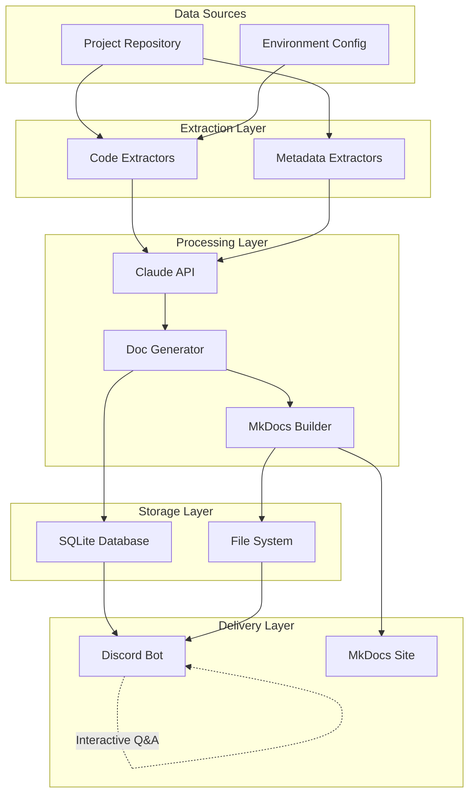
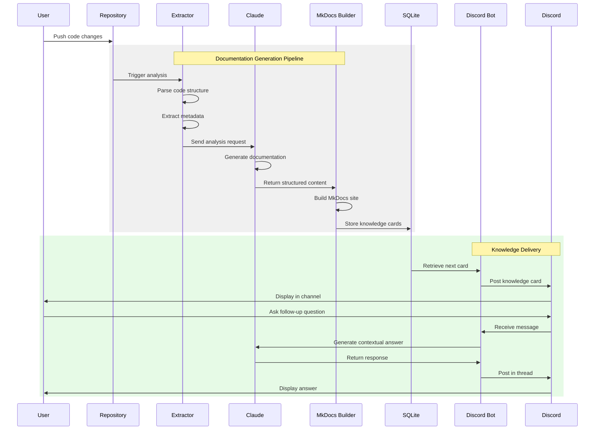

# Architecture Overview

## System Architecture

The Project Reporter is a meta-documentation system that transforms project repositories into accessible knowledge through an automated documentation pipeline and interactive Discord-based delivery system.



## Component Architecture

### Core Components

| Component | Responsibility | Key Features |
|-----------|---------------|--------------|
| **Code Extractors** | Parse and analyze repository structure | - Language-agnostic parsing<br>- Dependency extraction<br>- Pattern recognition |
| **Claude Integration** | Generate documentation content | - Architectural analysis<br>- Code explanation<br>- Best practice identification |
| **MkDocs Builder** | Create static documentation sites | - Material theme configuration<br>- Automatic navigation<br>- Search indexing |
| **Discord Bot** | Deliver knowledge cards and handle Q&A | - Scheduled posting<br>- Thread-based discussions<br>- Context-aware responses |
| **SQLite Storage** | Persist documentation and metadata | - Knowledge card tracking<br>- Q&A history<br>- Analytics data |

## Three-Layer Architecture

The system follows a clean three-layer architecture pattern:

### 1. **Presentation Layer**
- **Discord Bot Interface**: Handles user interactions, command processing, and content formatting
- **MkDocs Web Interface**: Provides browsable documentation with search and navigation
- **Knowledge Card Renderer**: Formats bite-sized content for Discord delivery

### 2. **Business Logic Layer**
- **Documentation Pipeline**: Orchestrates the extraction → generation → building flow
- **Content Generation Engine**: Manages Claude API interactions and prompt engineering
- **Scheduling Service**: Controls knowledge card delivery timing and sequencing
- **Q&A Handler**: Processes user questions and generates contextual responses

### 3. **Data Access Layer**
- **Repository Scanner**: Abstracts file system operations for code analysis
- **Database Manager**: Handles SQLite operations for persistent storage
- **Cache Manager**: Optimizes repeated Claude API calls and document retrieval

!!! key-pattern "Separation of Concerns"
    Each layer communicates only with adjacent layers, ensuring clean interfaces and testability. The Discord bot never directly accesses the file system, and the code extractors don't know about Discord formatting.

## End-to-End Data Flow



## Key Architectural Decisions

### 1. **SQLite for Persistence**
**Decision**: Use SQLite instead of a full database server

**Rationale**:
- Single-file database perfect for Discord bot deployment
- No separate database process to manage
- Sufficient for knowledge card storage and Q&A history
- Easy backup and migration

**Trade-offs**:
- Limited concurrent write performance
- No built-in replication
- Adequate for single-bot instances

### 2. **Claude API for Content Generation**
**Decision**: Leverage Claude for documentation generation rather than templates or rule-based systems

**Rationale**:
- Contextual understanding of code patterns
- Natural language generation for readability
- Ability to identify architectural patterns
- Continuous improvement with model updates

**Trade-offs**:
- API costs for generation
- Dependency on external service
- Need for robust prompt engineering

### 3. **Discord Threads for Q&A**
**Decision**: Use Discord's thread feature for follow-up discussions

**Rationale**:
- Maintains conversation context
- Doesn't clutter main channel
- Natural discussion flow
- Persistent conversation history

**Trade-offs**:
- Thread limit per channel
- Requires thread permissions
- May need archival strategy

### 4. **Static Site Generation with MkDocs**
**Decision**: Generate static documentation sites instead of dynamic web apps

**Rationale**:
- Zero runtime dependencies for docs
- Excellent search and navigation
- Version control friendly
- Easy GitHub Pages deployment

**Trade-offs**:
- Rebuild required for updates
- No dynamic content
- Limited interactivity

!!! btp-insight "SAP BTP Extension Opportunity"
    The architecture could be extended to integrate with SAP BTP services:
    
    - **SAP AI Core**: Replace or supplement Claude API with SAP's AI services for enterprise deployments
    - **SAP Document Management Service**: Store generated documentation with versioning and access control
    - **SAP Event Mesh**: Trigger documentation updates through event-driven architecture
    - **SAP Work Zone**: Embed knowledge cards in enterprise portals for wider distribution

## Technology Stack

### Core Technologies

| Layer | Technology | Purpose |
|-------|------------|---------|
| **Language** | Python 3.x | Primary development language |
| **Documentation** | MkDocs + Material | Static site generation |
| **AI/ML** | Claude API | Content generation |
| **Messaging** | Discord.py | Bot framework |
| **Storage** | SQLite | Persistent storage |
| **Configuration** | python-dotenv | Environment management |

### Supporting Tools

| Category | Tool | Usage |
|----------|------|-------|
| **Package Management** | Poetry/pip | Dependency management |
| **Code Analysis** | AST parsing | Code structure extraction |
| **Scheduling** | APScheduler | Knowledge card timing |
| **HTTP Client** | httpx/aiohttp | API communications |
| **Markdown Processing** | Python-Markdown | Content formatting |

!!! extension-idea "Microservices Architecture"
    For larger deployments, consider decomposing into microservices:
    
    ```mermaid
    graph LR
        subgraph "Extraction Service"
            ES[Code Analysis API]
        end
        
        subgraph "Generation Service"
            GS[Claude Wrapper API]
        end
        
        subgraph "Builder Service"
            BS[MkDocs Builder API]
        end
        
        subgraph "Delivery Service"
            DS[Discord Bot]
        end
        
        ES --> GS
        GS --> BS
        BS --> DS
    ```
    
    This would enable:
    - Independent scaling of components
    - Multiple Discord bot instances
    - Load balancing for Claude API calls
    - Separate deployment strategies

!!! note "Configuration Management"
    The `.env.example` file provides a template for required configuration:
    - Discord bot token and channel IDs
    - Claude API credentials
    - MkDocs build settings
    - Scheduling parameters
    - Database connection strings