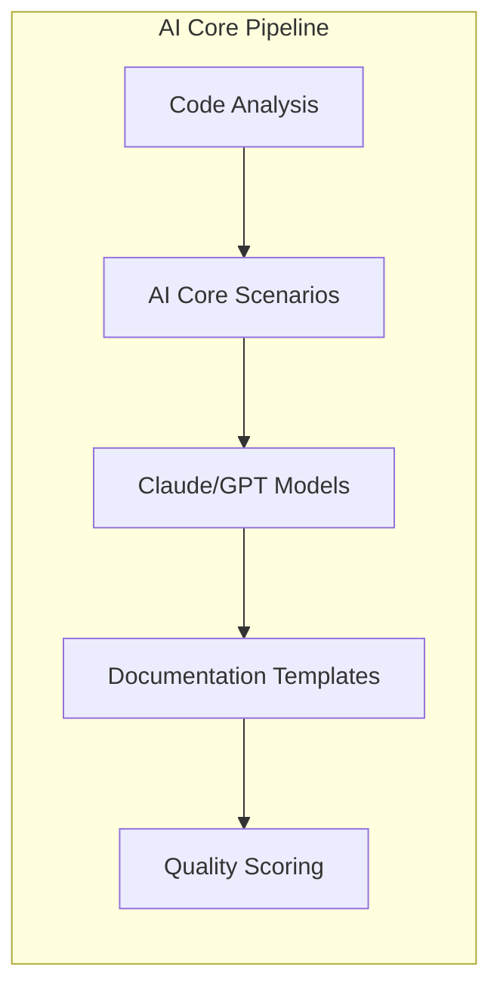
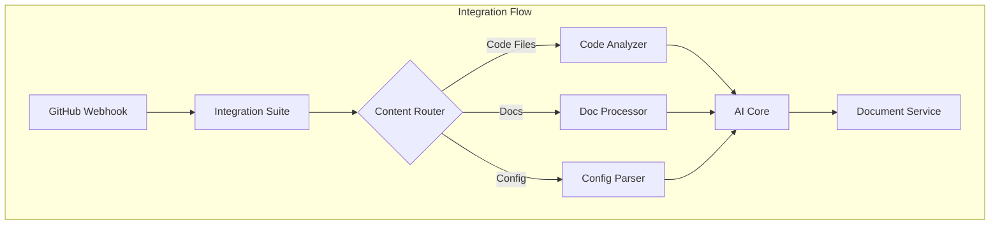
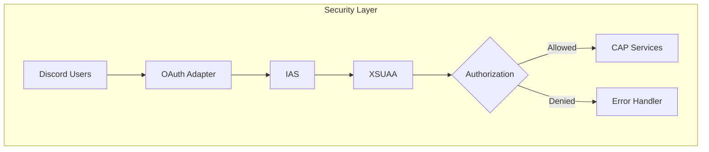

# SAP BTP Integration Opportunities

!!! btp-insight "Current Integration Status"
    Project Reporter currently operates as a standalone Python application with minimal cloud service dependencies. This presents significant opportunities for SAP BTP integration to enhance scalability, security, and enterprise readiness.

## Current Architecture vs. BTP-Native Services

=== "Current Stack"
    ```mermaid
    graph TB
        subgraph "Current Architecture"
            A[GitHub Repos] --> B[Python Extractors]
            B --> C[Claude API]
            C --> D[MkDocs Builder]
            D --> E[Static Sites]
            F[SQLite DB] --> G[Discord Bot]
            E --> G
        end
    ```

=== "BTP-Enhanced Architecture"
    ```mermaid
    graph TB
        subgraph "SAP BTP Architecture"
            A[GitHub/Git] --> B[Integration Suite]
            B --> C[AI Core]
            C --> D[Document Service]
            D --> E[Content Delivery]
            F[HANA Cloud] --> G[CAP Service]
            G --> H[Discord Bot]
            E --> H
            I[XSUAA] -.-> G
            I -.-> D
        end
    ```

## Core BTP Integration Opportunities

### 1. SAP AI Core Integration

!!! key-pattern "AI Core for Documentation Generation"
    Replace direct Claude API calls with SAP AI Core to leverage enterprise-grade ML operations, model versioning, and unified AI service management.

**Implementation Architecture:**



**Benefits:**
- Centralized model management and versioning
- Built-in MLOps capabilities for documentation quality tracking
- Cost optimization through resource pooling
- Enterprise security and compliance

### 2. HANA Cloud Migration

!!! extension-idea "From SQLite to HANA Cloud"
    Migrate from SQLite to HANA Cloud for enhanced performance, real-time analytics on documentation usage, and multi-tenant support.

=== "Migration Strategy"
    | Component | Current (SQLite) | Target (HANA Cloud) |
    |-----------|------------------|---------------------|
    | Schema | Simple relational | Multi-tenant aware |
    | Analytics | Basic queries | Real-time usage analytics |
    | Search | SQL LIKE | HANA Search capabilities |
    | Scale | Single instance | Horizontal scaling |

=== "Implementation Steps"
    1. **Schema Design**: Adapt for multi-tenant patterns
    2. **Data Migration**: ETL pipeline via Integration Suite
    3. **CAP Integration**: Build data access layer
    4. **Analytics Views**: Create usage and quality metrics

### 3. CAP Framework Integration

!!! key-pattern "CAP-Based Service Architecture"
    Rebuild the backend using CAP (Cloud Application Programming) framework for better modularity and BTP service integration.

```typescript
// Example CAP service definition
service DocumentationService @(path: '/api/v1') {
    entity Projects {
        key ID: UUID;
        name: String(100);
        repository: String(255);
        lastAnalyzed: Timestamp;
        documents: Composition of many Documents on documents.project = $self;
    }
    
    entity Documents {
        key ID: UUID;
        project: Association to Projects;
        content: LargeString;
        metadata: String(5000); // JSON metadata
        quality: Decimal(3,2);
    }
    
    // Service actions
    action analyzeRepository(url: String) returns Projects;
    action generateDocumentation(projectId: UUID) returns Documents;
    action publishToDiscord(documentId: UUID) returns Boolean;
}
```

### 4. Integration Suite for Repository Ingestion

!!! extension-idea "Automated Repository Analysis Pipeline"
    Use SAP Integration Suite to create robust, scalable pipelines for repository ingestion and analysis.



### 5. Security Enhancement with XSUAA/IAS

!!! warning "Security Considerations"
    Current implementation lacks enterprise authentication. XSUAA integration provides OAuth 2.0 flows and fine-grained authorization.

**Security Architecture:**



**Implementation Benefits:**
- Role-based access to documentation
- Audit trails for compliance
- Integration with enterprise identity providers
- Secure API token management

## Migration Roadmap

### Phase 1: Foundation (Weeks 1-4)
- [ ] Set up BTP subaccount and entitlements
- [ ] Deploy CAP skeleton application
- [ ] Configure HANA Cloud instance
- [ ] Implement basic XSUAA integration

### Phase 2: Core Services (Weeks 5-8)
- [ ] Migrate data models to CAP
- [ ] Implement AI Core integration
- [ ] Build Integration Suite flows
- [ ] Create documentation service APIs

### Phase 3: Advanced Features (Weeks 9-12)
- [ ] Multi-tenant support
- [ ] Advanced analytics dashboards
- [ ] Automated quality scoring
- [ ] Enterprise Discord bot features

## Extension Ideas

!!! extension-idea "Advanced BTP Integrations"
    1. **SAP Analytics Cloud**: Create dashboards for documentation coverage and quality metrics
    2. **Business Rules Service**: Define rules for automatic documentation updates
    3. **Workflow Service**: Approval flows for documentation changes
    4. **Event Mesh**: Real-time notifications for documentation events
    5. **Document Management Service**: Version control for generated documentation

## Technical Considerations

### Performance Optimization
- Use HANA's in-memory capabilities for rapid documentation search
- Implement caching strategies with Redis on BTP
- Leverage CAP's built-in pagination and filtering

### Scalability Patterns
- Horizontal scaling with Cloud Foundry
- Message queuing for asynchronous processing
- Circuit breakers for external API calls

### Cost Management
- Implement usage quotas per tenant
- Optimize AI Core inference calls
- Use scheduled jobs for batch processing

!!! note "Next Steps"
    Begin with a proof-of-concept focusing on CAP framework adoption and HANA Cloud migration. This provides the foundation for subsequent BTP service integrations while maintaining the ability to run the existing system in parallel during transition.