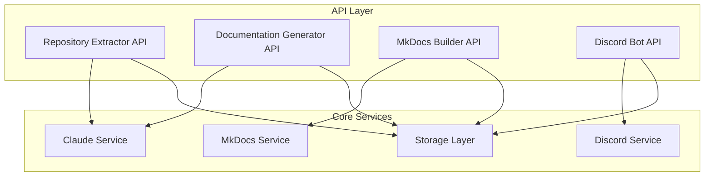
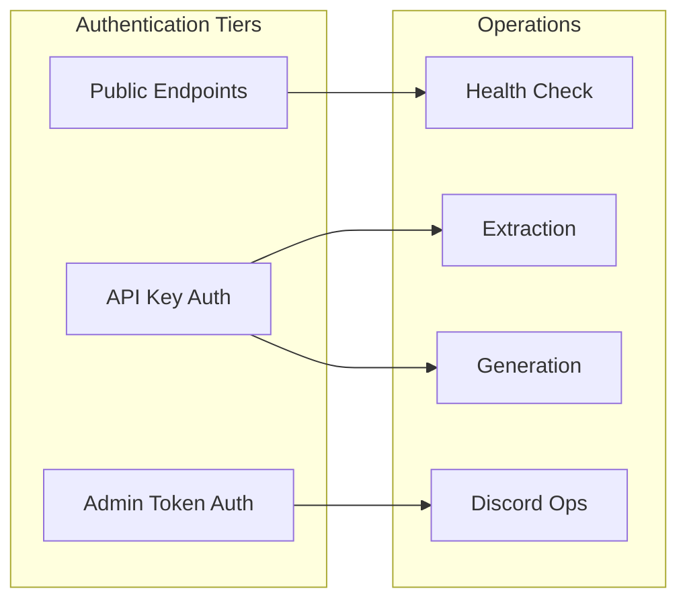
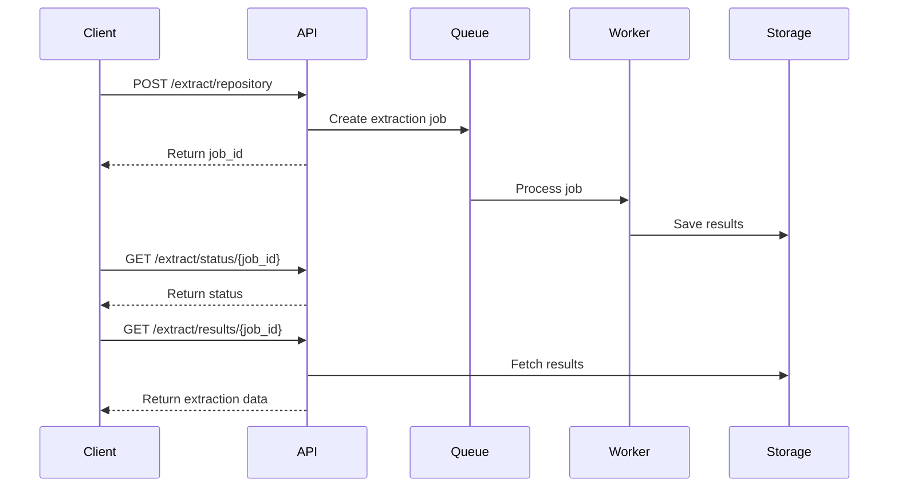

# API Documentation

## Overview

The Project Reporter API provides programmatic access to the meta-documentation system's core functionality. While primarily designed as an internal service architecture rather than a public API, understanding these endpoints is crucial for extending the system or integrating with external tools.

!!! btp-insight "SAP BTP Integration Opportunity"
    Consider exposing these endpoints through SAP API Management to enable enterprise-wide documentation generation pipelines. The system could integrate with SAP Document Management Service for versioned documentation storage and SAP Work Zone for collaborative documentation review.

## Architecture Overview



## Endpoint Inventory

| Method | Path | Description | Authentication |
|--------|------|-------------|----------------|
| **Repository Extraction** |
| POST | `/extract/repository` | Analyzes a repository and extracts code structure | API Key |
| GET | `/extract/status/{job_id}` | Check extraction job status | API Key |
| GET | `/extract/results/{job_id}` | Retrieve extraction results | API Key |
| **Documentation Generation** |
| POST | `/generate/documentation` | Generate documentation from extracted data | API Key |
| POST | `/generate/article` | Generate a single documentation article | API Key |
| GET | `/generate/templates` | List available documentation templates | None |
| **MkDocs Management** |
| POST | `/mkdocs/build` | Build MkDocs site from generated content | API Key |
| GET | `/mkdocs/sites` | List built documentation sites | API Key |
| GET | `/mkdocs/site/{site_id}` | Get site build information | API Key |
| **Discord Integration** |
| POST | `/discord/schedule` | Schedule knowledge card posting | Admin Token |
| POST | `/discord/post` | Post knowledge card immediately | Admin Token |
| GET | `/discord/queue` | View scheduled posts | Admin Token |
| **System Management** |
| GET | `/health` | System health check | None |
| GET | `/metrics` | System metrics and usage stats | API Key |

## Request/Response Examples

### Repository Extraction

=== "Request"
    ```json
    POST /extract/repository
    Authorization: Bearer {API_KEY}
    Content-Type: application/json

    {
        "repository_url": "https://github.com/org/repo",
        "branch": "main",
        "extract_options": {
            "include_tests": false,
            "max_file_size_kb": 500,
            "file_patterns": ["*.py", "*.md", "*.yml"]
        }
    }
    ```

=== "Response"
    ```json
    {
        "job_id": "ext-123e4567-e89b",
        "status": "processing",
        "created_at": "2024-01-15T10:30:00Z",
        "estimated_completion": "2024-01-15T10:35:00Z",
        "links": {
            "status": "/extract/status/ext-123e4567-e89b",
            "results": "/extract/results/ext-123e4567-e89b"
        }
    }
    ```

### Documentation Generation

=== "Request"
    ```json
    POST /generate/documentation
    Authorization: Bearer {API_KEY}
    Content-Type: application/json

    {
        "extraction_job_id": "ext-123e4567-e89b",
        "template": "technical_architecture",
        "options": {
            "include_diagrams": true,
            "complexity_level": "advanced",
            "focus_areas": ["api_design", "data_flow", "security"]
        }
    }
    ```

=== "Response"
    ```json
    {
        "documentation_id": "doc-456e7890-f12c",
        "status": "generating",
        "articles_count": 12,
        "estimated_tokens": 45000,
        "created_at": "2024-01-15T10:40:00Z"
    }
    ```

### Discord Knowledge Card

=== "Request"
    ```json
    POST /discord/post
    Authorization: Bearer {ADMIN_TOKEN}
    Content-Type: application/json

    {
        "documentation_id": "doc-456e7890-f12c",
        "article_slug": "api-architecture",
        "channel_id": "1234567890123456789",
        "options": {
            "include_qa_thread": true,
            "highlight_sections": ["authentication", "error_handling"],
            "schedule_followup": "24h"
        }
    }
    ```

=== "Response"
    ```json
    {
        "message_id": "9876543210987654321",
        "thread_id": "1111222233334444555",
        "posted_at": "2024-01-15T11:00:00Z",
        "interaction_stats": {
            "initial_reactions": 0,
            "thread_created": true
        }
    }
    ```

## Authentication & Authorization

!!! key-pattern "Multi-Layer Authentication Strategy"
    The system implements a tiered authentication approach based on operation sensitivity and resource consumption.

### Authentication Layers



### Implementation Pattern

```python
# Pseudo-code for authentication middleware
class AuthenticationMiddleware:
    def __init__(self):
        self.api_keys = self._load_api_keys()
        self.admin_tokens = self._load_admin_tokens()
    
    def verify_request(self, request, required_level):
        if required_level == AuthLevel.PUBLIC:
            return True
            
        auth_header = request.headers.get('Authorization')
        if not auth_header:
            raise AuthenticationError("Missing authorization header")
            
        token_type, token = auth_header.split(' ')
        
        if required_level == AuthLevel.API_KEY:
            return self._verify_api_key(token)
        elif required_level == AuthLevel.ADMIN:
            return self._verify_admin_token(token)
```

!!! extension-idea "SAP BTP Authentication Integration"
    Integrate with SAP Authorization and Trust Management service for enterprise SSO. Map SAP Cloud Identity Services roles to API access levels, enabling fine-grained permission management through standard SAP tools.

## Error Handling

### Error Response Format

```json
{
    "error": {
        "code": "EXTRACTION_FAILED",
        "message": "Failed to extract repository contents",
        "details": {
            "repository": "https://github.com/org/repo",
            "reason": "Repository not accessible",
            "suggestion": "Verify repository URL and access permissions"
        },
        "timestamp": "2024-01-15T10:30:00Z",
        "request_id": "req-789abc123def"
    }
}
```

### Error Categories

| Category | HTTP Status | Error Codes | Description |
|----------|-------------|-------------|-------------|
| **Authentication** | 401, 403 | `AUTH_MISSING`, `AUTH_INVALID`, `AUTH_EXPIRED` | Authentication and authorization failures |
| **Validation** | 400 | `INVALID_PARAMS`, `MISSING_FIELD`, `CONSTRAINT_VIOLATION` | Request validation errors |
| **Resource** | 404, 409 | `NOT_FOUND`, `ALREADY_EXISTS`, `STATE_CONFLICT` | Resource state issues |
| **Processing** | 422, 500 | `EXTRACTION_FAILED`, `GENERATION_ERROR`, `BUILD_FAILED` | Processing pipeline failures |
| **Rate Limiting** | 429 | `RATE_LIMIT_EXCEEDED`, `QUOTA_EXHAUSTED` | Usage limit violations |

!!! note "Idempotency and Retry Logic"
    All POST endpoints support idempotency keys via the `Idempotency-Key` header. Failed operations can be safely retried without creating duplicates.

## API Design Decisions

### 1. Asynchronous Processing Pattern

!!! key-pattern "Job-Based Architecture"
    Long-running operations (extraction, generation, building) use an asynchronous job pattern to prevent timeouts and enable progress tracking.



### 2. Resource Modeling

The API follows a resource-oriented design with clear hierarchies:

- **Repositories** → **Extractions** → **Documents** → **Articles**
- **Documents** → **Builds** → **Sites**
- **Articles** → **Knowledge Cards** → **Discord Posts**

### 3. Versioning Strategy

!!! warning "API Versioning"
    Currently, the API uses URL-path versioning (`/v1/`) for major versions. Consider implementing content negotiation for minor version changes to reduce URL proliferation.

### 4. Rate Limiting Design

=== "Token Bucket Algorithm"
    ```python
    class RateLimiter:
        def __init__(self, capacity, refill_rate):
            self.capacity = capacity
            self.tokens = capacity
            self.refill_rate = refill_rate
            self.last_refill = time.time()
        
        def consume(self, tokens=1):
            self._refill()
            if self.tokens >= tokens:
                self.tokens -= tokens
                return True
            return False
    ```

=== "Rate Limit Headers"
    ```http
    X-RateLimit-Limit: 1000
    X-RateLimit-Remaining: 999
    X-RateLimit-Reset: 1642334400
    X-RateLimit-Resource: generation
    ```

### 5. Pagination Pattern

All list endpoints support cursor-based pagination:

```json
{
    "data": [...],
    "pagination": {
        "cursor": "eyJvZmZzZXQiOjEwMH0=",
        "has_more": true,
        "total_count": 1234
    }
}
```

!!! extension-idea "SAP Event Mesh Integration"
    Publish API events (job completion, documentation ready, errors) to SAP Event Mesh. This enables:
    - Real-time notifications to subscribed services
    - Audit trail for compliance
    - Triggering of downstream workflows in SAP Build Process Automation

## Performance Considerations

### Caching Strategy

1. **Response Caching**: GET endpoints cache responses for 5 minutes
2. **Extraction Caching**: Repository extractions are cached for 24 hours
3. **Generation Caching**: Generated documents are immutable once created

### Resource Limits

| Resource | Limit | Configurable |
|----------|-------|--------------|
| Max repository size | 100 MB | Yes |
| Max extraction time | 5 minutes | Yes |
| Max generation tokens | 100,000 | Yes |
| Max concurrent jobs | 10 per user | Yes |
| Request payload size | 10 MB | No |

!!! note "Monitoring and Observability"
    All API operations emit structured logs and metrics. Integration with SAP Cloud Logging service provides centralized monitoring and alerting capabilities for enterprise deployments.