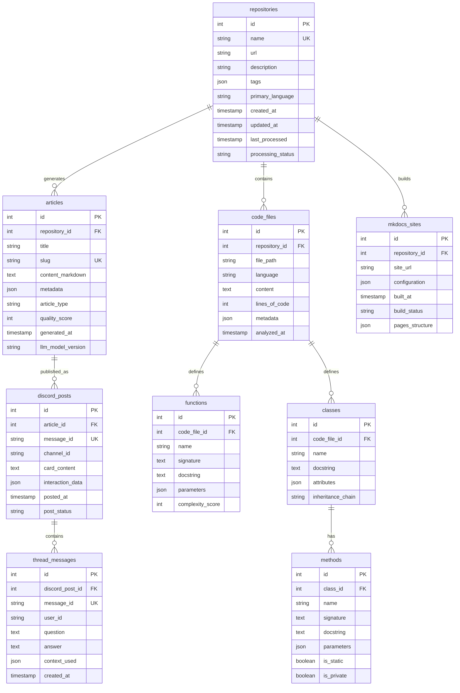
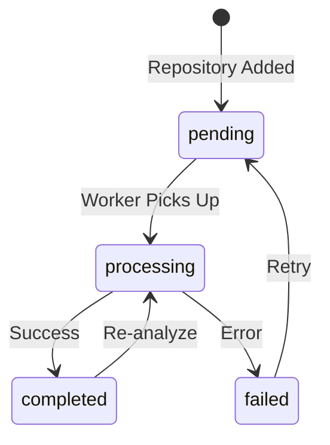

# Data Model Documentation

## Overview

The Project Reporter data model is designed to support a meta-documentation system that processes repositories, generates documentation via LLM, and delivers knowledge through Discord. The schema follows a **hybrid approach** combining normalized transactional tables with denormalized content storage for optimal query performance.

!!! btp-insight "SAP BTP Extension Opportunity"
    This data model could be enhanced with SAP HANA Cloud for:
    - **Text search capabilities** on generated documentation
    - **Graph processing** for repository dependency analysis
    - **Predictive analytics** on documentation quality scores
    - **Real-time analytics** on Discord user engagement

## Entity Relationship Diagram



## Table Specifications

### Core Entity Tables

=== "repositories"

    | Column | Type | Constraints | Description |
    |--------|------|------------|-------------|
    | `id` | INTEGER | PRIMARY KEY | Auto-incrementing identifier |
    | `name` | VARCHAR(255) | UNIQUE, NOT NULL | Repository name (e.g., "project_reporter") |
    | `url` | VARCHAR(500) | NOT NULL | Full repository URL |
    | `description` | TEXT | | Project description from README or metadata |
    | `tags` | JSON | | Array of technology tags ["python", "discord", "claude-api"] |
    | `primary_language` | VARCHAR(50) | | Main programming language detected |
    | `created_at` | TIMESTAMP | DEFAULT NOW() | Record creation time |
    | `updated_at` | TIMESTAMP | | Last modification time |
    | `last_processed` | TIMESTAMP | | Last successful processing run |
    | `processing_status` | ENUM | | Status: 'pending', 'processing', 'completed', 'failed' |

    !!! key-pattern "Design Pattern: Event Sourcing Light"
        The `processing_status` and `last_processed` fields enable tracking of async processing pipelines without full event sourcing overhead.

=== "articles"

    | Column | Type | Constraints | Description |
    |--------|------|------------|-------------|
    | `id` | INTEGER | PRIMARY KEY | Auto-incrementing identifier |
    | `repository_id` | INTEGER | FOREIGN KEY | Link to source repository |
    | `title` | VARCHAR(500) | NOT NULL | Article title |
    | `slug` | VARCHAR(500) | UNIQUE | URL-friendly identifier |
    | `content_markdown` | TEXT | NOT NULL | Full article content in Markdown |
    | `metadata` | JSON | | Structured data (tags, categories, reading time) |
    | `article_type` | VARCHAR(50) | | Type: 'architecture', 'implementation', 'tutorial' |
    | `quality_score` | INTEGER | | LLM-assigned quality metric (0-100) |
    | `generated_at` | TIMESTAMP | | Generation timestamp |
    | `llm_model_version` | VARCHAR(50) | | Claude model version used |

    !!! note "Storage Optimization"
        Articles store full Markdown content rather than referencing external files for faster Discord bot response times.

### Code Analysis Tables

=== "code_files"

    | Column | Type | Constraints | Description |
    |--------|------|------------|-------------|
    | `id` | INTEGER | PRIMARY KEY | Auto-incrementing identifier |
    | `repository_id` | INTEGER | FOREIGN KEY | Parent repository |
    | `file_path` | VARCHAR(500) | NOT NULL | Relative file path |
    | `language` | VARCHAR(50) | | Detected language |
    | `content` | TEXT | | Full file content (for searchability) |
    | `lines_of_code` | INTEGER | | LOC metric |
    | `metadata` | JSON | | Imports, dependencies, complexity metrics |
    | `analyzed_at` | TIMESTAMP | | Analysis timestamp |

    **Index Strategy**: Composite index on `(repository_id, file_path)` for efficient file lookups.

=== "functions & classes"

    These tables capture code structure for intelligent documentation generation:

    **functions**
    - Stores standalone functions with signatures and docstrings
    - `complexity_score` uses cyclomatic complexity for prioritization
    - `parameters` JSON includes types, defaults, and descriptions

    **classes & methods**
    - Hierarchical structure with classes containing methods
    - `inheritance_chain` stores full class hierarchy as string
    - Private/public visibility tracked for API documentation

### Discord Integration Tables

=== "discord_posts"

    | Column | Type | Constraints | Description |
    |--------|------|------------|-------------|
    | `id` | INTEGER | PRIMARY KEY | Auto-incrementing identifier |
    | `article_id` | INTEGER | FOREIGN KEY | Source article |
    | `message_id` | VARCHAR(100) | UNIQUE | Discord message ID |
    | `channel_id` | VARCHAR(100) | NOT NULL | Target Discord channel |
    | `card_content` | TEXT | | Formatted card content |
    | `interaction_data` | JSON | | Reactions, view counts, engagement metrics |
    | `posted_at` | TIMESTAMP | | Post timestamp |
    | `post_status` | VARCHAR(50) | | Status: 'scheduled', 'posted', 'deleted' |

=== "thread_messages"

    | Column | Type | Constraints | Description |
    |--------|------|------------|-------------|
    | `id` | INTEGER | PRIMARY KEY | Auto-incrementing identifier |
    | `discord_post_id` | INTEGER | FOREIGN KEY | Parent Discord post |
    | `message_id` | VARCHAR(100) | UNIQUE | Discord message ID |
    | `user_id` | VARCHAR(100) | | Discord user ID |
    | `question` | TEXT | | User's question |
    | `answer` | TEXT | | LLM-generated answer |
    | `context_used` | JSON | | Article sections and code snippets used |
    | `created_at` | TIMESTAMP | | Message timestamp |

## Design Patterns

### 1. Slowly Changing Dimension (SCD) Type 2 - Modified

While not implementing full SCD Type 2, the system tracks key temporal aspects:

```sql
-- Pseudo-implementation for article versioning
CREATE VIEW article_versions AS
SELECT 
    a.*,
    ROW_NUMBER() OVER (PARTITION BY repository_id, slug 
                      ORDER BY generated_at DESC) as version_number,
    LAG(generated_at) OVER (PARTITION BY repository_id, slug 
                           ORDER BY generated_at) as previous_version_date
FROM articles a;
```

!!! extension-idea "SAP BTP Enhancement"
    Implement full SCD Type 2 using SAP HANA's temporal tables for complete article version history and diff analysis.

### 2. Content Denormalization Pattern

Articles store complete Markdown content rather than assembling from fragments:

**Trade-offs:**
- ✅ **Pros**: Fast retrieval, atomic updates, simple caching
- ❌ **Cons**: Storage overhead, potential consistency issues

This aligns with the read-heavy Discord bot workload where response time is critical.

### 3. JSON Flexibility Pattern

Strategic use of JSON columns for evolving schemas:

```python
# Example metadata structure
article_metadata = {
    "tags": ["architecture", "python"],
    "estimated_reading_time": 5,
    "complexity_level": "intermediate",
    "prerequisites": ["basic-python", "discord-api"],
    "generated_prompts": ["explain architecture", "summarize implementation"]
}
```

### 4. Event-Driven State Machine

Processing status tracking enables reliable async workflows:



## Cross-Schema Synchronization

### Repository ↔ Articles Sync

Articles are regenerated when:
1. Repository `updated_at` > Article `generated_at`
2. LLM model version changes
3. Manual refresh triggered

```sql
-- Identify stale articles
CREATE VIEW stale_articles AS
SELECT a.*
FROM articles a
JOIN repositories r ON a.repository_id = r.id
WHERE r.updated_at > a.generated_at
   OR a.llm_model_version != (SELECT value FROM config WHERE key = 'current_llm_version');
```

### Articles ↔ Discord Posts Sync

Knowledge cards are scheduled based on:
- Article quality scores (higher scores = more frequent posts)
- Engagement metrics from previous posts
- Time-based rotation to ensure variety

!!! warning "Consistency Challenge"
    Discord message IDs are immutable, so edited articles require new posts rather than updates. The system tracks this via `post_status`.

## Performance Optimizations

### Indexing Strategy

```sql
-- Core performance indexes
CREATE INDEX idx_repo_status ON repositories(processing_status, last_processed);
CREATE INDEX idx_articles_repo_type ON articles(repository_id, article_type);
CREATE INDEX idx_discord_posts_schedule ON discord_posts(post_status, posted_at);
CREATE INDEX idx_code_files_repo_path ON code_files(repository_id, file_path);

-- Full-text search on content
CREATE INDEX idx_articles_content_fts ON articles USING gin(to_tsvector('english', content_markdown));
```

### Query Optimization Patterns

1. **Batch Processing**: Code analysis processes files in batches of 100 to balance memory and transaction size
2. **Materialized Views**: Common aggregations (e.g., repository stats) are pre-computed
3. **Connection Pooling**: SQLite WAL mode with connection pooling for concurrent reads

!!! btp-insight "SAP CAP Alternative"
    This schema could be reimplemented using SAP Cloud Application Programming Model (CAP) with:
    - CDS models for type-safe schema definition
    - Built-in draft handling for article editing workflows
    - Automatic OData API generation for external integrations
    - Native multitenancy for organization-based isolation