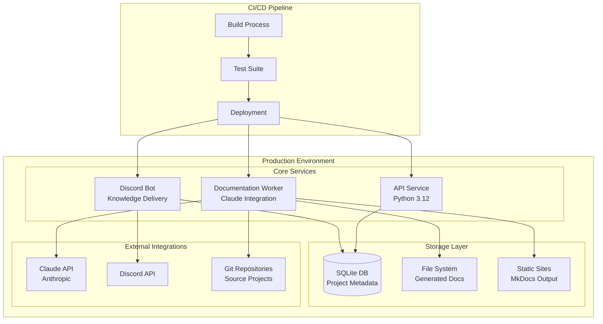
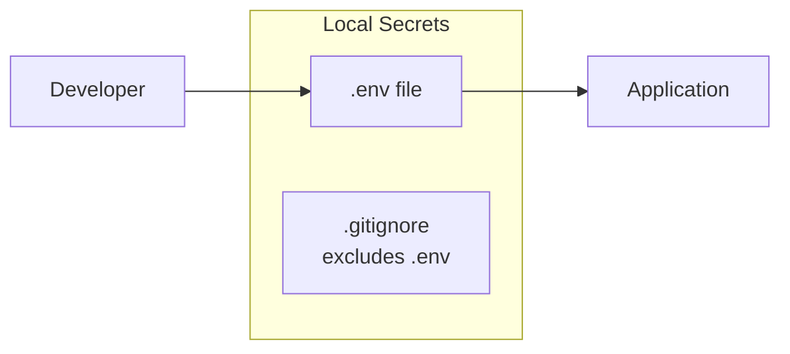
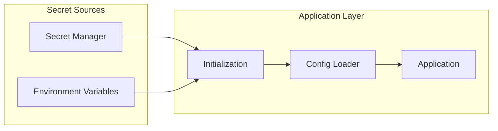
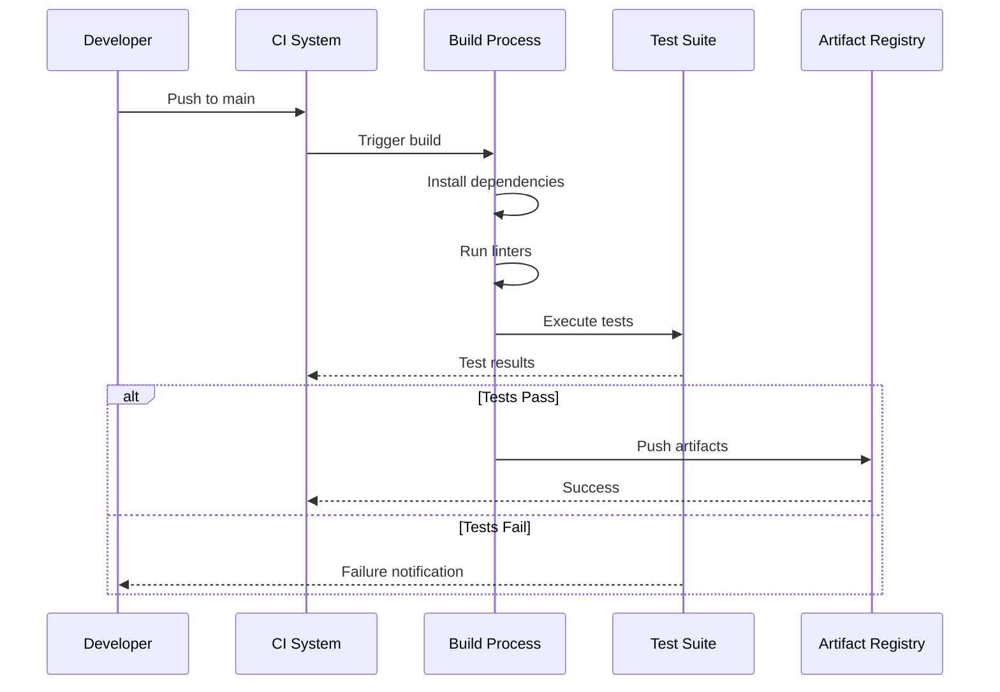
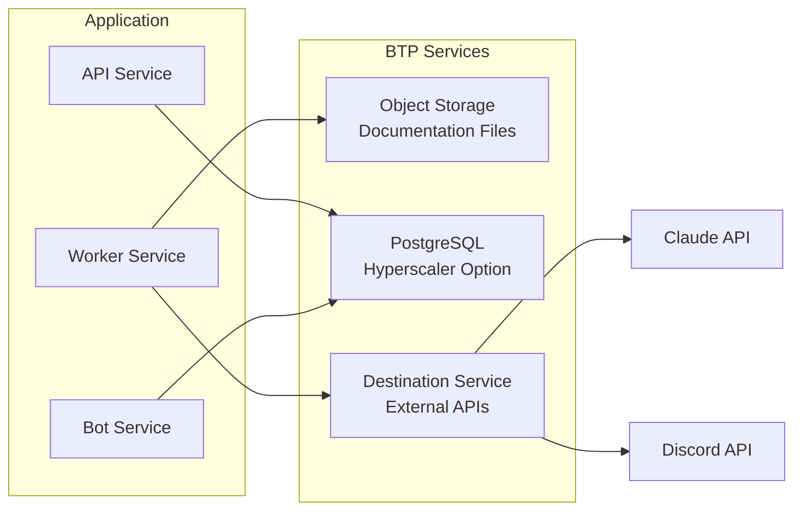
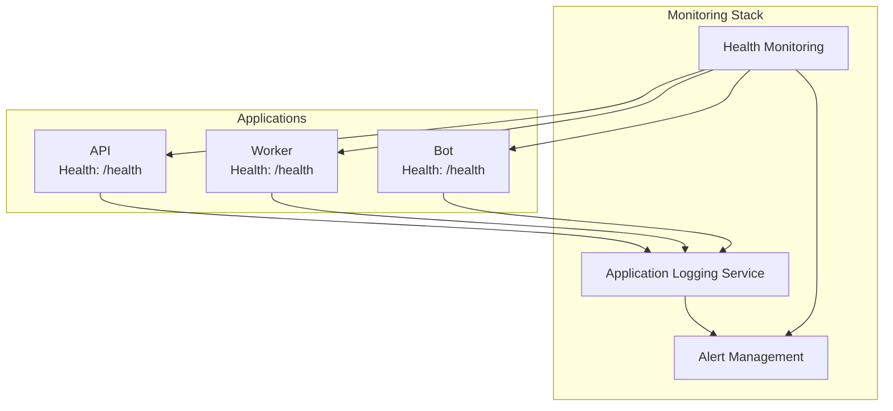

# Deployment

The Project Reporter system uses a distributed deployment architecture with multiple components working together to ingest project repositories, generate documentation, build static sites, and deliver knowledge through Discord.

## Deployment Topology



## Configuration Artifacts

### Runtime Configuration

The system uses Python 3.12 as specified in `runtime.txt`:

```
python-3.12.0
```

!!! key-pattern "Runtime Versioning"
    The explicit Python version ensures consistency across development, testing, and production environments. This is particularly important for:
    
    - Claude API client compatibility
    - Discord.py async features
    - Type hint support for documentation generation

### Environment Configuration

The `.env.example` file defines the required configuration variables:

=== "Core Settings"
    ```bash
    # API Keys
    CLAUDE_API_KEY=your_anthropic_api_key
    DISCORD_BOT_TOKEN=your_discord_bot_token
    
    # Database
    DATABASE_PATH=/data/project_reporter.db
    
    # Documentation Output
    DOCS_OUTPUT_PATH=/data/generated_docs
    MKDOCS_BUILD_PATH=/data/mkdocs_sites
    ```

=== "Service Configuration"
    ```bash
    # Worker Settings
    WORKER_CONCURRENCY=2
    GENERATION_TIMEOUT=300
    
    # Discord Bot
    DISCORD_CHANNEL_ID=your_channel_id
    POST_SCHEDULE_CRON="0 9,17 * * *"
    
    # Repository Settings
    MAX_REPO_SIZE_MB=100
    CLONE_TIMEOUT=60
    ```

### Dependency Management

The project uses two dependency specification formats:

- **`pyproject.toml`**: Modern Python project configuration with dependency groups
- **`requirements.txt`**: Traditional pip requirements for deployment compatibility

!!! note "Dependency Strategy"
    The dual approach supports both modern development workflows (using `pyproject.toml` with tools like Poetry) and traditional deployment scenarios that expect `requirements.txt`.

## Secret Management

### Development Environment



### Production Environment



!!! warning "API Key Security"
    - Never commit `.env` files to version control
    - Use separate API keys for each environment
    - Rotate keys regularly, especially for Claude API access
    - Implement key usage monitoring and alerts

## Build and Deploy Process

### Build Pipeline



### Deployment Process

=== "Container Deployment"
    ```bash
    # Build container image
    docker build -t project-reporter:latest .
    
    # Tag for registry
    docker tag project-reporter:latest registry/project-reporter:v1.0.0
    
    # Push to registry
    docker push registry/project-reporter:v1.0.0
    
    # Deploy services
    docker-compose up -d
    ```

=== "Direct Deployment"
    ```bash
    # Create virtual environment
    python3.12 -m venv venv
    source venv/bin/activate
    
    # Install dependencies
    pip install -r requirements.txt
    
    # Run migrations
    python -m project_reporter.db migrate
    
    # Start services
    python -m project_reporter.api &
    python -m project_reporter.worker &
    python -m project_reporter.bot &
    ```

## Environment-Specific Considerations

### Development Environment

| Aspect | Configuration |
|--------|--------------|
| Database | Local SQLite file |
| Claude API | Development key with rate limits |
| Discord Bot | Test server/channel |
| Documentation | Local file system |
| Logging | Debug level, console output |

### Staging Environment

| Aspect | Configuration |
|--------|--------------|
| Database | Shared SQLite or PostgreSQL |
| Claude API | Staging key with moderate limits |
| Discord Bot | Staging channel |
| Documentation | Shared storage mount |
| Logging | Info level, file rotation |

### Production Environment

| Aspect | Configuration |
|--------|--------------|
| Database | PostgreSQL with backups |
| Claude API | Production key, no rate limits |
| Discord Bot | Production channels |
| Documentation | CDN-backed storage |
| Logging | Warning level, centralized logging |

!!! btp-insight "Multi-Environment Strategy"
    The system supports environment-specific configurations through:
    
    - Environment variable prefixes (DEV_, STAGE_, PROD_)
    - Configuration file overlays
    - Dynamic service discovery
    - Health check endpoints for monitoring

## BTP Deployment Considerations

### Cloud Foundry Deployment

```yaml
# manifest.yml
applications:
- name: project-reporter-api
  memory: 512M
  instances: 2
  buildpack: python_buildpack
  services:
    - project-reporter-db
    - project-reporter-storage
  env:
    PYTHON_VERSION: 3.12.0
    
- name: project-reporter-worker
  memory: 1G
  instances: 1
  buildpack: python_buildpack
  services:
    - project-reporter-db
    - project-reporter-storage
    - claude-api-service
    
- name: project-reporter-bot
  memory: 256M
  instances: 1
  buildpack: python_buildpack
  services:
    - project-reporter-db
    - discord-service
```

### BTP Service Integration



!!! extension-idea "BTP Enhancement Opportunities"
    1. **SAP AI Core Integration**: Replace or augment Claude with SAP's AI services for documentation generation
    2. **SAP Event Mesh**: Use for asynchronous communication between components instead of direct calls
    3. **SAP Analytics Cloud**: Create dashboards for documentation metrics and bot engagement
    4. **SAP Build Process Automation**: Automate the documentation approval workflow
    5. **SAP Document Management Service**: Store and version generated documentation with proper governance

### Monitoring and Operations



!!! key-pattern "Production Readiness Checklist"
    - [ ] Environment variables configured for all services
    - [ ] Database migrations executed successfully
    - [ ] Health check endpoints responding
    - [ ] Logging configured with appropriate levels
    - [ ] API rate limits configured
    - [ ] Discord bot permissions verified
    - [ ] Storage permissions set correctly
    - [ ] Monitoring alerts configured
    - [ ] Backup procedures documented
    - [ ] Rollback process tested