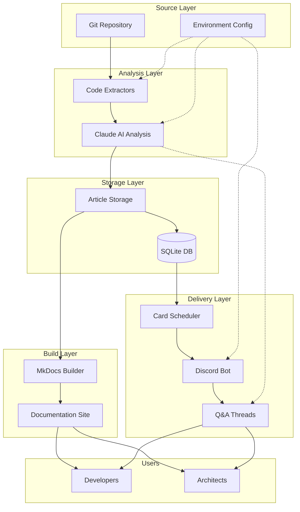

# Project Overview

## Executive Summary

Project Reporter is a meta-documentation system that transforms software repositories into comprehensive architectural documentation through AI-powered analysis. The system bridges the gap between code implementation and knowledge sharing by automatically generating technical documentation from source code, building searchable documentation sites, and delivering contextual insights through interactive Discord conversations.

At its core, Project Reporter addresses the persistent challenge of keeping documentation synchronized with rapidly evolving codebases. By leveraging Claude's advanced language understanding capabilities, the system extracts architectural patterns, implementation decisions, and technical trade-offs directly from source code, creating documentation that reflects the actual state of the project rather than aspirational designs. The resulting documentation is not only automatically generated but also made accessible through multiple channels - from traditional web-based documentation sites to conversational Discord interactions.

The system's unique value proposition lies in its ability to create "living documentation" that adapts to code changes while providing multiple consumption patterns. Whether a developer needs a comprehensive architectural overview, a quick refresher on a specific component, or an interactive Q&A session about implementation details, Project Reporter delivers the right level of detail through the appropriate channel.

## Problem Statement

Modern software projects suffer from a fundamental documentation challenge: the gap between code evolution and documentation updates. Traditional documentation approaches fail because:

- **Manual documentation quickly becomes outdated** as code changes outpace documentation updates
- **Context switching between code and docs** creates friction in the development workflow  
- **Static documentation lacks interactivity** for exploring specific questions or edge cases
- **Knowledge silos form** when documentation exists in disparate locations without unified access
- **Onboarding complexity increases** as projects grow without systematic documentation

Project Reporter solves these challenges by creating an automated documentation pipeline that:
- Continuously analyzes repositories to extract current architectural patterns
- Generates contextual documentation using AI to understand code intent
- Builds searchable, version-controlled documentation sites
- Delivers bite-sized knowledge through scheduled Discord messages
- Enables interactive Q&A for deep-dive explorations

## Ecosystem Overview

## Technology Summary

| Component | Technology | Purpose | Key Features |
|-----------|------------|---------|--------------|
| **Code Analysis** | Python Extractors | Parse repositories for structure and patterns | AST analysis, dependency mapping, pattern detection |
| **AI Engine** | Claude API | Generate documentation from code analysis | Context-aware writing, architectural insights, pattern recognition |
| **Documentation** | MkDocs Material | Build searchable documentation sites | Modern UI, full-text search, responsive design, Mermaid support |
| **Storage** | SQLite | Store articles and metadata | Lightweight, embedded, full-text search capabilities |
| **Delivery** | Discord Bot | Interactive knowledge sharing | Scheduled posts, thread-based Q&A, contextual responses |
| **Configuration** | Python dotenv | Environment management | API keys, Discord tokens, generation parameters |
| **Packaging** | pyproject.toml | Modern Python packaging | Dependency management, build configuration |

!!! key-pattern "Architecture Philosophy"
    The system follows a **pipeline architecture** where each component has a single responsibility and communicates through well-defined interfaces. This enables:
    
    - Independent scaling of analysis, generation, and delivery
    - Easy substitution of components (e.g., different AI providers)
    - Clear debugging and monitoring boundaries
    - Parallel processing where appropriate

!!! btp-insight "SAP BTP Extension Opportunities"
    This architecture could be enhanced with SAP BTP services:
    
    - **SAP AI Core** for custom model training on enterprise codebases
    - **SAP Document Management Service** for version-controlled documentation storage  
    - **SAP Event Mesh** for real-time documentation updates on code commits
    - **SAP Work Zone** integration for enterprise documentation portals

## Documentation Sections

=== "Architecture"
    - [System Architecture](architecture/system-design.md) - Component design and interaction patterns
    - [Data Flow](architecture/data-flow.md) - How information moves through the pipeline
    - [Integration Points](architecture/integrations.md) - External service connections

=== "Implementation"
    - [Code Extractors](implementation/extractors.md) - Repository analysis implementation
    - [AI Generation](implementation/ai-pipeline.md) - Claude integration and prompt engineering
    - [Discord Bot](implementation/discord-bot.md) - Interactive delivery system

=== "Operations"
    - [Deployment Guide](operations/deployment.md) - Production setup and configuration
    - [Monitoring](operations/monitoring.md) - System health and performance tracking
    - [Troubleshooting](operations/troubleshooting.md) - Common issues and solutions

=== "Extensions"
    - [Adding Extractors](extensions/custom-extractors.md) - Support new languages/frameworks
    - [Custom Templates](extensions/templates.md) - Modify documentation output
    - [Bot Commands](extensions/bot-features.md) - Extend Discord interactions

!!! extension-idea "Future Enhancements"
    Consider these potential extensions:
    
    - **Multi-repository analysis** for microservice documentation
    - **CI/CD integration** for automatic documentation updates
    - **Slack/Teams adapters** for broader enterprise reach
    - **Documentation quality metrics** to measure coverage and freshness