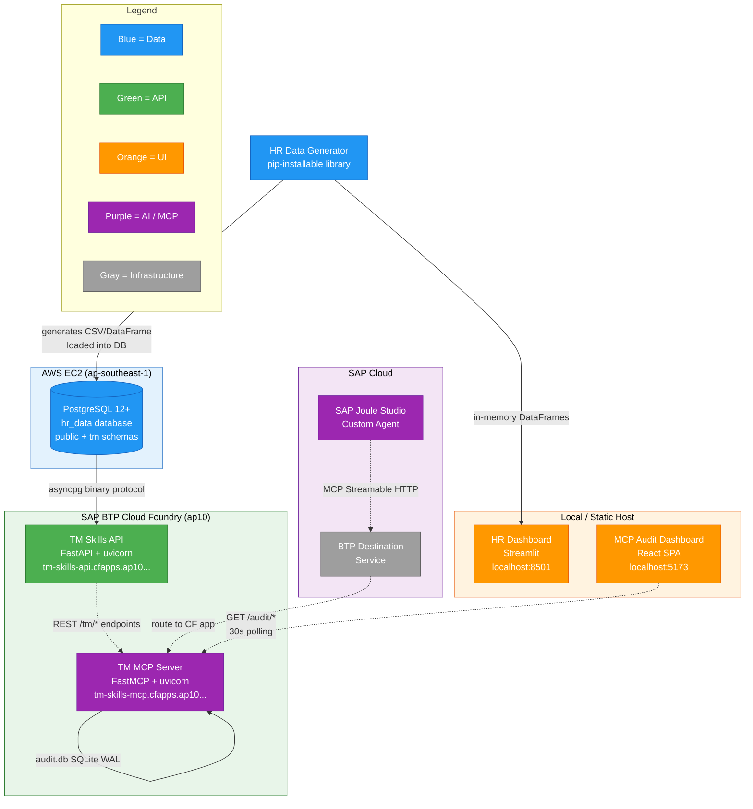
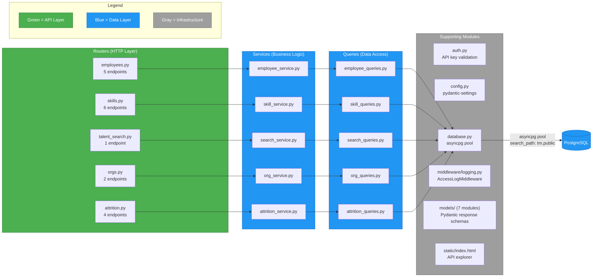
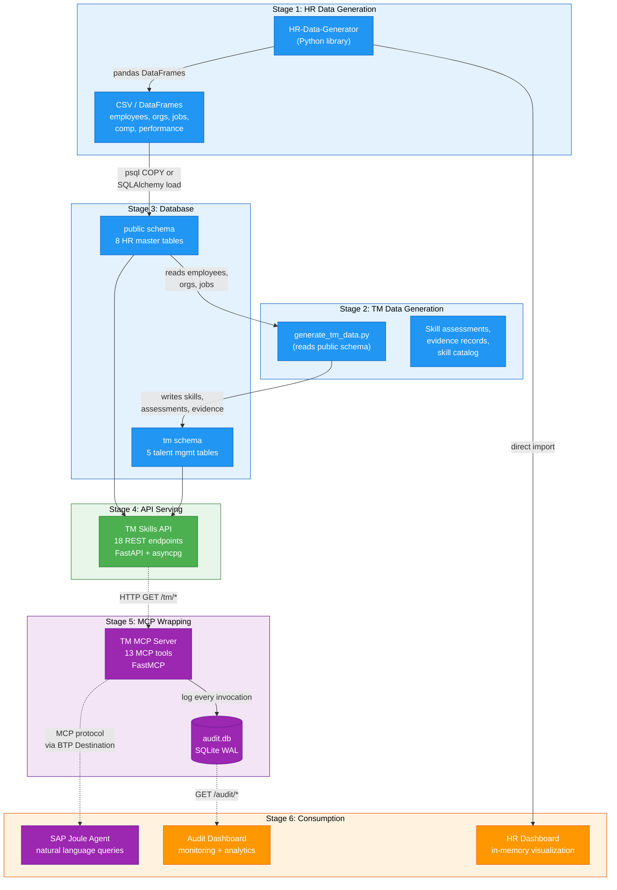

# Architecture

This chapter describes the system architecture of the Talent Management demo -- the five repositories that form it, how they connect, the layered design inside the main API, the end-to-end data flow, and the technology choices that underpin each layer.

---

## Ecosystem Overview

The demo is distributed across five repositories, each owning a distinct responsibility in the pipeline from synthetic data generation through AI-assisted talent queries. The table below summarizes each component, followed by an architecture diagram showing their deployment locations and data flow.

| Repository | Purpose | Tech Stack |
|:-----------|:--------|:-----------|
| **HR-Data-Generator** | Python library that generates synthetic HR datasets (employees, orgs, jobs, compensation, performance) | Python 3.10, pandas, NumPy |
| **talent-management-app** | REST API serving 14+ business questions against PostgreSQL; deployed on SAP BTP Cloud Foundry | FastAPI, asyncpg, PostgreSQL |
| **tm-mcp-server** | MCP server wrapping the REST API as 13 MCP tools for SAP Joule Studio integration; includes audit logging | Python 3.10, FastMCP, SQLite |
| **hr-data-dashboard** | Interactive visualization dashboard for HR data exploration | Streamlit, Plotly, Pydeck, PyVis |
| **mcp-audit-dashboard** | Monitoring SPA that visualizes MCP tool invocations, latencies, and error rates | React 19, TypeScript, Recharts, TanStack |

### System Architecture Diagram

The following diagram shows all five components, their deployment targets, and the data flow between them. The PostgreSQL database runs on an AWS EC2 instance in `ap-southeast-1` (Singapore). The TM Skills API and MCP Server are deployed as separate Cloud Foundry applications on SAP BTP `ap10` (also Singapore, minimizing cross-region latency). The HR Dashboard runs locally via Streamlit, while the MCP Audit Dashboard is a React SPA that can run locally or be statically hosted.



**Key observations from the diagram:**

- **Region co-location.** The PostgreSQL database (AWS `ap-southeast-1`) and the BTP applications (`ap10` Singapore) are in the same geographic region. This was a deliberate choice to keep query latency under 5 ms for database calls.
- **MCP as a thin wrapper.** The MCP server does not access PostgreSQL directly. It forwards every tool invocation as an HTTP request to the TM Skills API, which owns all database access. This separation means the MCP server can be redeployed without touching the API, and vice versa.
- **BTP Destination routing.** SAP Joule Studio connects to the MCP server through BTP's Destination Service, which handles URL routing and (optionally) authentication token injection. This is the standard SAP pattern for connecting cloud services to custom backends.
- **Dual data paths.** The HR Dashboard generates data in-memory using the HR Data Generator library directly, while the TM Skills API reads from PostgreSQL. These are two independent consumption paths for the same conceptual data.

---

For a detailed inventory of each deployable component, see [Component Inventory](component-inventory.md).

---

## Three-Layer Application Architecture

The `talent-management-app` repository follows a clean three-layer architecture that separates HTTP concerns, business logic, and data access. Each layer is a Python package under `app/`, and each business domain (employees, skills, search, orgs, attrition) has a dedicated module in every layer.

```
app/
 +-- routers/      HTTP endpoint definitions, parameter validation
 +-- services/     Business logic, data transformation, multi-query orchestration
 +-- queries/      Pure SQL strings + asyncpg execution
```

### Layer Diagram



### Layer Responsibilities

**Routers (5 modules, 18 endpoints total).** Each router is a FastAPI `APIRouter` that defines HTTP endpoints for one business domain. Routers handle parameter validation (path parameters, query strings), apply the API key authentication dependency, and delegate to the corresponding service. They are thin -- typically 5-15 lines per endpoint function. The full endpoint inventory:

| Router | Prefix | Endpoints |
|:-------|:-------|:----------|
| `employees.py` | `/tm/employees` | `search`, `{id}/skills`, `{id}/skills/{skill_id}/evidence`, `{id}/top-skills`, `{id}/evidence` |
| `skills.py` | `/tm/skills` | `browse`, `{id}/experts`, `{id}/coverage`, `{id}/candidates`, `{id}/stale`, `{id}/cooccurring` |
| `talent_search.py` | `/tm/talent` | `search` (multi-skill AND search) |
| `orgs.py` | `/tm/orgs` | `{id}/skills/summary`, `{id}/skills/{skill_id}/experts` |
| `attrition.py` | `/tm/attrition` | `employees/{id}`, `employees` (all), `high-risk`, `orgs/{id}/summary` |

**Services (5 modules).** Services contain business logic that may span multiple queries. For example, a service method might call two queries, merge results, compute derived fields, and return a Pydantic model. Services never import FastAPI -- they are framework-agnostic Python functions that accept an asyncpg `Connection` and domain parameters.

**Queries (5 modules).** Each query module contains SQL strings and thin async functions that execute them against the database via asyncpg. The `database.py` module configures the connection pool with `search_path: tm,public`, so queries can reference tables in both schemas without explicit prefixes. This is the only layer that touches SQL.

### Supporting Modules

| Module | Role |
|:-------|:-----|
| `auth.py` | FastAPI dependency that validates the `X-API-Key` header against a configured set of keys. When `API_KEYS` is empty, authentication is disabled (development mode). |
| `config.py` | Uses `pydantic-settings` to load configuration from environment variables and `.env` files. Defines database connection parameters, CORS origins, API keys, and rate limiting settings. |
| `database.py` | Manages an asyncpg connection pool. Created at startup via FastAPI's `lifespan` context manager, closed at shutdown. The pool is sized between `DB_MIN_POOL` (2) and `DB_MAX_POOL` (10) connections. |
| `middleware/logging.py` | `AccessLogMiddleware` that logs structured request data (method, path, status, duration) for every incoming request. |
| `models/` | Seven Pydantic model modules (`employee.py`, `skill.py`, `evidence.py`, `search.py`, `org.py`, `attrition.py`, `common.py`) defining response schemas for the API. These models also drive the OpenAPI specification. |
| `static/index.html` | An interactive API explorer page served at the root URL, providing a browser-based interface to test endpoints without external tools. |

---

## End-to-End Data Flow

Data moves through the system in a six-stage pipeline, from synthetic generation to end-user consumption. The diagram below traces this journey.



### Stage-by-Stage Walkthrough

**Stage 1 -- HR Data Generation.** The `HR-Data-Generator` library produces eight interconnected HR tables as pandas DataFrames: employee master records, organizational units, job roles, job assignments (with history), compensation records, performance reviews, locations, and employment types. The generator supports configurable parameters for employee count, date ranges, attrition rates, and noise levels (for ML difficulty). Output is loaded into PostgreSQL's `public` schema using either `psql COPY` commands or a SQLAlchemy-based loader script. See [Data Generation Module](../data-generation/index.md) for implementation details.

**Stage 2 -- TM Data Generation.** The `generate_tm_data.py` script in the `talent-management-app` repository reads employee and organizational data from the `public` schema, then generates talent management data: a skill catalog, skill assessments (employee-skill-proficiency triples), and evidence records (certifications, project contributions, peer endorsements) that substantiate each assessment. This data is written to the `tm` schema. The two-schema design keeps HR master data cleanly separated from derived talent data. See [Database Design](../data-model/index.md) for schema details.

**Stage 3 -- Database.** PostgreSQL 12+ runs on an AWS EC2 instance in `ap-southeast-1`. The `hr_data` database contains two schemas: `public` holds the eight HR master tables, and `tm` holds the talent management tables. The asyncpg connection pool in the API is configured with `search_path: tm,public`, allowing queries to reference tables in either schema without explicit prefixes.

**Stage 4 -- API Serving.** The TM Skills API exposes 18 REST endpoints across five routers. Each request flows through the three-layer architecture (router, service, query) described in the Three-Layer Application Architecture section above. The API reads from both schemas and returns JSON responses shaped by Pydantic models. All endpoints except `/health` require an `X-API-Key` header. Rate limiting (60 requests/minute by default) is enforced via SlowAPI.

**Stage 5 -- MCP Wrapping.** The TM MCP Server registers 13 of the API's endpoints as MCP tools using FastMCP's `@mcp.tool()` decorator. When an MCP client (such as a Joule agent) invokes a tool, the server translates the call into an HTTP GET request to the corresponding API endpoint, forwards the response, and logs the invocation to `audit.db` (a SQLite database in WAL mode). The server also exposes three REST endpoints (`/audit/recent`, `/audit/query`, `/audit/summary`) for the audit dashboard to consume. See [Business Questions & SQL Query Design](../business-queries/index.md) for the full tool-to-question mapping.

**Stage 6 -- Consumption.** Three consumers sit at the end of the pipeline:
- **SAP Joule Agent** sends natural language queries that the Joule framework translates into MCP tool calls, routed through BTP Destination Service to the MCP server.
- **MCP Audit Dashboard** polls the MCP server's `/audit/*` REST endpoints every 30 seconds, rendering tool usage charts, latency distributions, session timelines, and error rates.
- **HR Dashboard** takes a separate path entirely -- it imports the `HR-Data-Generator` library directly, generates data in-memory, and visualizes it using Streamlit, Plotly, Pydeck, and PyVis. It does not connect to PostgreSQL or the API.

---

## Technology Stack

The technology choices are organized into five layers, from the bottom of the stack (infrastructure) to the top (presentation). Each layer was selected to balance developer productivity, deployment simplicity, and the constraints of the SAP BTP platform.

### Technology Layers Diagram

```mermaid
graph TB
    subgraph Infra["Infrastructure Layer"]
        CF["SAP BTP Cloud Foundry\n(ap10 Singapore)"]
        EC2["AWS EC2\n(ap-southeast-1)"]
        DEST2["BTP Destination Service"]
    end

    subgraph Data["Data Layer"]
        PG2["PostgreSQL 12+\npublic + tm schemas"]
        ASYNCPG["asyncpg\nasync binary protocol"]
        SQLITE2["SQLite WAL\naudit logging"]
    end

    subgraph App["Application Layer"]
        FASTAPI["FastAPI\nasync web framework"]
        PYDANTIC["pydantic-settings\nenv var config"]
        SLOWAPI["SlowAPI\nrate limiting"]
        UVICORN["uvicorn\nASGI server"]
    end

    subgraph AI["AI / MCP Layer"]
        FASTMCP["FastMCP\nPython MCP SDK"]
        OPENAPI["OpenAPI 3.0.3\nspec for Joule"]
        AIOSQLITE["aiosqlite\nasync SQLite driver"]
    end

    subgraph Pres["Presentation Layer"]
        STREAMLIT["Streamlit + Plotly\n+ Pydeck + PyVis"]
        REACT["React 19 + TypeScript"]
        RECHARTS["Recharts + TanStack"]
        TAILWIND["Tailwind CSS v4"]
    end

    Pres --> AI --> App --> Data --> Infra

    style Infra fill:#9E9E9E,stroke:#616161,color:#fff
    style Data fill:#2196F3,stroke:#1565C0,color:#fff
    style App fill:#4CAF50,stroke:#2E7D32,color:#fff
    style AI fill:#9C27B0,stroke:#6A1B9A,color:#fff
    style Pres fill:#FF9800,stroke:#E65100,color:#fff

    style CF fill:#9E9E9E,stroke:#616161,color:#fff
    style EC2 fill:#9E9E9E,stroke:#616161,color:#fff
    style DEST2 fill:#9E9E9E,stroke:#616161,color:#fff
    style PG2 fill:#2196F3,stroke:#1565C0,color:#fff
    style ASYNCPG fill:#2196F3,stroke:#1565C0,color:#fff
    style SQLITE2 fill:#2196F3,stroke:#1565C0,color:#fff
    style FASTAPI fill:#4CAF50,stroke:#2E7D32,color:#fff
    style PYDANTIC fill:#4CAF50,stroke:#2E7D32,color:#fff
    style SLOWAPI fill:#4CAF50,stroke:#2E7D32,color:#fff
    style UVICORN fill:#4CAF50,stroke:#2E7D32,color:#fff
    style FASTMCP fill:#9C27B0,stroke:#6A1B9A,color:#fff
    style OPENAPI fill:#9C27B0,stroke:#6A1B9A,color:#fff
    style AIOSQLITE fill:#9C27B0,stroke:#6A1B9A,color:#fff
    style STREAMLIT fill:#FF9800,stroke:#E65100,color:#fff
    style REACT fill:#FF9800,stroke:#E65100,color:#fff
    style RECHARTS fill:#FF9800,stroke:#E65100,color:#fff
    style TAILWIND fill:#FF9800,stroke:#E65100,color:#fff

    subgraph Legend
        LI["Gray = Infrastructure"]
        LD["Blue = Data"]
        LA["Green = Application"]
        LAI["Purple = AI / MCP"]
        LP["Orange = Presentation"]
    end
    style LI fill:#9E9E9E,stroke:#616161,color:#fff
    style LD fill:#2196F3,stroke:#1565C0,color:#fff
    style LA fill:#4CAF50,stroke:#2E7D32,color:#fff
    style LAI fill:#9C27B0,stroke:#6A1B9A,color:#fff
    style LP fill:#FF9800,stroke:#E65100,color:#fff
```



### Layer Details

**Infrastructure Layer.** Two cloud platforms host the running components:

- **SAP BTP Cloud Foundry (`ap10`).** Both the TM Skills API and TM MCP Server are deployed here as Cloud Foundry applications using the Python buildpack. CF provides automatic HTTPS, health monitoring (HTTP health check on `/health`), log aggregation, and environment variable injection. Each application is allocated 256 MB memory and 512 MB disk.
- **AWS EC2 (`ap-southeast-1`).** PostgreSQL runs on an EC2 instance in the same Singapore region as BTP `ap10`. This co-location keeps database round-trip times low. The instance is manually managed (not RDS) to keep costs minimal for a demo environment.
- **BTP Destination Service.** Provides URL routing from SAP Joule Studio to the MCP server's Cloud Foundry route. The Destination configuration stores the target URL and can optionally inject authentication headers, decoupling the Joule agent from direct knowledge of the backend URL.

**Data Layer.** Two database engines serve different needs:

- **PostgreSQL 12+** stores all HR and talent management data. The `hr_data` database uses two schemas: `public` for the eight HR master tables and `tm` for the five talent management tables. PostgreSQL was chosen for its mature support for complex analytical queries (window functions, CTEs, lateral joins) that power the business questions.
- **asyncpg** is the PostgreSQL driver, chosen over psycopg2 for its async-native design and binary protocol support, which provides measurably lower latency than text-mode drivers. The connection pool is configured with 2-10 connections.
- **SQLite in WAL mode** is used exclusively by the MCP server for audit logging. WAL (Write-Ahead Logging) allows concurrent reads while writes are in progress, which is important because audit reads (from the dashboard) and writes (from tool invocations) happen simultaneously. SQLite was chosen over PostgreSQL for audit data because it requires zero infrastructure -- the database file lives alongside the application on the CF container's ephemeral disk.

**Application Layer.** The TM Skills API is built on:

- **FastAPI** for async request handling, automatic OpenAPI spec generation, and dependency injection (used for database connections and authentication).
- **pydantic-settings** for type-safe configuration from environment variables, with `.env` file fallback for local development.
- **SlowAPI** for rate limiting (default: 60 requests/minute per IP), protecting the API from accidental overuse during demos.
- **uvicorn** as the ASGI server, running with a single worker on Cloud Foundry (CF manages scaling via instances, not workers).

**AI / MCP Layer.** The MCP server bridges the REST API to the Model Context Protocol:

- **FastMCP** (Anthropic's Python MCP SDK) provides the `@mcp.tool()` decorator for registering tools, the streamable HTTP transport for MCP clients, and resource/prompt template support. The server implements MCP specification version `2025-03-26`.
- **OpenAPI 3.0.3** specification (`openapi.json`) is generated by FastAPI and consumed by SAP Joule Studio to understand the API's capabilities during agent configuration.
- **aiosqlite** provides async SQLite access for the audit logger, matching the async architecture of the rest of the server.

**Presentation Layer.** Two dashboards serve different audiences:

- **HR Dashboard** uses **Streamlit** as the application framework with **Plotly** for interactive charts, **Pydeck** for geographic map visualizations, and **PyVis** (via NetworkX) for organizational hierarchy network graphs. It generates data in-memory and does not require a running backend.
- **MCP Audit Dashboard** is a **React 19** SPA written in **TypeScript 5.9**, built with **Vite 7.3**. It uses **Recharts** for charts (donut, bar, area, scatter, histogram), **TanStack Table** for sortable/paginated data grids, **TanStack Query** for data fetching with 30-second polling, and **Tailwind CSS v4** (CSS-first configuration, no `tailwind.config.js`) for styling. The dashboard follows a dark-theme-only design with a consistent color map across all 13 MCP tools.

---

## Key Architectural Decisions

Several design decisions shaped the architecture. These are worth noting because they represent deliberate tradeoffs rather than defaults.

**Separate MCP server rather than embedded in the API.** The MCP server is a standalone application rather than an additional endpoint on the FastAPI server. This means two CF deployments instead of one, but it provides independent scaling, independent release cycles, and a clean separation between the REST API (which serves multiple consumers) and the MCP protocol (which serves only Joule). It also means the MCP server can be swapped or upgraded without risk to the API.

**Two schemas in one database rather than two databases.** The `public` and `tm` schemas share a single PostgreSQL database (`hr_data`). This simplifies cross-schema joins (e.g., enriching skill records with employee names) while maintaining logical separation. The `search_path` setting in asyncpg handles schema resolution transparently.

**SQLite for audit rather than PostgreSQL.** Audit data is written to a local SQLite file on the MCP server's container. This eliminates a network hop for every audit write (which happens on every tool call) and removes a dependency on PostgreSQL availability for the monitoring subsystem. The tradeoff is that audit data is lost if the CF container is recreated -- acceptable for a demo but not for production. See [Learnings](../learnings/index.md) for discussion of this tradeoff.

**Polling over WebSockets for the audit dashboard.** The audit dashboard polls the MCP server every 30 seconds rather than maintaining a WebSocket connection. For a monitoring dashboard where 30-second data freshness is sufficient, polling is simpler, more resilient to disconnections, and requires no server-side state management. TanStack Query's `refetchInterval` provides this out of the box.

**In-memory data for the HR dashboard.** The HR Dashboard generates data fresh each time it starts rather than reading from PostgreSQL. This makes it fully self-contained -- a user can run `streamlit run app.py` with no backend infrastructure. The tradeoff is that the dashboard's data and the API's data are generated independently and may differ in detail, though they follow the same generation logic.

---

## Cross-References

- [Introduction](../index.md) -- Project motivation and demo overview
- [Database Design](../data-model/index.md) -- Schema details for the `public` and `tm` schemas
- [Data Generation Module](../data-generation/index.md) -- HR Data Generator implementation
- [Business Questions & SQL Query Design](../business-queries/index.md) -- The 14+ business questions and their SQL implementations
- [Deployment](../deployment/index.md) -- Cloud Foundry and AWS deployment procedures
- [Learnings](../learnings/index.md) -- Key takeaways and architectural tradeoffs
- [Component Inventory](component-inventory.md) -- Detailed inventory of each deployable component
