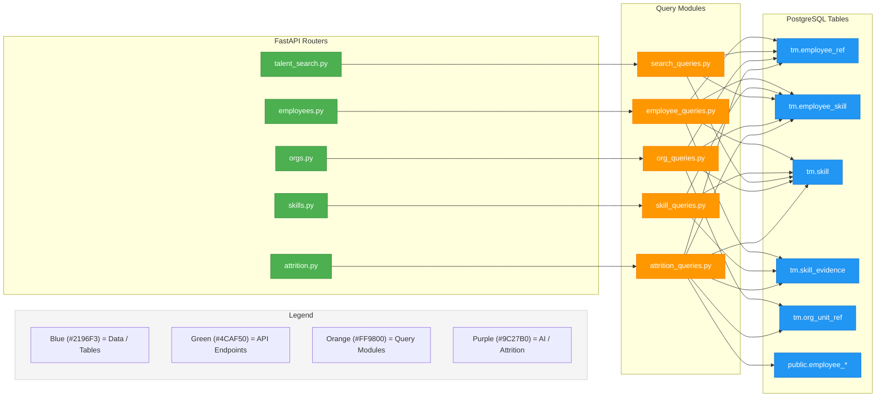
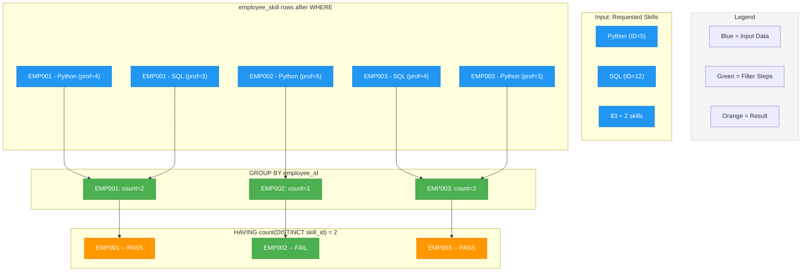
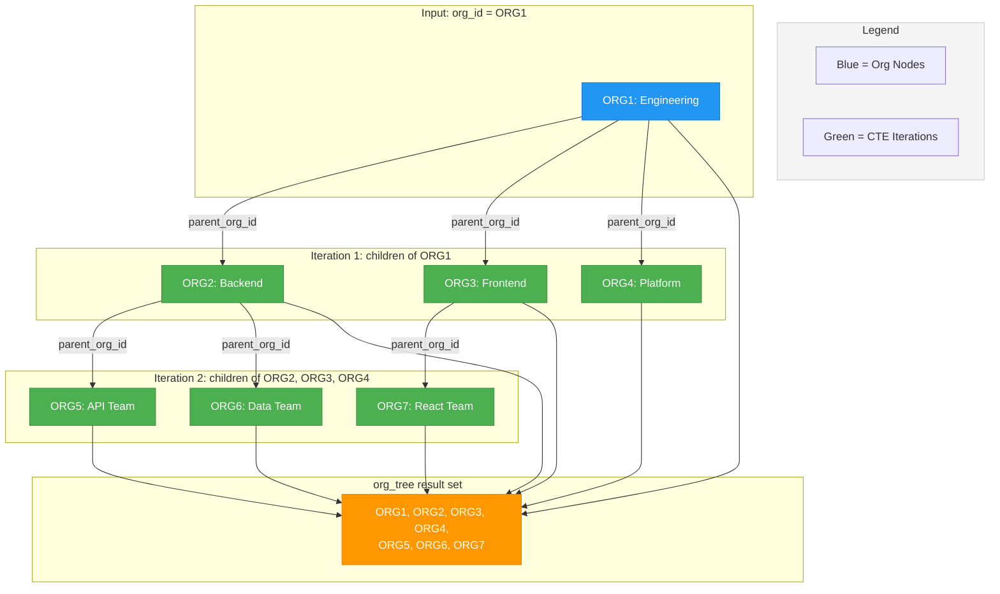
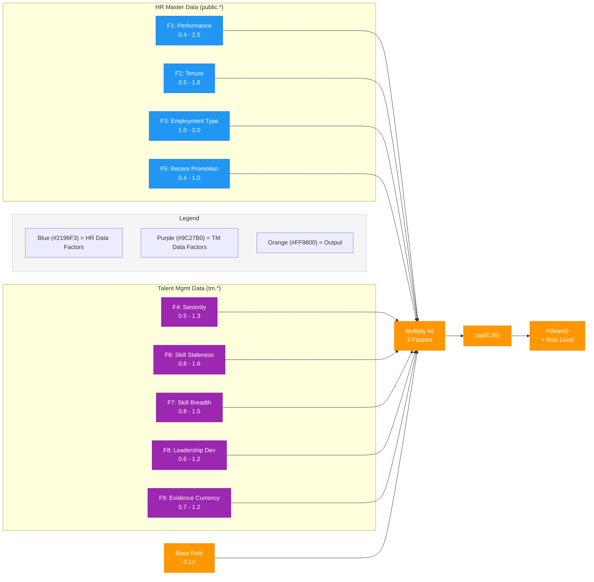

# Business Questions & SQL Query Design

> **Previous:** [Data Generation Module](../data-generation/index.md) | **Next:** [Deployment](../deployment/index.md)

---

## Overview

The Talent Management Skills API answers **12 distinct business questions** through **14+ GET endpoints**, plus 4 additional endpoints for attrition prediction. Every question maps to a curated SQL query stored in dedicated `app/queries/` modules. There is no ORM in the stack -- all SQL is hand-written, using asyncpg's `$1, $2, ...` positional parameters for parameterized (prepared) statements.

This design decision is deliberate. The queries leverage PostgreSQL features -- recursive CTEs, self-joins, window functions, relational division via `HAVING`, and `LATERAL` joins -- that would be awkward or impossible to express idiomatically through an ORM. The resulting architecture keeps SQL isolated in query modules, called by service modules, which are invoked by FastAPI routers:

```
routers/  -->  services/  -->  queries/
(HTTP)         (logic)         (SQL strings)
```

The tables referenced throughout this chapter (`employee_ref`, `employee_skill`, `skill`, `skill_evidence`, `org_unit_ref`) live in the `tm` schema and are detailed in [Database Design](../data-model/index.md). HR master-data tables (`employee`, `employee_performance`, `employee_job_assignment`) live in the `public` schema and are joined only for the attrition prediction module.



---

## Question-to-Endpoint Map

The 12 business questions are organized into four functional groups. Each maps to one or more API endpoints with specific query parameters.

### Employee-Centric Questions (Endpoints 1, 2, 8, 10, search)

| # | Business Question | Endpoint | Key Parameters |
|---|-------------------|----------|----------------|
| -- | "Find employees by name" | `GET /tm/employees/search` | `name`, `limit` (1-100) |
| 1 | "What skills does employee X have?" | `GET /tm/employees/{id}/skills` | -- |
| 2 | "Why do we think X is proficient in skill Y?" | `GET /tm/employees/{id}/skills/{skill_id}/evidence` | -- |
| 8 | "What are X's top N skills?" | `GET /tm/employees/{id}/top-skills` | `limit` (default 10) |
| 10 | "What evidence exists for X across all skills?" | `GET /tm/employees/{id}/evidence` | -- |

### Skill-Centric Questions (Endpoints 3, 4, 6, 7, 9, 11)

| # | Business Question | Endpoint | Key Parameters |
|---|-------------------|----------|----------------|
| 11 | "What skills exist in the catalog?" | `GET /tm/skills` | `category`, `search` |
| 3 | "Who are the top experts in skill Y?" | `GET /tm/skills/{id}/experts` | `min_proficiency`, `limit` |
| 4 | "How many employees have skill Y at proficiency >= N?" | `GET /tm/skills/{id}/coverage` | `min_proficiency` |
| 6 | "Who has skill Y AND strong evidence?" | `GET /tm/skills/{id}/candidates` | `min_proficiency`, `min_evidence_strength` |
| 7 | "Whose skill Y hasn't been validated recently?" | `GET /tm/skills/{id}/stale` | `older_than_days` (default 365) |
| 9 | "What skills co-occur with skill Y?" | `GET /tm/skills/{id}/cooccurring` | `min_proficiency`, `top` |

### Multi-Skill Search (Endpoint 5)

| # | Business Question | Endpoint | Key Parameters |
|---|-------------------|----------|----------------|
| 5 | "Who has BOTH Python AND SQL at proficiency >= N?" | `GET /tm/talent/search` | `skills` (comma-separated), `min_proficiency` |

### Organization-Level (Endpoint 12)

| # | Business Question | Endpoint | Key Parameters |
|---|-------------------|----------|----------------|
| 12a | "What are the top skills in org X?" | `GET /tm/orgs/{id}/skills/summary` | `limit` |
| 12b | "Who in org X has skill Y?" | `GET /tm/orgs/{id}/skills/{skill_id}/experts` | `min_proficiency` |

All employee IDs follow the pattern `EMP\d{6}` (e.g., `EMP000142`), and org IDs follow `ORG\d{1,4}[A-Z]?` (e.g., `ORG12A`). FastAPI path parameter validation enforces these patterns before the query layer is reached.

---

## SQL Pattern Deep Dives

The queries span a range of SQL complexity, from simple filtered joins to advanced patterns that merit closer examination. This section walks through five key patterns, explaining why each was chosen and how it works.

### Filtered Joins -- The Baseline Pattern

Most endpoints follow the same structural template: join `employee_skill` with `skill` (and optionally `employee_ref` or `skill_evidence`), apply `WHERE` filters from query parameters, and `ORDER BY` relevance columns.

**Endpoint 1 -- Employee Skill Profile:**

```sql
SELECT s.skill_id, s.name AS skill_name, s.category,
       es.proficiency, es.confidence, es.source, es.last_updated_at
FROM employee_skill es
JOIN skill s ON s.skill_id = es.skill_id
WHERE es.employee_id = $1
ORDER BY es.proficiency DESC, es.confidence DESC, s.name
```

**Endpoint 8 -- Top Skills (Skill Passport):**

```sql
SELECT s.skill_id, s.name AS skill_name, s.category,
       es.proficiency, es.confidence, es.source, es.last_updated_at
FROM employee_skill es
JOIN skill s ON s.skill_id = es.skill_id
WHERE es.employee_id = $1
ORDER BY es.proficiency DESC, es.confidence DESC, es.last_updated_at DESC
LIMIT $2
```

The only difference between Endpoints 1 and 8 is the `LIMIT $2` clause and the tie-breaking sort on `last_updated_at`. This illustrates the design philosophy: rather than building one "god query" with conditional clauses, each endpoint gets its own purpose-specific query. The duplication is minimal, and each query is independently testable.

**Endpoint 2 -- Skill Evidence:**

```sql
SELECT evidence_id, evidence_type, title, issuer_or_system,
       evidence_date, url_or_ref, signal_strength, notes, created_at
FROM skill_evidence
WHERE employee_id = $1 AND skill_id = $2
ORDER BY signal_strength DESC, evidence_date DESC NULLS LAST
```

Note `NULLS LAST` -- some evidence records (e.g., peer endorsements) may lack a formal date. PostgreSQL sorts `NULL` as highest by default in `DESC` order, which would push undated items to the top. `NULLS LAST` corrects this.

### Relational Division -- Multi-Skill AND Search (Endpoint 5)

This is the most conceptually interesting query in the system. When a user searches for employees who know "Python AND SQL AND Docker," the system must enforce AND semantics -- the employee must have *all* specified skills at the required proficiency, not just any one of them.

**Step 1 -- Resolve skill names to IDs:**

```sql
SELECT skill_id, name
FROM skill
WHERE name ILIKE ANY($1) AND is_active = TRUE
```

The `ILIKE ANY($1)` construct accepts a PostgreSQL array of patterns, enabling case-insensitive matching for multiple skill names in a single query.

**Step 2 -- Relational division via HAVING:**

```sql
SELECT es.employee_id
FROM employee_skill es
WHERE es.skill_id = ANY($1) AND es.proficiency >= $2
GROUP BY es.employee_id
HAVING count(DISTINCT es.skill_id) = $3
```

This is a classic **relational division** pattern. The `WHERE` clause filters to rows matching *any* of the requested skills at sufficient proficiency. The `GROUP BY` collapses to one row per employee. The `HAVING count(DISTINCT es.skill_id) = $3` is the key: `$3` equals the total number of requested skills. An employee only passes this filter if they have *every* requested skill -- not just some.

Without `HAVING`, this would be an OR search. The `count(DISTINCT ...) = N` comparison converts it to AND.



EMP002 only has Python (count=1), so `HAVING count = 2` filters them out. Only EMP001 and EMP003 -- who have *both* skills -- survive.

**Step 3 -- Fetch matched skill details:**

After the division query returns qualifying `employee_id` values, a third query fetches the full skill details (proficiency, confidence, source, last update) for display.

### Recursive CTE -- Org Hierarchy Traversal (Endpoint 12)

Organization structures are inherently hierarchical: "Engineering" contains "Backend," "Frontend," and "Platform," each of which may contain sub-teams. When a manager asks "What are the top skills in my org?", the query must include all descendant org units.

**The recursive CTE:**

```sql
WITH RECURSIVE org_tree AS (
    -- Base case: the starting org
    SELECT org_id FROM org_unit_ref WHERE org_id = $1
    UNION ALL
    -- Recursive step: find children
    SELECT o.org_id FROM org_unit_ref o
    JOIN org_tree t ON o.parent_org_id = t.org_id
)
```

This walks the `parent_org_id` chain: start with the requested org, then find all orgs whose `parent_org_id` matches any org already in the result set, repeating until no more children exist.

**Org skill summary (built on the CTE):**

```sql
WITH RECURSIVE org_tree AS (
    SELECT org_id FROM org_unit_ref WHERE org_id = $1
    UNION ALL
    SELECT o.org_id FROM org_unit_ref o
    JOIN org_tree t ON o.parent_org_id = t.org_id
)
SELECT s.skill_id, s.name, s.category,
       count(DISTINCT es.employee_id)::int AS employee_count,
       round(avg(es.proficiency), 1)       AS avg_proficiency
FROM org_tree ot
JOIN employee_ref er ON er.org_id = ot.org_id
JOIN employee_skill es ON es.employee_id = er.employee_id
JOIN skill s ON s.skill_id = es.skill_id
GROUP BY s.skill_id, s.name, s.category
ORDER BY employee_count DESC, avg_proficiency DESC
LIMIT $2
```

The `org_tree` CTE is reused across multiple endpoint-12 queries (skill summary, expert finder, employee count), demonstrating the composability of CTEs. The same tree-walking logic defined once supports several different aggregations.



Querying "Engineering" (ORG1) automatically includes all 6 descendant orgs. The same `org_tree` CTE is then joined to `employee_ref` and `employee_skill` to aggregate skill data across the entire subtree.

### Self-Join for Co-occurrence (Endpoint 9)

Endpoint 9 answers the question "People who know X also know Y" -- a pattern familiar from market-basket analysis (association rules). The SQL uses a self-join on `employee_skill`:

```sql
SELECT s2.name, count(*) AS co_occurrence_count
FROM employee_skill es1
JOIN employee_skill es2 ON es1.employee_id = es2.employee_id
                       AND es1.skill_id != es2.skill_id
WHERE es1.skill_id = $1 AND es1.proficiency >= $2
GROUP BY s2.skill_id, s2.name
ORDER BY co_occurrence_count DESC
LIMIT $3
```

The self-join matches each employee who has the target skill (`es1.skill_id = $1`) with every *other* skill that same employee has (`es1.skill_id != es2.skill_id`). Grouping by the second skill and counting gives the co-occurrence frequency. The result reveals which skills cluster together in practice -- for example, employees strong in "Python" also tend to know "Data Analysis," "SQL," and "Machine Learning."

This is computationally equivalent to computing the support count in association rule mining, but expressed as a single SQL statement rather than a multi-pass algorithm.

### Additional Patterns

**Staleness detection (Endpoint 7):**

```sql
EXTRACT(DAY FROM now() - es.last_updated_at)::int AS days_since_update
```

PostgreSQL's `EXTRACT(DAY FROM interval)` converts a timestamp difference to an integer day count, enabling threshold filtering (`WHERE days_since_update > $2`). This powers the "governance / freshness" use case: identifying skill records that may need re-validation.

**ILIKE for case-insensitive search:**

The name search endpoint and skill taxonomy browsing both use `ILIKE` with `%` wildcards:

```sql
WHERE display_name ILIKE '%' || $1 || '%'
```

This is PostgreSQL-specific (standard SQL only defines `LIKE`). For a production system with thousands of employees, a trigram index (`pg_trgm`) would accelerate these queries, but for the demo's data volumes, sequential scan is acceptable.

**Proficiency distribution (Endpoint 4):**

The coverage endpoint returns not just a count but a histogram -- how many employees are at each proficiency level (0 through 5). This uses a `GROUP BY proficiency` aggregation to produce a distribution that can be rendered as a bar chart on the client.

---

## Attrition Prediction Queries

Beyond the 12 skill-centric questions, the application includes an **attrition prediction module** with 4 additional endpoints. This module bridges the `tm` schema (skills, evidence) and the `public` schema (HR master data) to compute a deterministic risk score for each employee.

### Attrition Endpoints

| Endpoint | Path | Purpose |
|----------|------|---------|
| Single employee | `GET /tm/attrition/employees/{id}` | Full risk score with 9-factor breakdown |
| Paginated list | `GET /tm/attrition/employees` | Browse all employees, filter by risk level, sortable |
| High-risk | `GET /tm/attrition/high-risk` | Employees above a probability threshold |
| Org summary | `GET /tm/attrition/orgs/{id}/summary` | Org-level risk distribution and top-N riskiest |

### The 9-Factor Deterministic Model

The risk score is computed as a product of a base rate and nine multiplicative factors. Five factors come from HR master data (`public.*` tables), and four come from talent management data (`tm.*` tables).

| # | Factor | Source Table | Multiplier Range | Rationale |
|---|--------|-------------|-------------------|-----------|
| 1 | Performance Rating | `public.employee_performance` | 0.4 -- 2.5 | Low performers leave (or are managed out) |
| 2 | Tenure | `public.employee` (hire_date) | 0.5 -- 1.8 | First-year employees churn most |
| 3 | Employment Type | `public.employee` | 1.0 -- 2.0 | Contractors churn at 2x full-time |
| 4 | Seniority Level | `tm.employee_ref` | 0.5 -- 1.3 | Junior staff more mobile |
| 5 | Recent Promotion | `public.employee_job_assignment` | 0.4 -- 1.0 | Recently promoted = less likely to leave |
| 6 | Skill Staleness | `tm.employee_skill` (avg days) | 0.8 -- 1.6 | Stale skills = disengaged |
| 7 | Skill Breadth | `tm.employee_skill` (count) | 0.8 -- 1.5 | Very few skills = fewer options internally |
| 8 | Leadership Development | `tm.employee_skill` + `tm.skill` | 0.6 -- 1.2 | Senior with leadership skills = invested |
| 9 | Evidence Currency | `tm.skill_evidence` (last 12mo) | 0.7 -- 1.2 | Recent evidence = active development |

**Formula:**

```
P(leave) = 0.12 x f1 x f2 x f3 x f4 x f5 x f6 x f7 x f8 x f9
```

The result is capped at 0.95 (no employee is 100% certain to leave). The base rate of 0.12 (12%) reflects typical industry annual attrition.

**Risk level classification:**

| Level | Probability Range |
|-------|-------------------|
| Low | < 0.10 |
| Medium | 0.10 -- 0.25 |
| High | 0.25 -- 0.50 |
| Critical | 0.50 -- 0.95 |

**Multiplier examples:**

- **Performance:** Rating 1 (lowest) maps to 2.5x; rating 5 maps to 0.4x. A top performer is 6x less likely to leave than a bottom performer, all else equal.
- **Tenure:** Less than 1 year yields 1.8x; 10+ years yields 0.5x. This reflects the well-documented "new hire churn" pattern.
- **Recent Promotion:** Promoted within 18 months = 0.4x; no promotion = 1.0x. Promotions are strong retention signals.
- **Skill Staleness:** Skills not updated in 2+ years = 1.6x. This factor connects talent management data to retention -- employees whose skills go stale may be disengaging.



### Feature Extraction SQL

The single-employee feature extraction query uses multiple CTEs to pull each factor from a different table in a single round-trip:

```sql
WITH
  perf AS (
    SELECT rating
    FROM public.employee_performance
    WHERE employee_id = $1
    ORDER BY review_date DESC LIMIT 1
  ),
  promo AS (
    SELECT EXISTS(
      SELECT 1 FROM public.employee_job_assignment
      WHERE employee_id = $1
        AND start_date >= now() - interval '18 months'
    ) AS recently_promoted
  ),
  skill_stats AS (
    SELECT avg(EXTRACT(DAY FROM now() - last_updated_at))::int AS avg_days_since_update,
           count(*)::int AS skill_count
    FROM employee_skill
    WHERE employee_id = $1
  ),
  leadership AS (
    SELECT EXISTS(
      SELECT 1 FROM employee_skill es
      JOIN skill s ON s.skill_id = es.skill_id
      WHERE es.employee_id = $1
        AND s.category = 'leadership'
        AND es.proficiency >= 3
    ) AS has_leadership_skills
  ),
  evidence AS (
    SELECT count(*)::int AS recent_evidence_count
    FROM skill_evidence
    WHERE employee_id = $1
      AND created_at >= now() - interval '12 months'
  )
SELECT
  er.employee_id, er.display_name, er.job_title, er.seniority_level,
  e.hire_date, e.employment_type,
  perf.rating,
  promo.recently_promoted,
  skill_stats.avg_days_since_update,
  skill_stats.skill_count,
  leadership.has_leadership_skills,
  evidence.recent_evidence_count
FROM employee_ref er
JOIN public.employee e ON e.employee_id = er.employee_id
CROSS JOIN perf, promo, skill_stats, leadership, evidence
WHERE er.employee_id = $1
```

This is a single query, but it effectively performs five sub-queries via CTEs. Each CTE extracts one feature dimension. The `CROSS JOIN` at the bottom combines them because each CTE produces exactly one row.

Note the explicit `public.` prefix on `employee_performance` and `employee_job_assignment`. Because the connection's `search_path` is `(tm, public)`, unqualified table names resolve to `tm` first. The HR tables must be explicitly schema-qualified to avoid ambiguity.

### LATERAL Joins for Batch Processing

The single-employee query works well for individual lookups, but the paginated list and org summary endpoints need scores for many employees. Issuing one query per employee (N+1 problem) would be prohibitively slow. The batch query solves this with `LATERAL` joins:

```sql
SELECT
  er.employee_id, er.display_name, er.job_title, er.seniority_level,
  e.hire_date, e.employment_type,
  perf.rating,
  promo.recently_promoted,
  ss.avg_days_since_update,
  ss.skill_count,
  ld.has_leadership_skills,
  ev.recent_evidence_count
FROM unnest($1::text[]) AS eid(employee_id)
JOIN employee_ref er ON er.employee_id = eid.employee_id
JOIN public.employee e ON e.employee_id = er.employee_id
LEFT JOIN LATERAL (
    SELECT rating FROM public.employee_performance
    WHERE employee_id = er.employee_id
    ORDER BY review_date DESC LIMIT 1
) perf ON TRUE
LEFT JOIN LATERAL (
    SELECT EXISTS(...) AS recently_promoted
) promo ON TRUE
LEFT JOIN LATERAL (
    SELECT avg(...)::int AS avg_days_since_update, count(*)::int AS skill_count
    FROM employee_skill WHERE employee_id = er.employee_id
) ss ON TRUE
LEFT JOIN LATERAL (
    SELECT EXISTS(...) AS has_leadership_skills
) ld ON TRUE
LEFT JOIN LATERAL (
    SELECT count(*)::int AS recent_evidence_count
    FROM skill_evidence
    WHERE employee_id = er.employee_id AND created_at >= now() - interval '12 months'
) ev ON TRUE
```

The `unnest($1::text[])` expands an array of employee IDs into a virtual table, and each `LATERAL` subquery runs once per row. This is PostgreSQL's equivalent of a "for-each" loop inside SQL, but the query planner can optimize across all iterations. The result is a single database round-trip instead of N separate queries.

The `LEFT JOIN LATERAL ... ON TRUE` pattern ensures that employees missing some data (e.g., no performance reviews) still appear in the result set with `NULL` values, which the service layer maps to default multipliers.

---

## Why Raw SQL over an ORM

The decision to write raw SQL instead of using an ORM like SQLAlchemy was deliberate. Here is the rationale:

**1. Full access to PostgreSQL-specific features.**
The queries use recursive CTEs (`WITH RECURSIVE`), self-joins for co-occurrence, relational division via `HAVING count(DISTINCT ...)`, `LATERAL` joins, `EXTRACT()`, `ILIKE`, `ANY()` with arrays, and `NULLS LAST`. While ORMs can express some of these, the resulting ORM code would be harder to read and debug than the SQL itself.

**2. Prepared statement safety via asyncpg.**
asyncpg's `$1, $2, ...` positional parameter syntax sends the query template and parameter values separately to PostgreSQL. The database compiles the query once and reuses the execution plan for subsequent calls with different parameters. This provides two benefits simultaneously:
- **SQL injection protection** -- parameter values are never interpolated into the query string.
- **Performance** -- PostgreSQL caches the prepared statement plan, avoiding repeated parsing and planning.

**3. Query complexity is the product, not a side effect.**
In a typical CRUD application, SQL is incidental -- the real logic is in the application layer. In this system, the SQL *is* the business logic. Each query encodes a specific analytical question. An ORM would add a layer of abstraction between the question and its answer, making the mapping harder to verify.

**4. Layered architecture keeps SQL manageable.**
The potential downside of raw SQL -- scattered query strings throughout the codebase -- is mitigated by the module structure:

```
app/queries/
    employee_queries.py    # Endpoints 1, 2, 8, 10, search
    skill_queries.py       # Endpoints 3, 4, 6, 7, 9, 11
    search_queries.py      # Endpoint 5 (multi-skill)
    org_queries.py         # Endpoint 12 (org hierarchy)
    attrition_queries.py   # Attrition prediction features

app/services/
    employee_service.py    # Calls employee_queries, shapes responses
    skill_service.py       # Calls skill_queries
    search_service.py      # Calls search_queries, orchestrates 3-step flow
    org_service.py         # Calls org_queries
    attrition_service.py   # Calls attrition_queries, computes risk scores

app/routers/
    employees.py           # HTTP layer, validation, dependency injection
    skills.py
    talent_search.py
    orgs.py
    attrition.py
```

Each query is a named constant (e.g., `MULTI_SKILL_SEARCH`, `ORG_TREE_CTE`) in its module. The service layer imports these constants, passes them to `asyncpg` with parameter values, and shapes the raw rows into Pydantic response models. The router layer handles HTTP concerns (path parameters, query parameter validation, status codes). This separation means:

- SQL queries can be tested against a database independently of HTTP.
- Service logic (e.g., the 9-factor attrition calculation) can be unit-tested with mock query results.
- Routers are thin -- they validate input and delegate.

**5. Transparency for the MCP use case.**
This application doubles as an MCP (Model Context Protocol) server, meaning an AI agent (custom Joule agent) calls these endpoints as tools. Having explicit, readable SQL makes it straightforward to audit what data the AI can access -- a critical concern for enterprise deployments. See [Architecture](../architecture/index.md) for how the MCP integration works.

---

## Summary

The 16+ endpoints in the TM Skills API demonstrate that hand-written SQL, when organized into dedicated query modules, can express sophisticated analytical questions cleanly and efficiently. The key patterns -- relational division for AND searches, recursive CTEs for hierarchy traversal, self-joins for co-occurrence analysis, and LATERAL joins for batch feature extraction -- leverage PostgreSQL's strengths in ways that would be difficult to replicate through an ORM abstraction.

The attrition prediction module shows how the same architectural pattern (queries/ -> services/ -> routers/) scales to a more complex use case involving cross-schema joins, multi-CTE feature extraction, and a deterministic scoring model. By keeping the multiplication logic in Python (the service layer) and the data extraction in SQL (the query layer), each part remains independently testable and auditable.

For schema details underlying these queries, see [Database Design](../data-model/index.md). For how these endpoints are deployed and accessed by the MCP agent, see [Deployment](../deployment/index.md).

---

> **Previous:** [Data Generation Module](../data-generation/index.md) | **Next:** [Deployment](../deployment/index.md)
