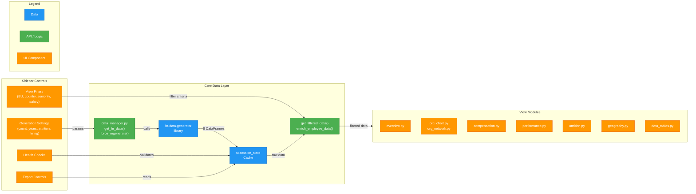
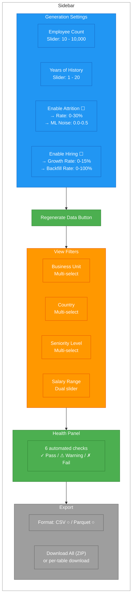
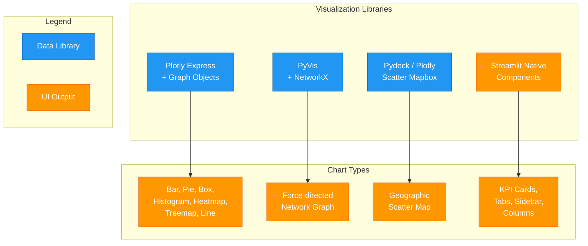

# HR Analytics Dashboard

The HR Data Dashboard is an interactive Streamlit application that brings the synthetic HR data to life through real-time visualization. Rather than connecting to a static database, the dashboard generates data on-the-fly using the `hr-data-generator` library documented in the [Data Generation Module](../data-generation/index.md). This tight coupling between generator and dashboard allows users to experiment with different workforce configurations -- adjusting employee counts, attrition rates, hiring growth, and years of history -- and immediately see the analytical consequences.

The dashboard organizes its analysis across seven primary tabs (with the Organization tab containing two sub-views, effectively providing eight distinct analytical surfaces). Each tab targets a specific HR analytics domain: workforce composition, organizational hierarchy, compensation benchmarking, performance trends, workforce dynamics, attrition risk, and geographic distribution. A final Data Tables tab provides raw access to all eight generated tables for inspection and export.

The application follows an SAP Fiori Horizon-inspired color theme throughout, giving charts a consistent, professional appearance that aligns with the broader Talent Management demo aesthetic.

**Source repository:** [hr-data-dashboard](https://github.com/pradeepj-prj/hr-data-dashboard)

---

## Dashboard Architecture

The dashboard follows a clear data flow pattern: sidebar controls feed generation parameters into the data manager, which caches results in Streamlit's session state, and view modules consume filtered snapshots of that cache. This design separates data lifecycle management from presentation logic.



**Key architectural decisions:**

- **Regeneration is explicit.** Data regenerates only when the user clicks "Regenerate Data" or changes the employee count. Filter changes (business unit, seniority, salary range, country) apply instantly on the cached dataset without triggering the generator. This keeps the UI responsive even at 10,000-employee scale.
- **Session state as cache.** Streamlit re-runs the entire script on every interaction. By storing generated DataFrames and their generation parameters in `st.session_state`, the data manager avoids redundant generation. It compares current parameters against cached ones and short-circuits when nothing has changed.
- **Enrichment at query time.** The `enrich_employee_data()` function creates a denormalized view by joining employees with their current job assignments, organizational units, locations, and compensation records. This join happens on filtered data, not the full dataset, keeping it efficient.

---

## The Eight Analytical Tabs

### Tab 1: Overview

The Overview tab provides a high-level workforce snapshot through four KPI cards and four summary charts.

**KPI Cards:**

| Metric | Calculation |
|--------|-------------|
| Total Employees | Count of employee records |
| Average Salary | Mean of `base_salary` from current compensation |
| Average Tenure | Mean years since `hire_date` |
| Gender Split | Percentage breakdown (e.g., "F: 48% / M: 52%") |

**Charts:**

- **Seniority Level Distribution** -- Bar chart across five levels (Entry, Junior, Mid, Senior, Executive), showing organizational shape at a glance.
- **Employment Type Breakdown** -- Donut pie chart of Full-time, Part-time, and Contract workers.
- **Headcount by Business Unit** -- Bar chart colored by BU (Engineering = blue, Sales = orange, Corporate = green).
- **Gender Distribution** -- Donut pie chart using the gender color palette.

### Tab 2: Organization (Two Sub-Views)

The Organization tab splits into Tree View and Network View, each offering a different perspective on hierarchy.

**Tree View** renders a Plotly treemap with a three-level drill-down: Business Unit -> Organization Name -> Individual Employee. Users can color-code the treemap by either business unit or seniority level via a dropdown selector. The treemap is sized at 600px height with tight margins, and hover tooltips show headcounts at each level.

**Network View** uses PyVis and NetworkX to render an interactive force-directed graph of manager-to-report relationships. Each node represents an employee, sized proportionally to seniority (10 + level x 5 pixels) and colored by either business unit or seniority. Directed edges (gray arrows) point from managers to their direct reports. A Force Atlas 2 physics simulation creates organic node spacing with configurable parameters (gravity: -50, spring length: 100, damping: 0.4). A **Max Nodes slider** (10-200) caps the displayed subset for browser performance -- rendering more than 200 nodes with physics simulation causes noticeable lag.

### Tab 3: Compensation Analytics

**KPI Cards:** Median Salary, Minimum Salary, Maximum Salary, and Salary Range (max minus min).

**Charts:**

- **Salary Distribution** -- Histogram with 25 bins showing the spread of base salaries across the workforce.
- **Salary by Seniority Level** -- Box plot with five boxes (one per level), using a blue gradient color scale from the `SENIORITY_COLORS` palette. This chart reveals how compensation scales with career progression.
- **Salary by Business Unit** -- Box plot comparing salary ranges across Engineering, Sales, and Corporate, colored with the `BU_COLORS` palette.
- **Compensation Change Reasons** -- Donut pie chart aggregated from the compensation history table, showing the frequency distribution of change types (promotion, annual review, market adjustment, etc.).

### Tab 4: Performance Analytics

**KPI Cards:** Average Rating, Total Reviews, High Performers (rated 4+, shown as percentage), and Needs Improvement (rated 2 or below, shown as percentage).

**Charts:**

- **Rating Distribution** -- Bar chart on the 1-5 scale with an intuitive red-to-green color mapping: 1 = red (#d62728), 2 = orange (#ff7f0e), 3 = light orange (#ffbb78), 4 = light green (#98df8a), 5 = green (#2ca02c).
- **Average Rating Trend** -- Line chart plotting mean rating by review year with markers, revealing whether organizational performance improves or degrades over the simulation period.
- **Rating Composition by Year** -- Stacked bar chart showing the absolute count of each rating level per year. This complements the trend line by exposing distribution shifts (e.g., fewer 1-2 ratings over time).
- **Business Unit x Year Heatmap** -- A color-intensity matrix using the RdYlGn (Red-Yellow-Green) diverging scale, highlighting which business units outperform or underperform across years.

### Tab 5: Workforce Dynamics

This tab appears when hiring simulation is enabled. When hiring is disabled, the tab label changes to show only attrition analytics.

**KPI Cards:** Total Hires, Total Attrition, and Net Change.

**Charts:**

- **Hires vs. Attrition by Year** -- Grouped bar chart with net change annotations, providing the clearest view of whether the organization is growing or shrinking year over year.
- **Headcount Trend** -- Line chart plotting total active employees across the simulation period.
- **New Hire Demographics** -- Breakdowns of incoming employees by seniority level and business unit distribution.

### Tab 6: Attrition Analytics

The most chart-dense tab, offering deep analysis of workforce departures.

**KPI Cards:** Attrition Rate (%), Active Employees, Terminated Count, Retired Count, and Voluntary vs. Involuntary percentage (with the involuntary figure shown as a delta).

**Charts:**

- **Termination Reasons** -- Donut pie chart with eight color-coded categories: three resignation types (Career Opportunity, Personal Reasons, Relocation), Retirement, two termination types (Performance, Policy Violation), and two layoff types (Restructuring, Cost Reduction).
- **Attrition by Business Unit** -- Bar chart comparing turnover rates across organizational units.
- **Attrition by Performance Rating** -- Bar chart correlating departure frequency with rating levels. This is a key ML-insight chart: it surfaces the correlation between low performance ratings and higher attrition probability, validating that the generator's ML-driven attrition model (see [Data Generation Module](../data-generation/index.md)) produces realistic patterns.
- **Attrition by Tenure Bucket** -- Bar chart grouping departures into tenure ranges (<1 year, 1-2 years, 2-5 years, 5-10 years, 10+ years).
- **Attrition by Seniority Level** -- Bar chart from Entry through Executive.
- **Attrition Timeline** -- Line chart showing termination counts over time, revealing whether attrition accelerates or stabilizes.

### Tab 7: Geographic Map

Uses Plotly Express scatter mapbox (OpenStreetMap base layer, requiring no API key) to display employee locations as circles sized by headcount and colored on a blue intensity scale.

**Tooltips** display city name, country, headcount, and average salary (when compensation data is available). The map centers automatically based on the mean latitude and longitude of populated locations, with a default zoom level of 2 for a global view.

**Summary tables** alongside the map show headcount aggregated by country (sorted descending) and a top-10 cities leaderboard. Two metric cards display the count of unique locations and unique countries represented in the dataset.

### Tab 8: Data Tables

A raw data inspection tab providing direct access to all eight generated tables: employees, job roles, job assignments, organization units, org assignments, locations, compensation, and performance reviews. Features include column-level statistics, search functionality, and per-table views for detailed record-level investigation.

---

## Sidebar Controls

The sidebar is organized into four collapsible sections that control both data generation and visualization filtering.



**Generation Settings** control what data is produced. Changing these and clicking "Regenerate Data" triggers a full data generation cycle with a progress bar. The attrition ML noise slider (0.0-0.5) controls how much random noise is injected into the logistic regression model that determines which employees leave, as described in the [Data Generation Module](../data-generation/index.md).

**View Filters** apply instantly on cached data. The filtering logic in `get_filtered_data()` is inclusive: it retains employees with NULL values in a filtered dimension alongside those that match the selection, preventing data loss from incomplete records.

### Data Health Checks

Six automated checks run against the generated dataset, each returning a pass, warning, or fail status with explanatory messages:

| Check | Pass Criteria | Warning Trigger |
|-------|--------------|-----------------|
| Headcount Trend | Positive headcount in all years | Zero headcount in any year |
| Attrition Rate | Average between 5-30% annually | Above 30% or below 5% |
| BU Distribution | All business units above 5% share | Any unit below 5% |
| Seniority Pyramid | More junior (L1-L2) than senior (L4-L5) | Inverted pyramid detected |
| Tenure Mix | Both new (<2yr) and tenured (>5yr) present | Either segment missing |
| New Hire Seniority | >50% of new hires at L1-L2 | Fewer than 50% junior hires |

These checks serve as a quality gate, confirming that generated data is realistic enough for the demo. If a check warns, users can adjust generation parameters (e.g., increase employee count to improve distribution balance) and regenerate.

### Data Export

The export section offers two formats via radio toggle:

- **CSV** -- Universal compatibility, human-readable.
- **Parquet** -- Recommended; typically 50% smaller file sizes with type preservation. Faster for loading into HANA Cloud.

Users can download all eight tables as a single ZIP archive or download individual tables separately.

---

## Visualization Technology Stack

The dashboard combines four visualization libraries, each chosen for a specific strength:



**Plotly Express and Graph Objects** serve as the primary charting library, providing bar charts, pie/donut charts, box plots, histograms, heatmaps, treemaps, and line charts. All charts are rendered via helper functions in `chart_helpers.py` that apply consistent styling: white backgrounds, dark gray text (#32363A), and SAP Fiori Horizon-inspired color palettes.

**PyVis with NetworkX** powers the interactive organizational network graph. NetworkX builds the directed graph data structure (nodes = employees, edges = manager relationships), while PyVis renders the HTML/JavaScript visualization with Force Atlas 2 physics simulation. This combination was chosen because Plotly's native network graph support lacks interactive physics.

**Plotly Scatter Mapbox** (using the OpenStreetMap tile layer) renders the geographic view. This choice avoids requiring a Mapbox API token while still providing smooth pan-and-zoom interaction. Circle sizes encode headcount and color intensity encodes the same metric on a blue scale.

**Streamlit native components** handle the structural UI: metric cards for KPIs, `st.tabs()` for navigation, `st.columns()` for layout grids, `st.sidebar` for controls, and `st.selectbox` / `st.multiselect` / `st.slider` for interactive inputs.

### Color Palettes

The `chart_helpers.py` module centralizes all color definitions, ensuring visual consistency across tabs:

| Palette | Application | Values |
|---------|-------------|--------|
| `BU_COLORS` | Business unit charts | Engineering=#0A6ED1, Sales=#E9730C, Corporate=#107E3E |
| `SENIORITY_COLORS` | Seniority-level charts | 5-level blue gradient (#BDD6F2 -> #085294) |
| `GENDER_COLORS` | Gender breakdowns | Male=#0A6ED1, Female=#E9730C, NA=#6A6D70 |
| `ATTRITION_COLORS` | Employment status | Active=#107E3E, Terminated=#BB0000, Retired=#DF6E0C |
| `TERMINATION_REASON_COLORS` | Departure reasons | 8 categories, blue/orange/red/gray family |
| Rating color scale | Performance ratings | 1=#d62728 (red) -> 5=#2ca02c (green) |

---

## Data Manager Pattern

The `data_manager.py` module is the architectural backbone of the dashboard. It mediates between the data generator library and the Streamlit view layer through four key functions:

| Function | Responsibility |
|----------|---------------|
| `get_hr_data()` | Generate data or retrieve from session state cache. Accepts all generation parameters (employee count, attrition settings, hiring settings, date range). Compares current parameters against cached values; regenerates only on mismatch. Displays a progress bar during generation. |
| `force_regenerate()` | Clear all cached keys from `st.session_state` and delegate to `get_hr_data()`. Called when the user clicks the "Regenerate Data" button. |
| `get_filtered_data()` | Apply sidebar filters (business unit, country, seniority, salary range) on cached data. Uses an inclusive boolean mask approach -- employees with NULL values in a filtered dimension are retained alongside matching records. Returns filtered tables plus unfiltered reference tables for cross-tab consistency. |
| `enrich_employee_data()` | Build a denormalized employee view by left-joining current job assignments (title, family, level, seniority), organizational assignments (org name, business unit), locations (city, country, region, lat/lng), and compensation (base salary, currency). Most view modules call this before rendering. |

The critical design insight is the separation between **regeneration** (expensive, triggered by explicit user action) and **filtering** (cheap, triggered by any filter widget change). This two-tier approach keeps the dashboard interactive. A 10,000-employee dataset with 20 years of history might take several seconds to generate, but filtering that cached dataset to show only Engineering employees in Germany happens in milliseconds.

---

## Setup and Running

### Prerequisites

- Python 3.10+
- `hr-data-generator` library installed

### Installation

```bash
git clone https://github.com/pradeepj-prj/hr-data-dashboard.git
cd hr-data-dashboard
python -m venv .venv
source .venv/bin/activate  # On Windows: .venv\Scripts\activate
```

Install the data generator library (from local path or PyPI):

```bash
pip install -e ../HR-Data-Generator  # Local development
# or
pip install hr-data-generator        # From PyPI
```

Install dashboard dependencies:

```bash
pip install -e .
```

### Running the Dashboard

```bash
streamlit run src/hr_dashboard/app.py
```

The dashboard opens in your browser at `http://localhost:8501`.

### Project Structure

```
hr-data-dashboard/
├── pyproject.toml
├── src/
│   └── hr_dashboard/
│       ├── app.py                 # Main Streamlit entry point
│       ├── data_manager.py        # Data generation and caching
│       ├── filters.py             # Sidebar filter components
│       ├── views/
│       │   ├── overview.py        # Summary metrics/KPIs
│       │   ├── org_chart.py       # Org hierarchy treemap
│       │   ├── org_network.py     # NetworkX + Pyvis graph
│       │   ├── compensation.py    # Salary analytics
│       │   ├── performance.py     # Performance dashboards
│       │   ├── attrition.py       # Workforce dynamics & attrition
│       │   ├── geography.py       # Pydeck interactive map
│       │   └── data_tables.py     # Raw data inspection
│       └── utils/
│           ├── chart_helpers.py   # Plotly chart utilities
│           ├── data_health.py     # Validation check functions
│           └── export.py          # Parquet/CSV export utilities
└── tests/
    └── test_data_manager.py
```

### Dependencies

| Package | Version | Purpose |
|---------|---------|---------|
| streamlit | >= 1.32.0 | Application framework |
| hr-data-generator | >= 0.1.0 | Synthetic HR data generation |
| pandas | >= 2.0.0 | Data manipulation |
| plotly | >= 5.18.0 | Charts and visualizations |
| networkx | >= 3.0 | Graph data structures |
| pyvis | >= 0.3.2 | Interactive network graphs |
| pydeck | >= 0.8.0 | Geographic map rendering |
| pyarrow | >= 14.0.0 | Parquet export support |

---

## Relationship to Other Components

The HR Dashboard serves as the visual validation layer for the data generator. By providing immediate, interactive feedback on generated datasets, it enables rapid iteration on generator parameters and confirms that the synthetic data exhibits realistic statistical properties before that data flows into the downstream components:

- The **Business Questions and SQL layer** ([Business Queries](../business-queries/index.md)) operates on the same schema, so patterns visible in the dashboard (e.g., attrition correlating with low performance) should be answerable via the Talent Management App.
- The **Data Health Checks** in the sidebar serve the same validation purpose as unit tests on the generator -- they confirm structural realism (pyramid-shaped seniority, reasonable attrition rates, geographic diversity) in a user-friendly format.
- The dashboard's export feature (CSV/Parquet) provides an alternative data pipeline for analysts who want to work outside the SQL-based MCP server flow documented in the [MCP Integration](../mcp-integration/index.md) chapter.

---

## Other Dashboards

The Talent Management demo includes two additional dashboards that serve different analytical needs:

- **[MCP Audit Dashboard](mcp-audit.md)** -- A React SPA for real-time monitoring of MCP tool invocations, latencies, and error rates. Focused on operational observability of the AI integration layer.
- **[SAPUI5 Enterprise Dashboard](sapui5-enterprise.md)** -- A freestyle SAPUI5 application deployable to SAP BTP, combining HR analytics, API exploration, and MCP observability in an enterprise-ready package.
