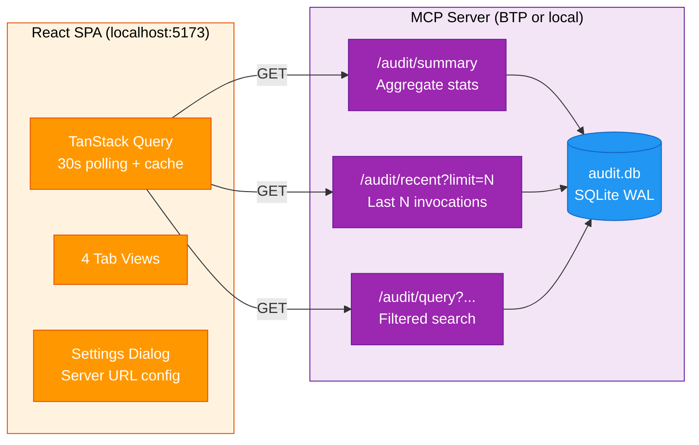

# MCP Audit Dashboard

The MCP Audit Dashboard is a real-time monitoring single-page application for the [TM Skills MCP Server](../mcp-integration/index.md). It visualizes MCP tool invocations, latencies, error rates, and session activity -- giving operators and demo audiences immediate insight into how AI agents interact with the Talent Management backend.

Built with React 19, TypeScript, Tailwind CSS, Recharts, and TanStack Table/Query, it polls the MCP server's audit REST endpoints every 30 seconds to maintain a live view of system health.

**Source repository:** [mcp-audit-dashboard](https://github.com/pradeepj-prj/mcp-audit-dashboard)

---

## Architecture

The dashboard is a lightweight React SPA that reads from three REST endpoints exposed by the MCP server's audit logging subsystem. It has no backend of its own -- all data comes directly from the MCP server over HTTP.



**Key design choices:**

- **No backend.** The dashboard is a pure client-side SPA. It reads directly from the MCP server's audit endpoints, which means deploying the dashboard requires zero additional infrastructure -- just static file hosting.
- **TanStack Query for data fetching.** All API calls go through TanStack Query hooks, which handle caching, background refetching (30-second polling interval), and automatic retry. This keeps the UI responsive even when the server is slow or temporarily unreachable.
- **Runtime URL switching.** The Settings dialog (gear icon, top-right) lets users paste a different MCP server URL at runtime, stored in localStorage. This is invaluable for demos where you might switch between a local development server and the production BTP deployment without rebuilding.

---

## The Four Views

### Overview

The Overview tab provides at-a-glance operational health through KPIs and summary visualizations:

- **KPI cards** -- Total calls, error rate (percentage), average latency (ms), unique clients, and unique tools used.
- **Tool usage donut chart** -- Proportional breakdown of which MCP tools are called most frequently, revealing usage patterns (e.g., whether agents favor `get_employees` over `get_attrition_risk`).
- **Recent activity feed** -- A chronological list of the latest tool invocations with status indicators (success/error), tool names, and timestamps.
- **Call volume over time** -- A time-series chart showing invocation frequency, useful for spotting usage spikes during demos or load testing.

### Session Explorer

The Session Explorer reconstructs what an AI agent did step-by-step, providing a narrative view of agent behavior:

- **Filters** -- Filter by client name and time range to isolate specific agent sessions.
- **Chronological timeline** -- Each tool call appears as a colored bar on a timeline, with the tool name, duration, and result status. The color coding maps to tool categories for quick visual scanning.
- **Gap detection** -- The timeline highlights pauses between consecutive tool calls. Long gaps may indicate agent "thinking time," user interaction delays, or network issues. Gaps are annotated with their duration.
- **Summary strip** -- Aggregated session metrics (total calls, total duration, error count) appear above the timeline.

### Observability

The Observability tab provides deep-dive performance analytics:

- **Calls per tool** -- Bar chart showing invocation counts by tool name, identifying the most and least used tools.
- **Error rates** -- Per-tool error rate bar chart, surfacing which tools are most failure-prone.
- **Latency distributions** -- Statistical breakdown showing average, max, P50, P95, and P99 latencies. The percentile view is critical for identifying tail latency issues that averages would hide.
- **Latency over time** -- Scatter plot of individual call durations over time, revealing patterns like latency degradation under sustained load.
- **Duration histogram** -- Distribution of call durations across configurable bins.
- **Slowest calls table** -- A ranked list of the longest-running tool invocations with full context (tool name, parameters, timestamp, duration).

### Raw Data

The Raw Data tab provides full access to the audit log:

- **Sortable/filterable table** -- Built on TanStack Table (headless), supporting column sorting, text filtering, and pagination.
- **Expandable rows** -- Click any row to reveal complete invocation details: input parameters, error messages (if any), and session metadata.
- **CSV export** -- Download the filtered dataset for offline analysis.

---

## MCP Server Integration

The dashboard depends on three REST endpoints that the MCP server exposes alongside its primary MCP protocol interface:

| Endpoint | Description |
|----------|-------------|
| `GET /audit/summary` | Aggregate stats: totals, per-tool averages, error rates |
| `GET /audit/recent?limit=N` | Last N tool invocations with full details |
| `GET /audit/query?...` | Filtered query by tool, client, time range, errors |

The MCP server requires two configuration changes to support the dashboard:

1. **CORS middleware** -- The server's FastAPI entry point must include `CORSMiddleware` to allow requests from the dashboard's origin (typically `localhost:5173` in development or a static hosting domain in production).
2. **Lazy database initialization** -- The audit logger's `_ensure_db()` method initializes the SQLite database on first access rather than at startup, ensuring REST endpoints work even before any MCP client has connected and generated audit data.

For details on the MCP server's audit logging architecture, see the [MCP Integration](../mcp-integration/index.md) chapter.

---

## Configuration

| Setting | How to Set | Default |
|---------|-----------|---------|
| MCP Server URL (dev) | `.env` -> `VITE_MCP_SERVER_URL` | `http://localhost:8080` |
| MCP Server URL (prod) | `.env.production` -> `VITE_MCP_SERVER_URL` | `https://tm-skills-mcp.cfapps.ap10.hana.ondemand.com` |
| Runtime override | Settings gear (top-right) -> paste URL | Stored in localStorage |

---

## Setup and Running

### Prerequisites

- Node.js 18+
- The MCP server running with CORS enabled

### Install and Run

```bash
git clone git@github.com:pradeepj-prj/mcp-audit-dashboard.git
cd mcp-audit-dashboard
npm install
npm run dev
```

Open `http://localhost:5173`. The dashboard connects to `http://localhost:8080` by default.

### Production Build

```bash
npm run build      # Output in dist/
npm run preview    # Serve locally at :4173
```

### Project Structure

```
src/
├── api/           TypeScript types, fetch client, TanStack Query hooks
├── lib/           Tool colors, date/duration formatters
└── components/
    ├── layout/    AppShell (header + tabs), StatusBadge, SettingsDialog
    ├── shared/    MetricCard, TimeRangePicker, LoadingSpinner, ErrorAlert
    ├── overview/  KPI grid, donut chart, activity feed, volume chart
    ├── sessions/  Filters, timeline with gap detection, summary strip
    ├── observability/  Bar charts, scatter plot, histogram, percentiles
    └── rawdata/   TanStack Table with filters, expansion, CSV export
```

---

## Tech Stack

| Layer | Technology |
|-------|------------|
| Framework | React 19 + TypeScript 5.9 |
| Build | Vite 7.3 |
| Styling | Tailwind CSS 4.1 (CSS-first, no config file) |
| Charts | Recharts 3.7 |
| Data Table | TanStack Table 8 (headless) |
| Data Fetching | TanStack Query 5 (caching + 30s polling) |
| UI Primitives | Headless UI (tabs), Lucide (icons), date-fns (dates) |

---

## Other Dashboards

The Talent Management demo includes two additional dashboards that serve different analytical needs:

- **[HR Analytics Dashboard](hr-analytics.md)** -- An interactive Streamlit application for exploring and visualizing synthetic HR data with eight analytical tabs covering workforce composition, compensation, performance, attrition, and geography.
- **[SAPUI5 Enterprise Dashboard](sapui5-enterprise.md)** -- A freestyle SAPUI5 application deployable to SAP BTP, combining HR analytics, API exploration, and MCP observability in an enterprise-ready package.
