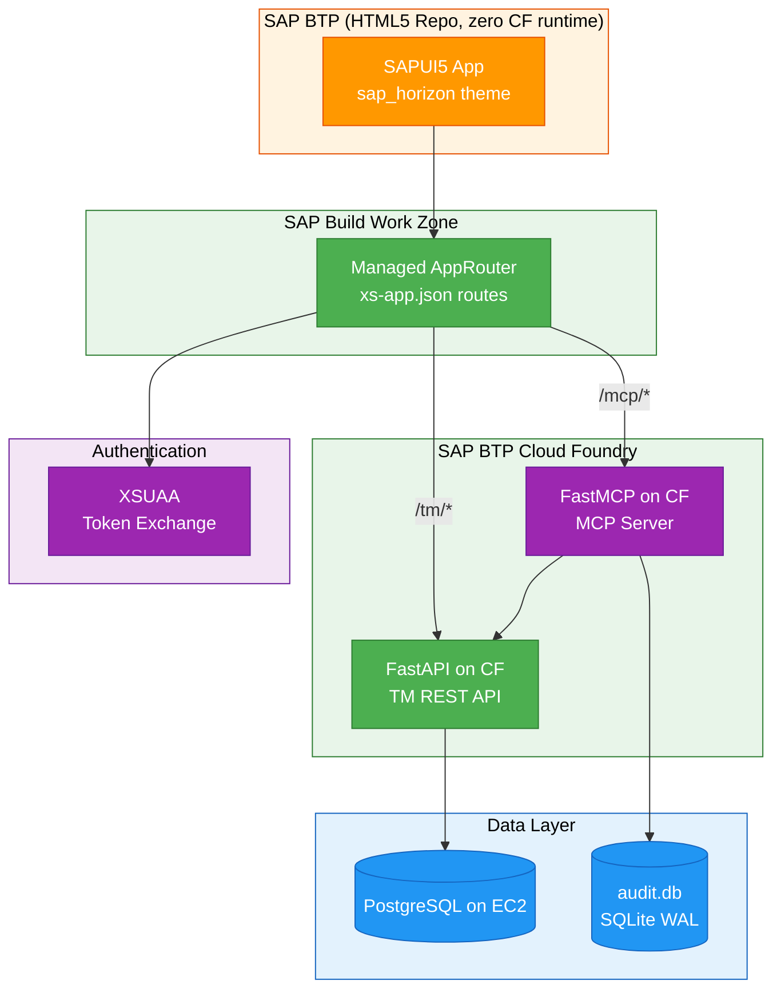

# SAPUI5 Enterprise Dashboard

The TM Skills Dashboard is a freestyle SAPUI5 application that unifies Talent Management monitoring and MCP server observability into a single enterprise-grade interface. Deployable to SAP BTP's HTML5 Application Repository via MTA, it consumes zero Cloud Foundry runtime memory -- the app is served entirely by the managed AppRouter in SAP Build Work Zone.

This dashboard bridges the gap between the developer-focused [HR Analytics Dashboard](hr-analytics.md) and the operations-focused [MCP Audit Dashboard](mcp-audit.md) by combining HR data exploration, interactive API testing, and MCP observability in one SAP-native application.

**Source repository:** [sap-ui5-tm-mcp](https://github.com/pradeepj-prj/sap-ui5-tm-mcp)

---

## Architecture

The application follows a three-tier architecture where the SAPUI5 frontend sits behind SAP's managed AppRouter, which handles authentication and routes API calls to the Python backends on Cloud Foundry.



!!! key-pattern "Key Pattern"
    **Why freestyle UI5 instead of CAP?** The Python backend already exists as a FastAPI application. CAP's value is auto-generating OData services from domain models, which does not apply when wrapping existing REST APIs. Freestyle SAPUI5 with direct `fetch()` calls to REST endpoints is the pragmatic choice here.

---

## The Six Tabs

The application organizes its functionality across six tabs, each backed by its own controller and XML view. Tab-scoped JSON models prevent cross-tab data contamination.

### Overview and Observability

The Overview tab serves as the landing page with at-a-glance operational health:

- **KPI tile row** -- Six metric tiles showing total calls, error rate, average latency, unique clients, unique tools, and active sessions. These tiles update on a 30-second polling interval.
- **Operation mix charts** -- VizFrame donut charts showing the distribution of tool invocations by tool name and by client.
- **Call volume timeline** -- A time-series line chart plotting invocation frequency, useful for correlating usage spikes with demo sessions or agent activity.
- **Latency percentiles** -- P50, P95, and P99 latency metrics displayed as tiles, with a scatter plot showing individual call durations over time.
- **Error rate analytics** -- Per-tool error rate breakdown via a bar chart, surfacing which MCP tools are most failure-prone.
- **Recent activity feed** -- A chronological list of the latest tool invocations with status indicators.

### API Explorer

An interactive form-driven UI for testing all 18 TM and attrition REST endpoints directly from the browser. The endpoints are organized into six categories:

| Category | Endpoints |
|----------|-----------|
| Employees | Employee listing, search, details |
| Skills | Skill inventory, gap analysis |
| Gaps | Workforce skill gaps, recommendations |
| Risk | Attrition risk scoring, predictions |
| Org | Organization structure, hierarchy queries |
| Attrition | Attrition analytics, trend analysis |

Each endpoint has a dynamically generated form with typed input fields, a submit button, and a formatted JSON response viewer. This serves both as a testing tool during development and as a live demo aid for showcasing API capabilities.

### MCP Explorer

A read-only catalog of the MCP server's capabilities:

- **21 tools** -- Each displayed as a card showing the tool name, description, and parameter schema. Tools map to the TM REST API endpoints documented in the [MCP Integration](../mcp-integration/index.md) chapter.
- **2 resources** -- MCP resources exposed by the server.
- **5 prompts** -- Pre-configured prompt templates that agents can use for common HR queries.

!!! note
    The MCP server returns HTML for its capability listing rather than structured JSON, so the tool/resource/prompt catalog is maintained as a static JSON file (`mcpCatalog.json`) in the application source. This is updated manually when the MCP server's tool set changes.

### Sessions

Time-based session grouping of audit entries, providing a narrative view of agent behavior:

- **Session splitting** -- Audit entries are grouped into sessions by detecting 2-hour inactivity gaps. The MCP server does not track sessions natively, so this grouping is computed client-side in the `groupIntoSessions()` utility function.
- **Expandable timelines** -- Each session expands to show a chronological list of tool calls with duration bars and status indicators.
- **Gap markers** -- Pauses between consecutive tool calls within a session are highlighted, helping identify agent thinking time or user interaction delays.

### Demo

A live-streaming view designed for presentation scenarios:

- **10-second polling** -- More aggressive than the standard 30-second interval, ensuring the audience sees near-real-time updates.
- **Real-time stats** -- Running totals and averages that update with each poll cycle.
- **Session picker** -- Select a specific session to watch its tool calls arrive in real time.

### Raw Data

A full audit log table with enterprise data management features:

- **Filterable and searchable** -- Column-level filters and a global search bar.
- **Sortable columns** -- Click any column header to sort ascending/descending.
- **Expandable rows** -- Click a row to reveal complete invocation details including input parameters, error messages, and session metadata.
- **CSV/XLSX export** -- Download the filtered dataset using `sap.ui.export` for offline analysis.

---

## BTP Deployment

### MTA Structure

The deployment uses the Multi-Target Application (MTA) model with three modules:

| Module | Purpose | Runtime |
|--------|---------|---------|
| `tm-dashboard-content` | UI5 app, built and zipped | None (static files) |
| `tm-dashboard-deployer` | Pushes the zip to HTML5 Application Repository | Transient (runs once, exits) |
| `tm-dashboard-destination-content` | Configures BTP destinations for API routing | None (configuration only) |

!!! btp-insight "BTP Insight"
    The zero-runtime-memory deployment pattern is a significant cost optimization. Traditional CF app deployments consume at least 256MB of runtime memory. By using the HTML5 Application Repository with managed AppRouter, the SAPUI5 app is served as static content with no persistent CF container, reducing BTP consumption credits to near zero for the frontend.

### Build and Deploy

```bash
# Build the MTA archive
mbt build

# Deploy to Cloud Foundry
cf deploy mta_archives/tm-dashboard_1.0.0.mtar
```

### Route Configuration

The `xs-app.json` file defines how the managed AppRouter routes requests:

- `/tm/*` routes to the TM REST API (FastAPI on Cloud Foundry)
- `/mcp/*` routes to the MCP server (FastMCP on Cloud Foundry)

### Authentication

The application currently uses API key passthrough (`authenticationType: "none"` for API routes). The technical guide series in the repository documents the migration path to full XSUAA JWT authentication with OAuth2UserTokenExchange principal propagation:

- **Part 3** covers XSUAA scopes, role templates, and token propagation configuration.
- **Part 4** covers migrating the Python FastAPI and FastMCP backends from API key authentication to JWT validation.

---

## Key Design Decisions

| Decision | Rationale |
|----------|-----------|
| **Tab-scoped models** | Each tab gets its own JSON model to avoid cross-tab data contamination when multiple views poll independently. |
| **Time-based session splitting** | The MCP server does not track sessions natively. Client-side 2-hour gap detection provides a reasonable approximation of agent sessions. |
| **Static MCP catalog** | The MCP server returns HTML for capability listings. A static JSON file is more reliable for structured display. |
| **VizFrame charts** | `sap.viz` VizFrame charts (donut, bar, column, scatter, timeseries_line) with lazy loading provide SAP-native charting that integrates with Fiori design language. |
| **No OData/CAP** | Direct `fetch()` calls via a thin `fetchJson()` helper. The backend is REST, not OData -- adding a CAP layer would add complexity without value. |

---

## Setup and Running

### Prerequisites

- Node.js 18+
- UI5 CLI (`@ui5/cli` -- installed as devDependency)
- For BTP deployment: Cloud MTA Build Tool (`mbt`) and Cloud Foundry CLI (`cf`)

### Local Development

```bash
npm install
npx ui5 serve
```

Open `http://localhost:8080/index.html`. The local dev server proxies API calls:

- `/tm/*` to the TM API layer on BTP
- `/mcp/*` to the MCP server on BTP

Use the Settings dialog (gear icon in ShellBar) to switch between BTP and local backend URLs, or to set an API key.

### Project Structure

```
app/webapp/                     SAPUI5 application source
  controller/                   8 controllers (App shell + 7 tabs)
    App.controller.js             ShellBar, tab navigation, settings
    Overview.controller.js        KPIs, charts, recent activity (30s poll)
    Observability.controller.js   Latency percentiles, error rates (30s poll)
    ApiExplorer.controller.js     18-endpoint interactive form
    McpExplorer.controller.js     MCP tool/resource/prompt catalog
    Sessions.controller.js        Time-based session grouping
    Demo.controller.js            Live call streaming (10s poll)
    RawData.controller.js         Filterable audit log table
  view/                         8 XML views (one per controller)
  fragment/                     4 reusable XML fragments
    KpiHeader.fragment.xml        6-metric KPI tile row
    EndpointForm.fragment.xml     Dynamic API query form
    AttritionDashboard.fragment.xml  Attrition KPIs + chart
    ToolCard.fragment.xml         MCP tool card layout
  model/
    models.js                   Device model, groupIntoSessions(), fetchJson()
    formatter.js                13 formatting functions
    mcpCatalog.json             Static MCP tool/resource/prompt catalog
  css/style.css                 Custom styles (duration colors, risk badges)
  i18n/                         Internationalization bundles
  Component.js                  Initializes server + app JSON models
  manifest.json                 App descriptor (ID, dependencies, routing)
  index.html                    Bootstrap entry point (sap_horizon theme)
  xs-app.json                   Managed AppRouter route definitions
docs/                           4-part technical guide series + Joule guide
mta.yaml                       MTA deployment descriptor
xs-security.json                XSUAA config (minimal, ready for scope expansion)
ui5.yaml                       UI5 tooling config (SAPUI5 1.120.0)
```

---

## Tech Stack

| Layer | Technology |
|-------|------------|
| Framework | SAPUI5 1.120.0 with `sap_horizon` theme |
| Libraries | `sap.m`, `sap.f`, `sap.ui.core`, `sap.ui.layout`, `sap.viz`, `sap.tnt`, `sap.ui.export` |
| Backend | FastAPI (Python) on Cloud Foundry + FastMCP (Python) on Cloud Foundry |
| Database | PostgreSQL on EC2 |
| Auth | XSUAA (planned), API key passthrough (current) |
| Deployment | MTA to HTML5 Application Repository (zero CF runtime) |

---

## Technical Guide Series

The repository includes a comprehensive 4-part guide plus a supplementary Joule integration guide:

| Part | Topic |
|------|-------|
| Part 1 | Architecture rationale, system topology, key SAP BTP concepts |
| Part 2 | Scaffolding, config files, build/deploy workflow |
| Part 3 | XSUAA scopes, role templates, token propagation |
| Part 4 | Migrating FastAPI/FastMCP from API key to JWT auth |
| Supplementary | Custom Joule agent in SAP Build Work Zone |

!!! extension-idea "Extension Idea"
    The Joule agent guide describes integrating the MCP server as a custom agent within SAP Build Work Zone, enabling natural-language HR queries through SAP's built-in AI assistant. This pattern could be extended to other BTP services -- for example, connecting SAP AI Core for more sophisticated attrition prediction models, or integrating with SAP Integration Suite to pull real HR data from SuccessFactors alongside the synthetic dataset.

---

## Other Dashboards

The Talent Management demo includes two additional dashboards that serve different analytical needs:

- **[HR Analytics Dashboard](hr-analytics.md)** -- An interactive Streamlit application for exploring and visualizing synthetic HR data with eight analytical tabs covering workforce composition, compensation, performance, attrition, and geography.
- **[MCP Audit Dashboard](mcp-audit.md)** -- A React SPA for real-time monitoring of MCP tool invocations, latencies, and error rates. Focused on operational observability of the AI integration layer.
