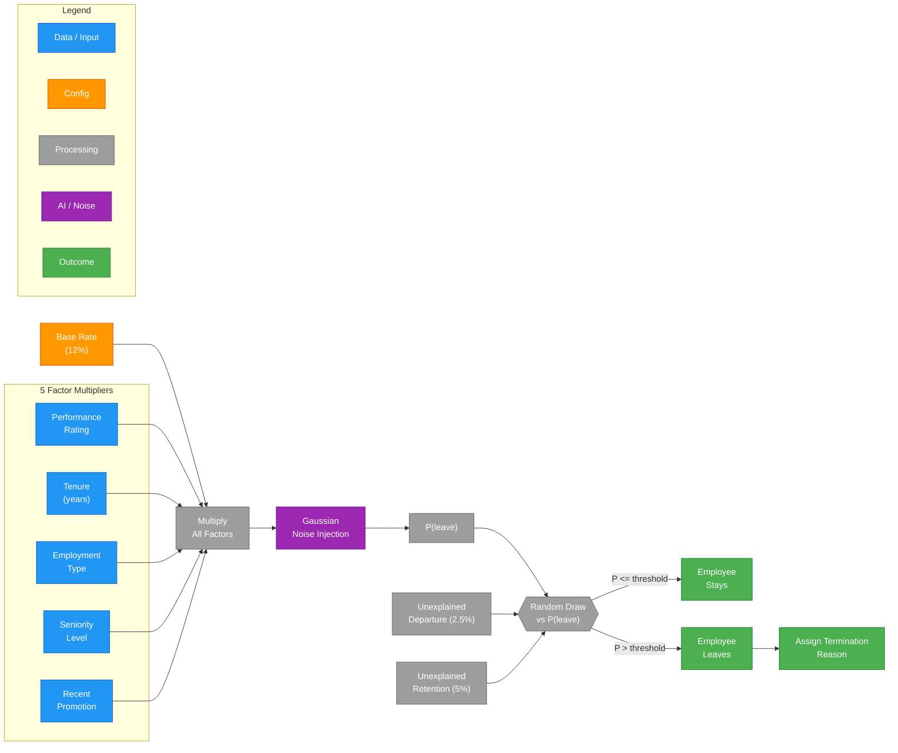

# Attrition Model

The attrition model in `src/hr_data_generator/attrition.py` is the intellectual centerpiece of the HR Data Generator. It produces realistic departure patterns that serve as ground truth labels for ML model training, while providing configurable "noise" to control prediction difficulty.

For context on how this model fits into the broader data generation pipeline, see the [Data Generation overview](index.md) -- specifically Phase 7 (Workforce Dynamics), which invokes the attrition model on a per-year basis.

## Multiplicative Probability Formula

The probability that an employee leaves in a given year is computed as a product of a base rate and five factor multipliers:

```
P(leave) = base_rate x perf_factor x tenure_factor x emp_type_factor x seniority_factor x promotion_factor
```

Each factor is implemented as a strategy class (`LookupStrategy` for discrete values, `RangeLookupStrategy` for continuous ranges), making the model extensible.

## Factor Multiplier Tables

**Performance Rating Factor** -- poor performers are 6x more likely to leave than top performers:

| Rating | Label | Multiplier |
|--------|-------|-----------|
| 1 | Needs Improvement | 2.5x |
| 2 | Partially Meets | 1.5x |
| 3 | Meets Expectations | 1.0x (baseline) |
| 4 | Exceeds Expectations | 0.6x |
| 5 | Outstanding | 0.4x |

**Tenure Factor** -- new employees have the highest flight risk:

| Tenure | Multiplier |
|--------|-----------|
| < 1 year | 1.8x |
| 1--2 years | 1.3x |
| 2--5 years | 1.0x (baseline) |
| 5--10 years | 0.7x |
| 10+ years | 0.5x |

**Employment Type Factor** -- contractors leave at 2x the rate of full-time employees:

| Type | Multiplier |
|------|-----------|
| Full-time | 1.0x |
| Contract | 2.0x |
| Part-time | 1.4x |

**Seniority Factor** -- senior leaders are "stickier":

| Level | Multiplier |
|-------|-----------|
| Level 1 (Junior) | 1.3x |
| Level 2 (Mid) | 1.1x |
| Level 3 (Senior) | 0.9x |
| Level 4 (Manager) | 0.7x |
| Level 5 (Director) | 0.5x |

**Recent Promotion Factor** -- recently promoted employees are 60% less likely to leave:

| Promoted in Last Year? | Multiplier |
|----------------------|-----------|
| Yes | 0.4x |
| No | 1.0x |

## Probability Flow



## Noise Injection for ML Realism

Real-world attrition is not perfectly predictable from observable factors. To simulate this, the model injects Gaussian noise into the computed probability, controlled by the `noise_std` parameter:

| noise_std | Expected ML Accuracy | Difficulty |
|-----------|---------------------|-----------|
| 0.1 | ~90%+ | Easy -- useful for testing pipelines |
| 0.2 | ~80--85% | Default -- realistic for production models |
| 0.3 | ~70--75% | Challenging -- models real-world unpredictability |

The noise is applied multiplicatively: `P_final = P(leave) * (1 + noise)`, where `noise ~ N(0, noise_std)`. This ensures that even employees with very low computed probability have a small chance of leaving, and vice versa.

## Unexplained Events

Two additional mechanisms add further realism:

- **Unexplained departures (2.5%):** Any employee has a 2.5% base chance of leaving regardless of their computed probability. This represents events invisible to the model -- personal crises, partner relocations, health issues.
- **Unexplained retention (5%):** Employees with a computed probability above 30% have a 5% chance of staying anyway. This represents counter-offers, loyalty, or changed circumstances.

## Termination Reason Assignment

When an employee is determined to leave, a termination reason is assigned. The first decision is voluntary vs. involuntary, which is influenced by performance rating:

| Performance Rating | P(Involuntary) |
|-------------------|----------------|
| 1--2 (low performers) | 60% |
| 3 (meets expectations) | 20% |
| 4--5 (high performers) | 5% |

**Voluntary reasons and weights:**

| Reason | Weight | Notes |
|--------|--------|-------|
| Resignation -- Career Opportunity | 35% | |
| Resignation -- Personal Reasons | 20% | |
| Resignation -- Relocation | 15% | |
| Retirement | 30% | Age-weighted: only for age 55+, boosted probability at 60+ |

**Involuntary reasons and weights:**

| Reason | Weight |
|--------|--------|
| Termination -- Performance | 40% |
| Termination -- Policy Violation | 15% |
| Layoff -- Restructuring | 30% |
| Layoff -- Cost Reduction | 15% |
