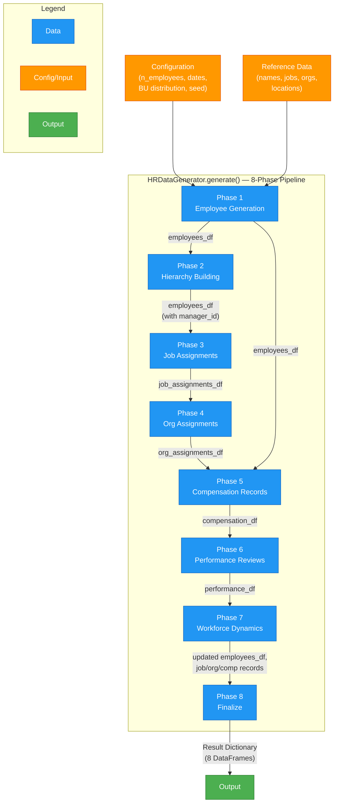
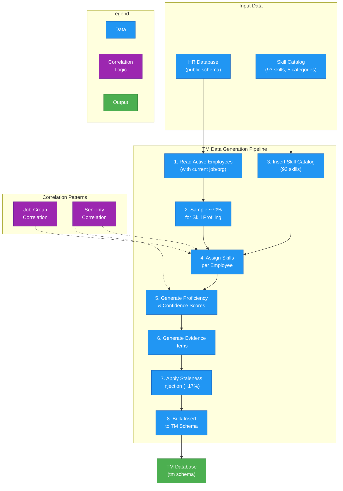
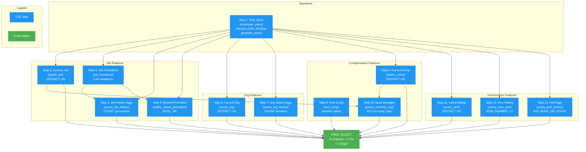

# Data Generation Module

## 4.1 Overview

The Talent Management demo relies on two complementary data generators that produce realistic synthetic datasets for the HR public schema and the Talent Management (TM) schema, respectively. Both generators share a design philosophy: **seeded randomness for reproducibility**, **configurable distributions to match real-world patterns**, and **correlation-aware generation** so that the relationships between attributes (e.g., seniority and salary, job family and skills) mirror what one would observe in production HR systems.

| Generator | Repository | Schema | Primary Class / Script | Seed Default |
|-----------|-----------|--------|----------------------|-------------|
| HR Data Generator | `hr-data-generator` | `public` | `HRDataGenerator` (src/hr_data_generator/generator.py) | Configurable |
| TM Data Generator | `talent-management-app` | `tm` | `scripts/generate_tm_data.py` | 42 |

The HR Data Generator is a structured Python library with separate modules for each concern (employees, hierarchy, assignments, compensation, performance, attrition, hiring). The TM Data Generator is a single standalone script that reads employees from the HR database and populates skill profiles, proficiency scores, and evidence records.

Both generators are designed to produce data that supports downstream analytics -- the HR generator in particular is tuned so that its attrition data can be used as a training set for ML models with configurable prediction difficulty. This chapter covers the generation pipeline in detail, including the statistical models that drive attrition and hiring simulation, and the feature engineering view that transforms raw data into ML-ready features.

For the database schemas these generators populate, see [Database Design](../data-model/index.md).

---

## 4.2 HR Data Generation Pipeline

The `HRDataGenerator` class in `src/hr_data_generator/generator.py` orchestrates an 8-phase pipeline. Each phase builds on the outputs of earlier phases, producing a set of interconnected DataFrames that together represent a complete, internally consistent HR dataset.

### Pipeline Architecture



### Phase 1: Employee Generation

The `generate_employees_with_bands()` function in `src/hr_data_generator/employee.py` creates the employee hub table. Each employee receives demographically realistic attributes with seniority-aware constraints.

**Seniority distribution** follows a pyramid structure typical of mid-size technology companies:

| Seniority Level | Label | Target Distribution |
|----------------|-------|-------------------|
| Level 5 | Director | ~5% |
| Level 4 | Manager / Staff | ~15% |
| Level 3 | Senior | ~25% |
| Level 2 | Mid-level | ~30% |
| Level 1 | Junior | ~25% |

**Age ranges are tied to seniority** to avoid unrealistic combinations (e.g., a 22-year-old Director):

| Seniority Level | Age Range |
|----------------|-----------|
| Level 5 (Director) | 45--65 |
| Level 4 (Manager) | 40--65 |
| Level 3 (Senior) | 30--60 |
| Level 2 (Mid) | 22--45 |
| Level 1 (Junior) | 21--40 |

**Business unit distribution** defaults to 50% Engineering, 30% Sales, and 20% Corporate, but is fully configurable. The generator ensures that each business unit with at least 10% of the workforce receives at least one senior leader (Level 4+).

**Name generation** draws from a culturally diverse pool with an APJ (Asia-Pacific-Japan) region focus, reflecting the demo's SAP customer base. Gender is assigned from configurable probabilities loaded from `params/employee_data.yaml`, and first names are selected based on gender classification.

**Hire dates** are derived from each employee's age, assuming a career start around age 21. A random date is selected between that calculated year and the simulation start date.

### Phase 2: Hierarchy Building

The `build_manager_hierarchy()` function in `src/hr_data_generator/hierarchy.py` constructs a reporting tree with strict structural rules:

1. **Exactly one CEO** -- the first Level 5 employee is designated CEO with a `NULL` manager_id.
2. **BU heads** -- remaining Level 5 employees report directly to the CEO and serve as business unit heads.
3. **Cascading assignment within each BU:**
   - Level 4 employees report to their BU head
   - Level 3 employees are randomly assigned to Level 4 managers within the same BU
   - Level 2 employees are assigned to Level 3 (or Level 4 if no Level 3 is available)
   - Level 1 employees are assigned to Level 2 or Level 3 managers
4. **Fallback** -- any employee without a manager after processing is assigned to the CEO.

Two validation functions enforce structural integrity:

- `validate_hierarchy()` checks for valid manager IDs, no self-reporting, and exactly one CEO.
- `validate_manager_bu_alignment()` ensures all non-CEO-direct-report employees have managers within the same business unit.

### Phase 3: Job Assignments

The `generate_job_assignments()` function in `src/hr_data_generator/assignments.py` creates time-variant job history using SCD Type 2 date chaining.

Each employee receives an initial job assignment matching their seniority level and business unit. The function then iterates through each year of the simulation, applying a configurable **promotion probability** (default: 12% per year). When a promotion occurs:

- Seniority level increments by one
- A new role is selected, preferring the same job family when possible
- The previous assignment's `end_date` is set to the day before the new assignment's `start_date`

This produces 0--3 role changes per employee over a typical 5-year simulation period. The cascading fallback system ensures valid role selection even when exact seniority/BU matches are unavailable.

### Phase 4: Org Assignments

Organization assignments are generated independently from job assignments, mirroring the SuccessFactors design where organizational placement and job role are tracked in separate entities. This means:

- An employee can transfer departments without being promoted
- An employee can be promoted without changing departments

The `generate_org_assignments()` function applies a configurable **transfer probability** (default: 5% per year). Transfers maintain job family alignment through a `JOB_FAMILY_TO_BUSINESS_UNIT` mapping and prioritize leaf organizations (those without child departments).

### Phase 5: Compensation Records

The `generate_compensation_records()` function in `src/hr_data_generator/compensation.py` creates salary history with three change reason types:

| Change Reason | Trigger | Salary Adjustment |
|--------------|---------|-------------------|
| New Hire | Employment start | Initial base salary |
| Annual Merit | Yearly review cycle | 2--5% increase |
| Promotion | Seniority level change | 8--15% increase |

**Base salary ranges by seniority level:**

| Level | Salary Range (USD) | Bonus Target |
|-------|-------------------|-------------|
| Level 1 (Junior) | $50,000 -- $75,000 | IC: 10% |
| Level 2 (Mid) | $70,000 -- $100,000 | IC: 10% |
| Level 3 (Senior) | $90,000 -- $140,000 | IC: 10% |
| Level 4 (Manager) | $130,000 -- $200,000 | Manager: 15% |
| Level 5 (Director) | $180,000 -- $300,000 | Director: 20% |

### Phase 6: Performance Reviews

The `generate_performance_reviews()` function in `src/hr_data_generator/performance.py` produces annual performance ratings with a bell-curve distribution:

| Rating | Label | Distribution |
|--------|-------|-------------|
| 1 | Needs Improvement | 5% |
| 2 | Partially Meets Expectations | 15% |
| 3 | Meets Expectations | 50% |
| 4 | Exceeds Expectations | 25% |
| 5 | Outstanding | 5% |

Reviews are generated for December 15 of each year. An employee must have been hired before the review date and have completed at least 6 months of employment to receive a review. The reviewing manager's `employee_id` is recorded as `manager_id` on each review record.

### Phase 7: Workforce Dynamics

This is the most complex phase. It simulates attrition, hiring, or both in an interleaved year-by-year loop. Three modes are supported:

| Mode | Flags | Behavior |
|------|-------|----------|
| Combined | `include_attrition=True, include_hiring=True` | Year-by-year: apply attrition, then backfill + growth hires |
| Attrition only | `include_attrition=True, include_hiring=False` | Apply attrition across full date range |
| Hiring only | `include_attrition=False, include_hiring=True` | Generate growth hires without attrition |

The combined mode follows this per-year sequence:

1. Calculate growth hires per BU based on current headcount and growth rates
2. Apply the attrition model (employees leave -- see [Attrition Model](attrition-model.md))
3. Calculate backfill hires = `backfill_rate` x attrition count per BU
4. Generate new employees with realistic demographics
5. Close time-variant records (job, org, compensation) for terminated employees

A streaming variant (`generate_streaming()`) yields `YearlyDataChunk` objects for memory-efficient processing of large datasets.

### Phase 8: Finalize

The final phase strips internal columns (prefixed with `_`, such as `_seniority_level` and `_business_unit`), validates the completed dataset, and packages the results into a dictionary of eight DataFrames: `employee`, `job_assignment`, `org_assignment`, `compensation`, `performance`, `job` (reference), `organization` (reference), and `location` (reference).

---

## 4.4 Hiring Model

When `include_hiring=True`, the generator simulates organic growth and backfill hiring on a year-by-year basis. The hiring model in `src/hr_data_generator/hiring.py` uses two complementary mechanisms.

### Growth Hires

Each business unit grows at a configurable annual rate:

| Business Unit | Default Annual Growth Rate |
|--------------|--------------------------|
| Engineering | 8% |
| Sales | 5% |
| Corporate | 2% |

Growth hires per BU per year = `floor(current_headcount_in_BU * growth_rate)`.

### Backfill Hires

When employees leave, not all positions are backfilled immediately (some are eliminated, some are deferred). The **backfill rate** (default: 85%) controls what fraction of departures trigger replacement hires:

```
backfill_hires_per_BU = floor(attrition_count_in_BU * backfill_rate)
```

### New Hire Demographics

New hires are generated with a seniority distribution skewed toward junior levels, reflecting the reality that most external hiring occurs at entry and mid-career levels:

| Seniority Level | New Hire Distribution |
|----------------|---------------------|
| Level 1 (Junior) | 40% |
| Level 2 (Mid) | 30% |
| Level 3 (Senior) | 20% |
| Level 4 (Manager) | 8% |
| Level 5 (Director) | 2% |

Each new hire receives a complete set of records: demographics, job assignment, org assignment, and initial compensation. The compensation for new hires follows the same seniority-based salary ranges as the initial population, with a +/-15% variance applied for realism. New hires are automatically integrated into the reporting hierarchy using the same BU-aligned manager assignment logic from Phase 2.

---

## 4.5 TM Data Generation

The `scripts/generate_tm_data.py` script in the `talent-management-app` repository generates skill profile data for the TM schema. Unlike the HR Data Generator (which is a reusable library), this is a single-purpose script that reads from the HR database and writes directly to the TM schema tables via PostgreSQL.

### Generation Process



### Step 1--2: Employee Selection

The script connects to the HR database, reads active employees (those without a `termination_date`), and joins their current job and org assignments. A configurable sample rate (default: 70%) determines how many employees receive skill profiles. This intentional incompleteness mirrors real-world conditions where not all employees have completed skill assessments.

### Step 3: Skill Catalog

The catalog contains 93 skills organized across five categories and mapped to job families:

| Category | Example Skills | Primary Job Families |
|----------|---------------|---------------------|
| Technical | Python, Java, Docker, Kubernetes, CI/CD | Software Engineering, IT |
| Functional | Salesforce, Pipeline Management, Forecasting | Sales, Finance |
| Leadership | Team Management, Strategic Planning, Mentoring | All (seniority 3+) |
| Domain | Cloud Architecture, Manufacturing Processes, Quality Standards | Hardware, Manufacturing, Quality |
| Tool | JIRA, Confluence, SAP, Tableau | All |

### Step 4: Skill Assignment with Job-Group Correlation

The `pick_skills_for_employee()` function assigns 4--20 skills per employee. The number of skills and their composition are correlated with both job group and seniority:

**Job-group correlation** ensures that software engineers are more likely to have skills like Python, Docker, and Kubernetes, while sales professionals are more likely to have Salesforce, Pipeline Management, and Negotiation. Approximately 60--65% of assigned skills come from the employee's primary domain, with the remainder drawn from cross-functional and general categories.

**Seniority correlation** affects both quantity and type:

| Seniority | Skill Count Range | Leadership Skills? | Proficiency Range |
|-----------|------------------|--------------------|------------------|
| Level 1 | 4--8 | No | 1--3 |
| Level 2 | 5--10 | No | 1--4 |
| Level 3 | 7--14 | Yes (eligible) | 2--4 |
| Level 4 | 10--18 | Yes (likely) | 3--5 |
| Level 5 | 12--20 | Yes (guaranteed) | 3--5 |

### Step 5: Proficiency and Confidence Scoring

**Proficiency scores** (0--5 scale) are generated with seniority correlation -- senior employees trend toward higher proficiency, while junior employees receive more modest scores.

**Confidence scores** (0--100 scale) are calculated based on three inputs:

- Evidence count (more evidence = higher confidence)
- Source type weighting (certifications carry more weight than peer endorsements)
- Recency (recent evidence boosts confidence)

### Step 6: Evidence Generation

Each skill assignment receives 0--5 evidence items drawn from six types:

| Evidence Type | Example Sources | Signal Strength |
|--------------|----------------|----------------|
| Certification | AWS, Coursera, Google Cloud | High |
| Project | Internal projects with dates and outcomes | High |
| Assessment | HackerRank, internal assessments | Medium-High |
| Manager Validation | Direct manager review | Medium |
| Peer Endorsement | Colleague endorsements | Medium-Low |
| Work History | Years of on-the-job experience | Low |

Each evidence item includes realistic metadata: issue dates, expiry dates (for certifications), issuing organizations, and signal strength weights used to compute confidence scores.

### Step 7: Staleness Injection

Approximately 17% of skill records have their `last_updated_at` timestamp set to more than one year ago. This is intentional -- it creates a realistic distribution where some skill assessments are current while others are stale, enabling the Talent Management application to surface "skills needing reassessment" as a business insight.

### Generated Data Statistics

With the default seed (42) and 70% sample rate, the generator produces:

| Metric | Value |
|--------|-------|
| Employees profiled | 1,348 / 1,927 active |
| Skills in catalog | 93 |
| Skill assignments | 13,410 (avg 9.9 per employee) |
| Evidence items | 18,794 (avg 1.4 per skill) |
| Stale skills (> 1 year old) | 2,253 (16.8%) |

---

## 4.6 Feature Engineering: The v_attrition_features View

While the HR Data Generator produces raw transactional records, the ML pipeline requires a **panel dataset** -- one row per employee per active year with computed features and a binary target variable. The `v_attrition_features` SQL view (defined in `scripts/features/01_create_feature_view.sql` in the HR-Data-Generator repository) transforms the raw 8-table schema into this format using a **13-step CTE pipeline**.

This view is notable because it faithfully mirrors the Python [attrition model's](attrition-model.md) logic in pure SQL, making it possible to train ML models directly from the database without any Python-based feature extraction.

### CTE Pipeline Architecture



### CTE Step Details

**Step 1 -- Year Spine** creates the backbone: one row per employee per year they were active. It uses `CROSS JOIN LATERAL generate_series()` to expand each employee's hire-year-to-termination-year range into individual rows. Years where the employee had less than 90 days of tenure are filtered out, matching the Python model's minimum tenure threshold.

```sql
-- Simplified example of the Year Spine CTE
SELECT e.employee_id, y.year AS observation_year
FROM employee e
CROSS JOIN LATERAL generate_series(
    EXTRACT(YEAR FROM e.hire_date)::INT,
    COALESCE(EXTRACT(YEAR FROM e.termination_date)::INT,
             EXTRACT(YEAR FROM CURRENT_DATE)::INT)
) AS y(year)
WHERE (MAKE_DATE(y.year, 12, 31) - e.hire_date) > 90
```

**Steps 2, 6, 8** use the same `DISTINCT ON` pattern to find the "current" record (job, org, or compensation) as of each year-end by ordering by `start_date DESC` and taking the first row per employee-year.

**Steps 3--5** handle job transition detection. Step 3 uses `LAG(seniority_level) OVER (PARTITION BY employee_id ORDER BY start_date)` to compare each job assignment's seniority with its predecessor. Step 4 aggregates these transitions into counts. Step 5 checks for promotions within a one-year lookback window using `BOOL_OR`.

**Step 9** captures the employee's first-ever salary (using `DISTINCT ON` with ascending order) for salary growth calculation.

**Step 10** computes the average salary per seniority band per year, enabling the `comp_ratio_in_role` feature: an employee's salary divided by the peer average for their seniority level.

**Steps 11--13** handle performance data. Step 11 gets the latest rating strictly before the observation year (using `<`, not `<=`, because December reviews should not inform same-year attrition decisions). Step 12 uses `ROW_NUMBER()` to find the second-latest rating for trend calculation. Step 13 produces aggregate performance metrics.

### Output Feature Catalog

The final `SELECT` assembles 25 features, 2 identifiers, and 1 target variable:

| Category | Features | Count |
|----------|----------|-------|
| **Identifiers** | employee_id, observation_year | 2 |
| **Demographics** | age, gender, country | 3 |
| **Core Attrition Model** | performance_rating, tenure_years, employment_type, seniority_level, had_recent_promotion | 5 |
| **Job History** | job_level, job_changes_count, time_in_current_role_years, total_promotions | 4 |
| **Organization** | business_unit, org_changes_count, cost_center | 3 |
| **Compensation** | current_salary, salary_growth_pct, comp_ratio_in_role, bonus_target_pct | 4 |
| **Performance** | avg_rating, performance_trend, had_low_rating, review_count | 4 |
| **Target** | left_this_year (binary: 0/1) | 1 |
| **Metadata** | termination_reason (only when left_this_year = 1) | 1 |

Key derived features:

- **salary_growth_pct** = `(current_salary - first_salary) / first_salary` -- captures total compensation growth since hire
- **comp_ratio_in_role** = `current_salary / avg_salary_for_band` -- values > 1.0 indicate above-average pay for their level; values < 1.0 may signal retention risk
- **performance_trend** = `latest_rating - second_latest_rating` -- positive values indicate improving performance; negative values indicate decline
- **time_in_current_role_years** = days since current job assignment started, converted to years -- long tenure in one role without promotion may signal stagnation

---

## 4.7 Design Considerations and Trade-offs

### Reproducibility vs. Realism

Both generators use seeded random number generators (NumPy's `np.random.Generator` for the HR generator, Python's `random.seed()` for the TM generator). This ensures that given the same seed and configuration, the output is byte-for-byte identical across runs. However, reproducibility constrains the generator to deterministic algorithms -- truly stochastic processes (e.g., agent-based models) are not used.

### Configurable Complexity

The HR Data Generator exposes over 15 configuration parameters (employee count, date range, BU distribution, attrition rate, noise level, growth rates, backfill rate, promotion probability, transfer probability, etc.). This allows the same codebase to produce datasets ranging from simple (100 employees, no attrition) to complex (10,000+ employees with interleaved attrition and hiring over 10 years).

### SuccessFactors Alignment

The decision to separate job assignments from org assignments -- generating them as independent time-variant entities -- mirrors the SAP SuccessFactors data model. While this adds complexity to both generation and querying, it ensures the demo data is structurally representative of what customers would see when integrating with SuccessFactors APIs. See [Database Design: SCD Type 2](../data-model/index.md#scd-type-2-design) for more on this schema decision.

### ML-Ready by Design

The [attrition model](attrition-model.md) was designed backward from the ML use case. The five factor multipliers were chosen to correspond to observable features, and the noise injection parameter was calibrated so that the "default" dataset produces ML accuracy in the 80--85% range -- realistic enough to demonstrate value, but not so high that the model appears trivially good. The `v_attrition_features` view completes the pipeline by providing these features in a single queryable surface, eliminating the need for Python-based feature extraction. For how these features are used by the business question queries, see [Business Questions & SQL Query Design](../business-queries/index.md).
