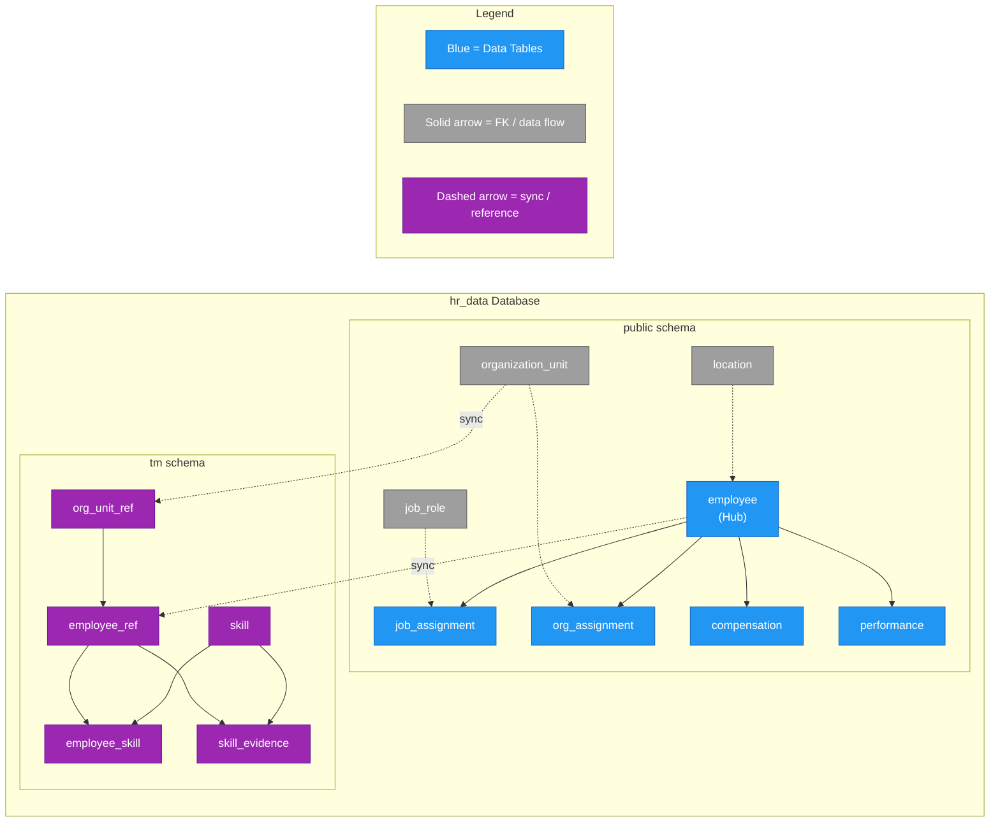
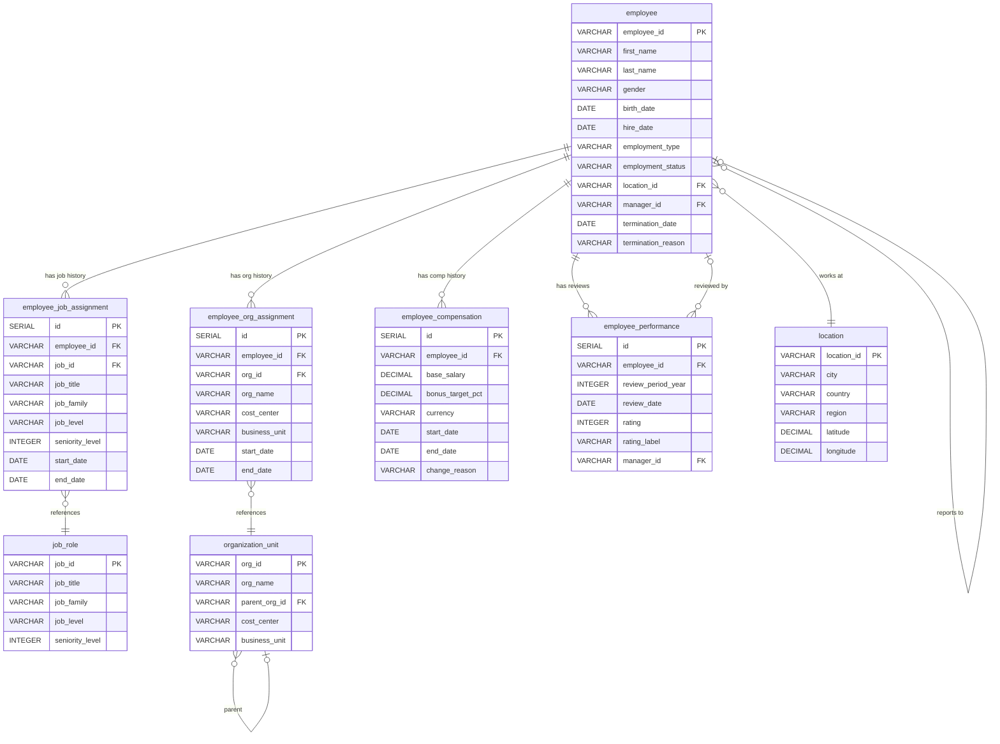
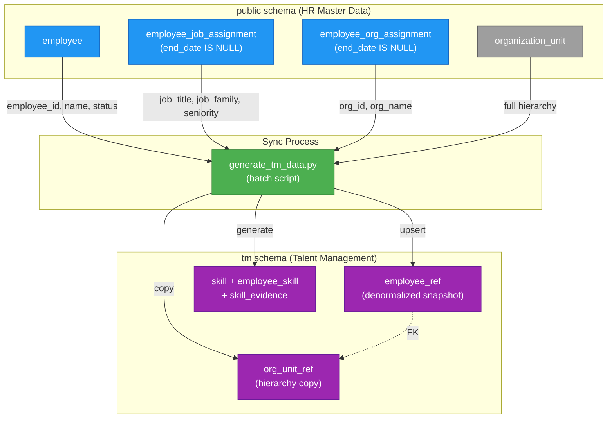
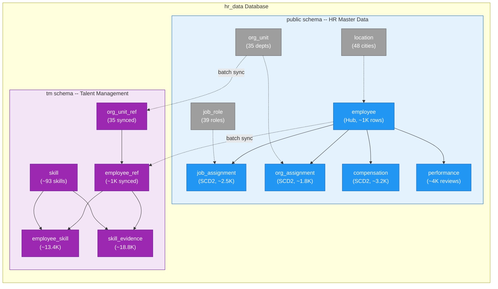

# Database Design

## 1. Overview

The Talent Management demo uses a single PostgreSQL database (`hr_data`) that houses two logically separated schemas:

- **`public` schema** -- HR master data modeled as a Data Vault-inspired hub-and-satellite architecture, designed for historical tracking and time-travel analytics.
- **`tm` schema** -- Talent Management data focused on skills, proficiency, and evidence, kept independent so it can be queried without exposing sensitive HR compensation or performance data.

This dual-schema approach delivers a clean separation of concerns: the public schema mirrors what an enterprise HRIS like SAP SuccessFactors would produce, while the TM schema represents a purpose-built skills inventory that references -- but does not duplicate -- HR master records.

Data flows into these schemas through two independent generation pipelines. The public schema is populated by the HR Data Generator library (`hr_data_generator`), and the TM schema is populated by a separate script (`scripts/generate_tm_data.py`) that reads from the public schema and enriches it with synthetic skill profiles. See [Data Generation](../data-generation/index.md) for a detailed walkthrough of both pipelines.



---

## 2. Public Schema (HR Master Data)

The public schema implements a **Data Vault-inspired hub-and-satellite architecture** similar to what SAP SuccessFactors uses internally. At the center is a single hub table (`employee`) surrounded by four time-variant satellite tables that track historical changes using the SCD Type 2 pattern, plus three reference/dimension tables that provide lookup values.

### 2.1 Hub Table: `employee`

The `employee` table is the central entity -- one row per person, immutable demographic and employment-lifecycle data. It never stores time-variant information like job title or salary; those live in the satellites.

| Column | Type | Description |
|--------|------|-------------|
| `employee_id` | `VARCHAR(20)` PK | Unique identifier (e.g., `EMP000001`) |
| `first_name` | `VARCHAR(100)` | First name |
| `last_name` | `VARCHAR(100)` | Last name |
| `gender` | `VARCHAR(10)` | `male` / `female` / `na` |
| `birth_date` | `DATE` | Date of birth |
| `hire_date` | `DATE` | Employment start date |
| `employment_type` | `VARCHAR(20)` | `Full-time` / `Part-time` / `Contract` |
| `employment_status` | `VARCHAR(20)` | `Active` / `Terminated` / `Retired` |
| `location_id` | `VARCHAR(10)` FK | References `location` |
| `manager_id` | `VARCHAR(20)` FK | Self-reference (NULL for CEO) |
| `termination_date` | `DATE` | NULL if active |
| `termination_reason` | `VARCHAR(200)` | NULL if active |

**Business rules enforced by CHECK constraints:**

- **Exactly one CEO**: Only one employee may have `manager_id = NULL`.
- **No self-management**: `manager_id != employee_id` is enforced at the database level.
- **Termination consistency**: Active employees must have `termination_date = NULL`; terminated/retired employees must have a non-null termination date.
- **Age floor**: `hire_date >= birth_date + 16 years` prevents unrealistic hire ages.
- **Manager seniority**: Managers must have a higher seniority level than their reports (enforced by the generator, not a constraint).

### 2.2 Time-Variant Satellite Tables

Four satellite tables radiate from the hub, each tracking a different dimension of an employee's career over time:

**`employee_job_assignment`** -- Tracks job changes and promotions.

| Column | Type | Description |
|--------|------|-------------|
| `employee_id` | `VARCHAR(20)` FK | References `employee` |
| `job_id` | `VARCHAR(10)` FK | References `job_role` |
| `job_title` | `VARCHAR(200)` | Denormalized title for query convenience |
| `job_family` | `VARCHAR(50)` | `Engineering` / `Sales` / `Corporate` |
| `job_level` | `VARCHAR(20)` | `IC` / `Manager` / `Director` |
| `seniority_level` | `INTEGER` | 1 (Junior) through 5 (Director) |
| `start_date` | `DATE` | When this assignment began |
| `end_date` | `DATE` | NULL = current record |

**`employee_org_assignment`** -- Tracks department transfers.

| Column | Type | Description |
|--------|------|-------------|
| `employee_id` | `VARCHAR(20)` FK | References `employee` |
| `org_id` | `VARCHAR(10)` FK | References `organization_unit` |
| `org_name` | `VARCHAR(200)` | Denormalized department name |
| `cost_center` | `VARCHAR(20)` | Cost center code |
| `business_unit` | `VARCHAR(50)` | `Engineering` / `Sales` / `Corporate` |
| `start_date` | `DATE` | When this assignment began |
| `end_date` | `DATE` | NULL = current record |

**`employee_compensation`** -- Tracks salary changes.

| Column | Type | Description |
|--------|------|-------------|
| `employee_id` | `VARCHAR(20)` FK | References `employee` |
| `base_salary` | `DECIMAL(12,2)` | Annual base salary |
| `bonus_target_pct` | `DECIMAL(5,2)` | Target bonus as % of base (0-100) |
| `currency` | `VARCHAR(3)` | Currency code (default `USD`) |
| `start_date` | `DATE` | When this salary took effect |
| `end_date` | `DATE` | NULL = current record |
| `change_reason` | `VARCHAR(50)` | `New Hire` / `Annual Merit` / `Promotion` |

**`employee_performance`** -- Annual review records (not continuous like the other satellites).

| Column | Type | Description |
|--------|------|-------------|
| `employee_id` | `VARCHAR(20)` FK | References `employee` |
| `review_period_year` | `INTEGER` | Year under review |
| `review_date` | `DATE` | When the review was conducted |
| `rating` | `INTEGER` | 1-5 scale |
| `rating_label` | `VARCHAR(50)` | Human-readable label |
| `manager_id` | `VARCHAR(20)` FK | Manager who conducted the review |

The performance rating scale follows a bell-curve distribution:

| Rating | Label | Target Distribution |
|--------|-------|-------------------|
| 1 | Needs Improvement | 5% |
| 2 | Partially Meets Expectations | 15% |
| 3 | Meets Expectations | 50% |
| 4 | Exceeds Expectations | 25% |
| 5 | Outstanding | 5% |

A `UNIQUE(employee_id, review_period_year)` constraint guarantees at most one review per employee per year.

### 2.3 Reference Tables

Three dimension tables provide lookup values used by the hub and satellites:

**`organization_unit`** -- 35 departments in a hierarchical tree.

| Column | Type | Description |
|--------|------|-------------|
| `org_id` | `VARCHAR(10)` PK | e.g., `ORG031B` |
| `org_name` | `VARCHAR(200)` | Department name |
| `parent_org_id` | `VARCHAR(10)` FK | Self-reference (NULL for root) |
| `cost_center` | `VARCHAR(20)` | Cost center code |
| `business_unit` | `VARCHAR(50)` | `Engineering` / `Sales` / `Corporate` |

The hierarchy has three levels: the root corporation (`ORG001`), business-unit nodes (e.g., `ORG030` Engineering), and leaf departments (e.g., `ORG031B` Product Dev - Software).

**`job_role`** -- 39 roles across three families.

| Column | Type | Description |
|--------|------|-------------|
| `job_id` | `VARCHAR(10)` PK | e.g., `JR003` |
| `job_title` | `VARCHAR(200)` | Full title |
| `job_family` | `VARCHAR(50)` | `Engineering` / `Sales` / `Corporate` |
| `job_level` | `VARCHAR(20)` | `IC` / `Manager` / `Director` |
| `seniority_level` | `INTEGER` | 1-5 |

**`location`** -- 48 cities across the APJ region.

| Column | Type | Description |
|--------|------|-------------|
| `location_id` | `VARCHAR(10)` PK | e.g., `SG01` |
| `city` | `VARCHAR(100)` | City name |
| `country` | `VARCHAR(100)` | Country name |
| `region` | `VARCHAR(50)` | Always `APJ` |
| `latitude` | `DECIMAL(9,6)` | Geographic latitude |
| `longitude` | `DECIMAL(9,6)` | Geographic longitude |

Locations span 18 countries including Singapore, Malaysia, India, Japan, Australia, and others throughout the Asia-Pacific region.

### 2.4 Entity-Relationship Diagram



### 2.5 Views and Functions

Two database objects simplify common access patterns:

**`v_employee_current`** -- A denormalized view that joins the hub table with all four satellites (filtered to `end_date IS NULL`) and the location table. This produces a single flat row per employee with their current job, org, compensation, and location data. It is the primary query target for dashboards and reports.

```sql
-- Usage: get all active employees with their current state
SELECT * FROM v_employee_current WHERE employment_status = 'Active';
```

**`get_employee_at_date(p_employee_id, p_date)`** -- A PL/pgSQL function that performs point-in-time lookups. Given an employee ID and a date, it returns the employee's job title, org name, salary, and seniority level as of that date by filtering each satellite's `start_date <= p_date AND (end_date IS NULL OR end_date >= p_date)`.

```sql
-- Usage: what was EMP000001's situation on June 15, 2023?
SELECT * FROM get_employee_at_date('EMP000001', '2023-06-15');
```

---

## 3. SCD Type 2 Deep Dive

### 3.1 The Pattern

All four satellite tables implement the **Slowly Changing Dimension Type 2** (SCD2) pattern. Instead of overwriting a record when data changes, the system closes the current record (by setting `end_date`) and inserts a new one. This preserves full history while making "current state" queries trivial.

The rules are:

1. **`end_date = NULL`** marks the current/active record.
2. **Exactly one active record** per employee per satellite at any time.
3. **No overlapping date ranges** for the same employee within a satellite.
4. **On termination**, all open satellite records receive `end_date = termination_date`.

Here is a concrete example showing how EMP000001's job history is stored:

```
employee_id | job_title               | seniority | start_date | end_date
------------|-------------------------|-----------|------------|------------
EMP000001   | Software Engineer I     | 1         | 2019-03-15 | 2020-04-30
EMP000001   | Software Engineer II    | 2         | 2020-05-01 | 2022-06-14
EMP000001   | Senior Software Eng.    | 3         | 2022-06-15 | NULL
```

The third row has `end_date = NULL`, indicating it is the current record. If this employee were terminated on 2025-01-15, the row would be updated to `end_date = '2025-01-15'`.

### 3.2 Timeline Visualization

The following Gantt chart illustrates a hypothetical career progression for EMP000001 across job assignments, org assignments, and compensation changes:

```mermaid
gantt
    title EMP000001 Career Timeline (SCD Type 2 Records)
    dateFormat YYYY-MM-DD
    axisFormat %Y

    section Job Assignment
    Software Engineer I      :j1, 2019-03-15, 2020-04-30
    Software Engineer II     :j2, 2020-05-01, 2022-06-14
    Senior Software Engineer :active, j3, 2022-06-15, 2025-12-31

    section Org Assignment
    Product Dev - Software   :o1, 2019-03-15, 2021-08-31
    Product Dev - Systems    :active, o2, 2021-09-01, 2025-12-31

    section Compensation
    New Hire: $65,000        :c1, 2019-03-15, 2020-03-31
    Annual Merit: $70,000    :c2, 2020-04-01, 2020-04-30
    Promotion: $82,000       :c3, 2020-05-01, 2022-06-14
    Promotion: $105,000      :active, c4, 2022-06-15, 2025-12-31
```

Note how job, org, and compensation changes happen at different times -- a promotion may coincide with a salary bump but not necessarily a department transfer. This independence is exactly why the satellites are separate tables.

### 3.3 Why SCD Type 2 Over Alternatives?

**Why not Third Normal Form (3NF)?**

A fully normalized schema would store each historical attribute in a separate table with its own effective date columns. Reconstructing "what did this employee look like on date X?" would require complex multi-table UNION queries with correlated subqueries on each attribute. SCD2 bundles related attributes into logical groups (job, org, compensation) that change together, making point-in-time queries straightforward.

**Why not a Pure Star Schema (daily grain)?**

A star schema with one row per employee per day would provide the simplest queries but at massive cost. With 1,000 employees over 5 years, that is approximately 1,000 x 1,825 = 1.8 million rows in a single fact table -- and most rows would be identical copies of the previous day. SCD2 stores a new record only when something actually changes, resulting in orders-of-magnitude fewer rows while preserving the same analytical capability.

### 3.4 Common Query Patterns

**Current state** -- The most common query. Filter for `end_date IS NULL`:

```sql
SELECT e.employee_id, ja.job_title, ja.seniority_level
FROM employee e
JOIN employee_job_assignment ja
  ON e.employee_id = ja.employee_id AND ja.end_date IS NULL
WHERE e.employment_status = 'Active';
```

**Time-travel** -- Retrieve state at any historical date:

```sql
SELECT ja.job_title, c.base_salary
FROM employee e
JOIN employee_job_assignment ja ON e.employee_id = ja.employee_id
  AND '2022-06-01' BETWEEN ja.start_date
  AND COALESCE(ja.end_date, '9999-12-31')
JOIN employee_compensation c ON e.employee_id = c.employee_id
  AND '2022-06-01' BETWEEN c.start_date
  AND COALESCE(c.end_date, '9999-12-31')
WHERE e.employee_id = 'EMP000001';
```

**Tenure calculation** -- How long has someone been in their current role:

```sql
SELECT employee_id, job_title,
       ROUND(EXTRACT(EPOCH FROM AGE(start_date)) / (365.25 * 86400), 1)
         AS years_in_role
FROM employee_job_assignment
WHERE end_date IS NULL;
```

**Promotion counting** -- How many role changes has each person had:

```sql
SELECT employee_id, COUNT(*) - 1 AS promotions
FROM employee_job_assignment
GROUP BY employee_id
HAVING COUNT(*) > 1
ORDER BY promotions DESC;
```

---

## 5. Cross-Schema Synchronization

The TM schema does not directly reference public schema tables through foreign keys. Instead, it maintains its own denormalized copies via two reference tables: `tm.employee_ref` and `tm.org_unit_ref`. This section explains how data flows between the schemas.

For a detailed look at the TM schema tables, ENUM types, and skill categories, see [TM Schema (Talent Management)](tm-schema.md).

### 5.1 Sync Mechanism

The `scripts/generate_tm_data.py` script in the Talent Management App repository performs a batch synchronization:

1. **Read from public schema**: The script queries `public.employee` joined with current job and org assignments (`end_date IS NULL`) to get each employee's latest state.
2. **Write to TM reference tables**: For each active employee, it inserts or updates a row in `tm.employee_ref` with denormalized fields (`display_name`, `job_title`, `job_family`, `org_name`, `seniority_level`).
3. **Org hierarchy copy**: The full `public.organization_unit` table is copied into `tm.org_unit_ref` to support recursive hierarchy queries within the TM schema.

This is a **batch process, not real-time replication**. In a production system, this would likely be replaced by CDC (Change Data Capture) or an event-driven sync, but for the demo, batch generation is sufficient.

### 5.2 Search Path Configuration

The Talent Management App's database connection pool is configured with:

```
server_settings = {"search_path": "tm,public"}
```

This means SQL queries issued by the application resolve table names by checking the `tm` schema first, then falling back to `public`. As a result, queries do not need explicit schema prefixes -- `SELECT * FROM employee_ref` resolves to `tm.employee_ref`, and `SELECT * FROM employee` resolves to `public.employee` (since there is no `tm.employee` table).

This approach keeps queries clean while still allowing cross-schema joins when needed (e.g., for the organizational summary endpoints described in [Business Questions & SQL Query Design](../business-queries/index.md)).

### 5.3 Cross-Schema Sync Flow



### 5.4 Why Not Direct Foreign Keys?

The decision to use reference copies instead of cross-schema foreign keys was deliberate:

- **Schema independence**: The TM schema can be deployed, dropped, or migrated without affecting the HR master data.
- **Query performance**: TM queries never need cross-schema joins for basic skill lookups, keeping the common path fast.
- **Security boundary**: In a production scenario, the TM application service account could have `SELECT` on `tm.*` but no access to `public.employee_compensation` or `public.employee_performance`, enforcing data isolation at the database level.

---

## 6. Full Schema Overview

### 6.1 Combined Schema Summary

The following table summarizes every table across both schemas:

| Schema | Table | Type | Approximate Rows | Purpose |
|--------|-------|------|-------------------|---------|
| `public` | `employee` | Hub | ~1,000 | Core employee demographics and lifecycle |
| `public` | `employee_job_assignment` | Satellite (SCD2) | ~2,500 | Job title and promotion history |
| `public` | `employee_org_assignment` | Satellite (SCD2) | ~1,800 | Department and transfer history |
| `public` | `employee_compensation` | Satellite (SCD2) | ~3,200 | Salary and bonus history |
| `public` | `employee_performance` | Satellite (event) | ~4,000 | Annual performance reviews |
| `public` | `organization_unit` | Reference | 35 | Hierarchical department structure |
| `public` | `job_role` | Reference | 39 | Job catalog (titles, families, levels) |
| `public` | `location` | Reference | 48 | APJ geographic locations |
| `public` | `hr_data_load_checkpoint` | Operational | varies | Streaming load progress tracking |
| `tm` | `org_unit_ref` | Reference copy | 35 | HR org hierarchy for TM queries |
| `tm` | `employee_ref` | Reference copy | ~1,000 | Denormalized employee snapshot |
| `tm` | `skill` | Dimension | ~93 | Skill catalog with categories |
| `tm` | `employee_skill` | Junction | ~13,410 | Employee-skill proficiency mappings |
| `tm` | `skill_evidence` | Fact | ~18,794 | Evidence items backing skill claims |

Row counts are approximate and depend on the generation parameters (seed, employee count, sample percentage). The figures above reflect a typical run with 1,000 employees and 100% TM sampling.

### 6.2 Combined Architecture Diagram



### 6.3 Design Decisions Summary

| Decision | Choice | Rationale |
|----------|--------|-----------|
| Hub-and-satellite architecture | Data Vault-inspired | Mirrors SAP SuccessFactors model; clean separation of static vs. time-variant data |
| SCD Type 2 for history | `start_date` / `end_date` pattern | Efficient storage (rows only on change); simple current-state and time-travel queries |
| Separate job and org satellites | Independent tracking | Job promotions and department transfers happen independently in real organizations |
| Denormalized columns in satellites | `job_title` in `employee_job_assignment`, `org_name` in `employee_org_assignment` | Avoids joins for common read queries; acceptable trade-off for a read-heavy analytics workload |
| TM schema reference copies | `employee_ref` and `org_unit_ref` | Schema independence, security boundary, query performance |
| PostgreSQL ENUMs for TM | `skill_category`, `skill_source`, `evidence_type` | Type safety at the database level; no need for separate lookup tables given the small, stable value sets |
| Composite primary key for `employee_skill` | `(employee_id, skill_id)` | Natural key prevents duplicates; no surrogate needed for a junction table |
| `confidence` score (0-100) | Computed from evidence count, recency, and signal strength | Provides a single ranking metric that accounts for evidence quality, not just self-reported proficiency |

---

**Next**: [Data Generation](../data-generation/index.md) covers how the HR Data Generator library and the TM data script populate these schemas with realistic, internally consistent synthetic data.

**Previous**: [Architecture](../architecture/index.md)
