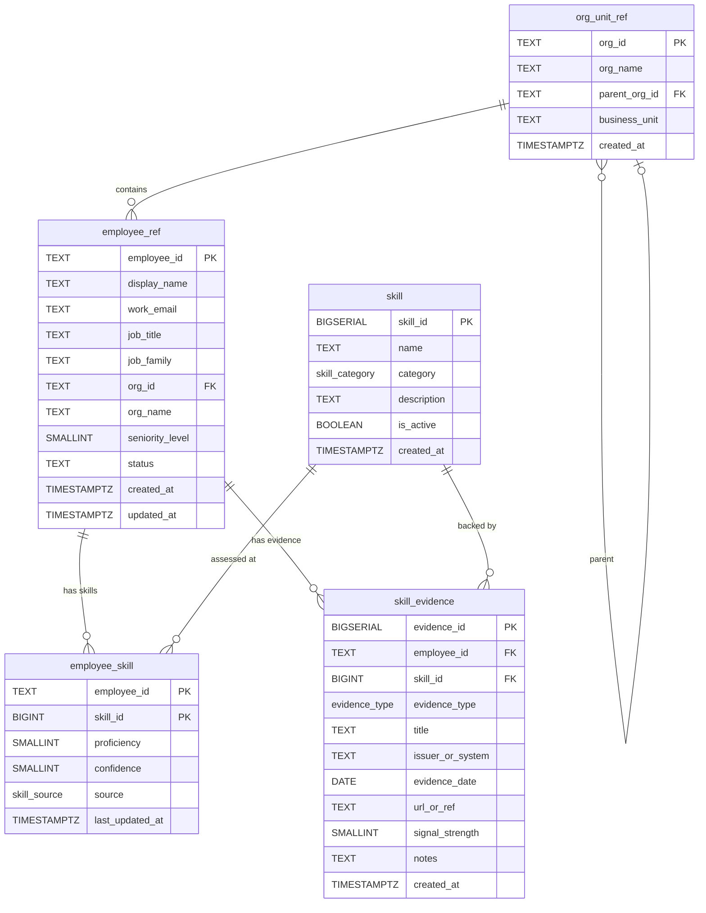

# TM Schema (Talent Management)

The `tm` schema resides in the same `hr_data` database but is logically independent. It focuses on skills, proficiency assessment, and evidence -- the building blocks of a talent management system. The schema does not store compensation, performance ratings, or other sensitive HR data.

For the public schema design, SCD Type 2 pattern details, cross-schema synchronization, and the full schema overview, see the [Database Design](index.md) main page.

## 4.1 Tables

**`tm.org_unit_ref`** -- Lightweight copy of the HR org hierarchy.

| Column | Type | Description |
|--------|------|-------------|
| `org_id` | `TEXT` PK | Matches `public.organization_unit.org_id` |
| `org_name` | `TEXT` | Department name |
| `parent_org_id` | `TEXT` FK | Self-referencing for hierarchy traversal |
| `business_unit` | `TEXT` | Business unit classification |
| `created_at` | `TIMESTAMPTZ` | Record creation timestamp |

**`tm.employee_ref`** -- TM system's local sync of HR master data.

| Column | Type | Description |
|--------|------|-------------|
| `employee_id` | `TEXT` PK | Matches `public.employee.employee_id` |
| `display_name` | `TEXT` | Full name |
| `work_email` | `TEXT` | Generated email address |
| `job_title` | `TEXT` | Current job title |
| `job_family` | `TEXT` | Job family classification |
| `org_id` | `TEXT` FK | References `tm.org_unit_ref` |
| `org_name` | `TEXT` | Denormalized department name |
| `seniority_level` | `SMALLINT` | 1-5, mirroring HR data |
| `status` | `TEXT` | `active` / `terminated` / `leave` |
| `created_at` | `TIMESTAMPTZ` | Record creation timestamp |
| `updated_at` | `TIMESTAMPTZ` | Auto-updated via trigger |

**`tm.skill`** -- Catalog of all skills tracked by the system.

| Column | Type | Description |
|--------|------|-------------|
| `skill_id` | `BIGSERIAL` PK | Auto-incrementing identifier |
| `name` | `TEXT` UNIQUE | Skill name (e.g., "Python", "People Management") |
| `category` | `skill_category` ENUM | Classification bucket |
| `description` | `TEXT` | Optional description |
| `is_active` | `BOOLEAN` | Whether the skill is currently tracked |
| `created_at` | `TIMESTAMPTZ` | Record creation timestamp |

**`tm.employee_skill`** -- The many-to-many join between employees and skills.

| Column | Type | Description |
|--------|------|-------------|
| `employee_id` | `TEXT` | Composite PK part 1, references `employee_ref` |
| `skill_id` | `BIGINT` | Composite PK part 2, references `skill` |
| `proficiency` | `SMALLINT` | 0 (none) to 5 (expert) |
| `confidence` | `SMALLINT` | 0-100, reflects evidence quality and recency |
| `source` | `skill_source` ENUM | How the proficiency was assessed |
| `last_updated_at` | `TIMESTAMPTZ` | Auto-updated via trigger |

**`tm.skill_evidence`** -- Supporting evidence for skill claims.

| Column | Type | Description |
|--------|------|-------------|
| `evidence_id` | `BIGSERIAL` PK | Auto-incrementing identifier |
| `employee_id` | `TEXT` FK | References `employee_ref` |
| `skill_id` | `BIGINT` FK | References `skill` |
| `evidence_type` | `evidence_type` ENUM | Classification of evidence |
| `title` | `TEXT` | Description (e.g., "AWS SAA Certification") |
| `issuer_or_system` | `TEXT` | Source (e.g., "Coursera", "Internal") |
| `evidence_date` | `DATE` | When the evidence was produced |
| `url_or_ref` | `TEXT` | Link or internal reference |
| `signal_strength` | `SMALLINT` | 1-5, weight of this evidence |
| `notes` | `TEXT` | Additional context |
| `created_at` | `TIMESTAMPTZ` | Record creation timestamp |

## 4.2 ENUM Types

The TM schema uses three PostgreSQL ENUM types to enforce value consistency without separate lookup tables:

- **`skill_category`**: `technical`, `functional`, `leadership`, `domain`, `tool`, `other`
- **`skill_source`**: `self`, `manager`, `assessment`, `certification`, `peer`, `inferred`, `system`
- **`evidence_type`**: `certification`, `project`, `assessment`, `manager_validation`, `peer_endorsement`, `portfolio`, `work_history`, `other`

## 4.3 Skill Categories Breakdown

The skill catalog contains approximately 93 skills distributed across five primary categories (plus `other`):

| Category | Count | Examples |
|----------|-------|---------|
| `technical` | ~31 | Python, Java, PCB Design, Six Sigma, FMEA |
| `tool` | ~25 | Docker, Kubernetes, Salesforce CRM, SAP, Jira |
| `functional` | ~25 | Pipeline Management, HR Analytics, Financial Modeling |
| `leadership` | ~8 | People Management, Strategic Planning, Change Management |
| `domain` | ~4 | ISO 9001, IATF 16949, Automotive Standards |

## 4.4 TM Schema ER Diagram

---

**Back to**: [Database Design](index.md) -- covers the public schema, SCD Type 2 deep dive, cross-schema synchronization, and full schema overview.

**Next**: [Data Generation](../data-generation/index.md) covers how the HR Data Generator library and the TM data script populate these schemas with realistic, internally consistent synthetic data.

**Previous**: [Architecture](../architecture/index.md)
