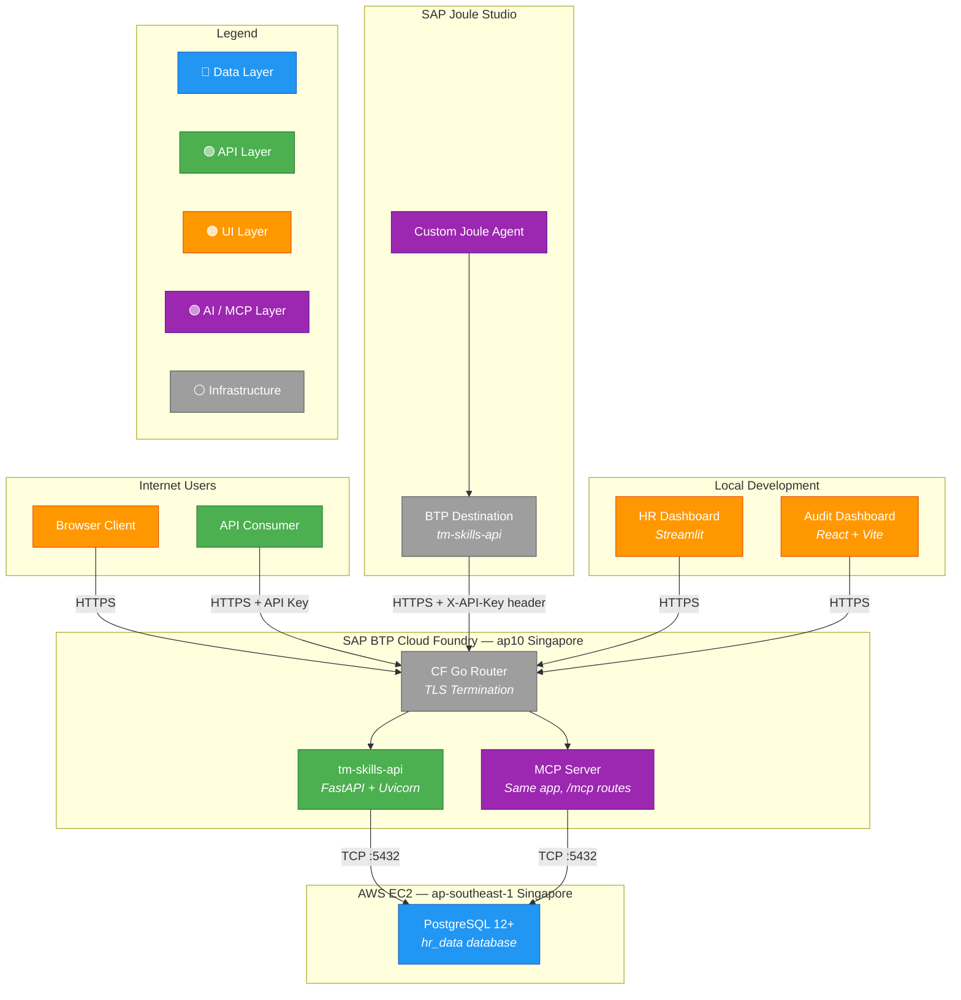
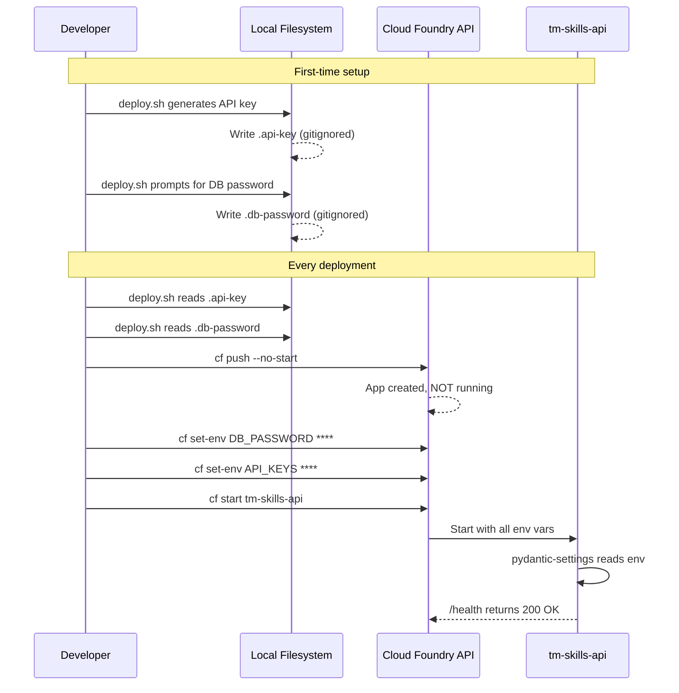
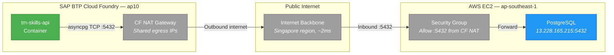
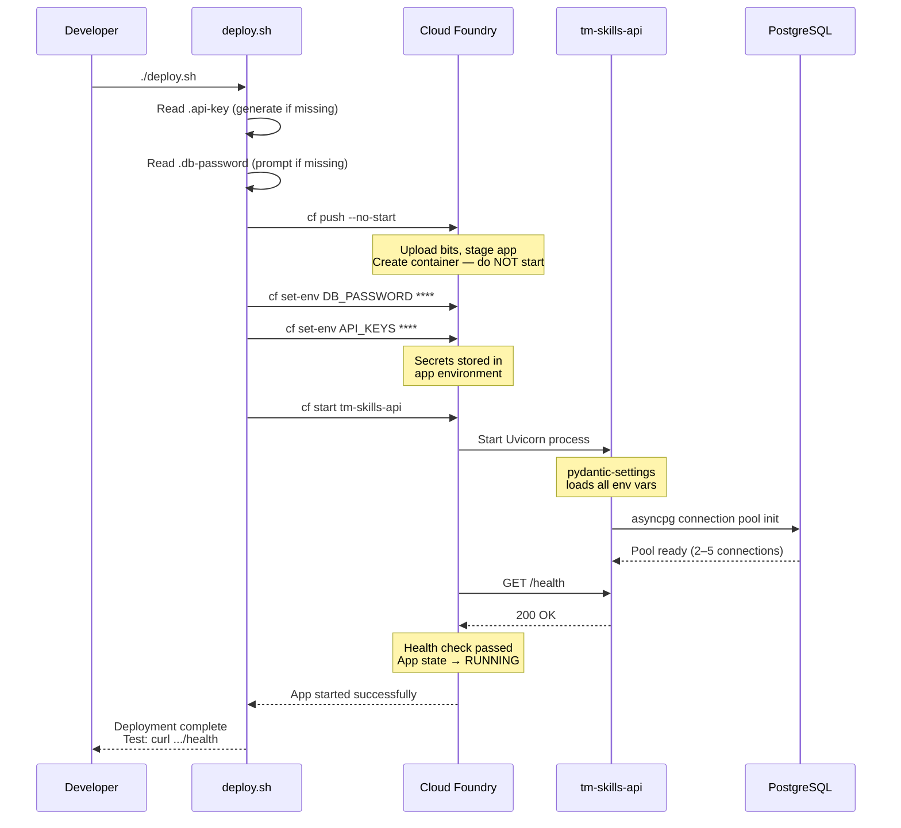

# Deployment

This chapter covers the end-to-end deployment of the Talent Management demo, from local development through SAP BTP Cloud Foundry and AWS infrastructure. The deployment strategy was designed around a key constraint: the application needed to run on SAP BTP Cloud Foundry (for integration with SAP Joule Studio) while connecting to an external PostgreSQL database hosted on AWS EC2. The result is a cross-cloud topology that works reliably with minimal resource consumption.

For context on the application being deployed, see [Business Questions & SQL Query Design](../business-queries/index.md) and [Architecture](../architecture/index.md).

---

## Deployment Topology

The system spans three environments: SAP BTP Cloud Foundry for the API and MCP server, AWS EC2 for the database, and local machines for dashboards still under development.



**Key design decisions:**

- **Same-region co-location:** Both BTP CF (ap10) and AWS EC2 (ap-southeast-1) are in Singapore, keeping database round-trip latency under 5ms.
- **Single CF app:** The TM Skills API and MCP Server are the same FastAPI application. MCP endpoints are additional routes, not a separate deployment.
- **Local dashboards:** The HR Dashboard (Streamlit) and Audit Dashboard (React) run locally during development. They call the deployed CF API over HTTPS.

---

## Cloud Foundry Deployment Artifacts

Cloud Foundry uses a convention-over-configuration model. The Python buildpack detects and processes specific files in the project root. Here is the complete set of deployment artifacts:

| File | Purpose |
|------|---------|
| `Procfile` | Start command: `web: uvicorn app.main:app --host 0.0.0.0 --port $PORT --workers 1 --log-level info` |
| `manifest.yml` | App config: 256M memory, `python_buildpack`, HTTP health check on `/health` |
| `requirements.txt` | Production dependencies (CF Python buildpack installs these) |
| `runtime.txt` | Python version pin: `python-3.10.x` |
| `.cfignore` | Excludes dev artifacts, secrets, tests, and docs from CF upload |
| `deploy.sh` | Automated deployment script with secret generation and management |

### manifest.yml

The manifest declares the application's resource requirements and non-secret environment variables:

```yaml
applications:
  - name: tm-skills-api
    memory: 256M
    disk_quota: 512M
    instances: 1
    buildpacks:
      - python_buildpack
    health-check-type: http
    health-check-http-endpoint: /health
    timeout: 120
    env:
      DB_HOST: "13.228.165.215"
      DB_PORT: "5432"
      DB_NAME: "hr_data"
      DB_USER: "hr_app"
      # DB_PASSWORD: set via `cf set-env` — never commit secrets
      DB_MIN_POOL: "2"
      DB_MAX_POOL: "5"
      CORS_ORIGINS: '["https://tm-skills-api.cfapps.ap10.hana.ondemand.com"]'
      # API_KEYS: set via `cf set-env` — never commit secrets
```

### Resource Sizing Rationale

| Resource | Value | Reasoning |
|----------|-------|-----------|
| Memory | 256M | Sufficient for async FastAPI + asyncpg. No heavy ML libraries loaded. |
| Workers | 1 | Single Uvicorn worker. The async event loop handles concurrency via coroutines, not processes. |
| DB pool max | 5 | Reduced from the default 10 in `config.py` — CF containers have limited outbound socket capacity. |
| Instances | 1 | Demo workload. Can scale horizontally by increasing this value. |
| Timeout | 120s | CF allows up to 120s for the app to start and pass health checks. |

### .cfignore

The `.cfignore` file is critical for keeping the CF upload lean and secure. It excludes credentials (`.api-key`, `.db-password`), the deployment script itself, test suites, IDE configs, and documentation. Without it, `cf push` would upload everything in the directory, including secrets stored in local files.

---

## Secret Management

Secrets — specifically `DB_PASSWORD` and `API_KEYS` — must never appear in `manifest.yml` or version control. The deployment script (`deploy.sh`) manages this through local credential files and the `cf set-env` command.

### The Critical Gotcha

Cloud Foundry's `manifest.yml` environment variables **overwrite** any values previously set via `cf set-env` on every `cf push`. Early in development, a line like `DB_PASSWORD: ""` in the manifest silently wiped the real password every time the app was redeployed.

**The rule:** Never put secrets in `manifest.yml`, not even as empty placeholders. Use comments instead (as shown above).

### Secret Flow



### deploy.sh Behavior

The deployment script follows a strict sequence:

1. **First run:** Generates a cryptographically random API key via Python's `secrets` module and writes it to `.api-key`. Prompts the operator for the database password and writes it to `.db-password`. Both files are listed in `.gitignore` and `.cfignore`.
2. **Every run:** Reads both files from disk, then executes:
   ```bash
   cf push --no-start          # Upload code, create app — do NOT start
   cf set-env tm-skills-api DB_PASSWORD "$(cat .db-password)"
   cf set-env tm-skills-api API_KEYS "$(cat .api-key)"
   cf start tm-skills-api      # Start with secrets now in env
   ```
3. **Key rotation:** Running `./deploy.sh --rotate` regenerates a new API key before deployment. The old key is immediately invalidated once the app restarts.

### The First-Push Chicken-and-Egg Problem

`cf set-env` requires the app to already exist in Cloud Foundry, but `cf push` by default creates the app **and starts it immediately**. On first deployment, the app would start without `DB_PASSWORD`, fail to connect to PostgreSQL, and crash.

The solution: `cf push --no-start` creates the app container and uploads the code without starting the process. This allows `cf set-env` to inject secrets before the first start.

---

## AWS EC2 PostgreSQL Setup

The PostgreSQL database runs on a dedicated AWS EC2 instance in the `ap-southeast-1` (Singapore) region, co-located with the BTP CF `ap10` region for minimal latency.

### Database Configuration

| Parameter | Value |
|-----------|-------|
| Instance region | ap-southeast-1 (Singapore) |
| Database engine | PostgreSQL 12+ |
| Database name | `hr_data` |
| Schemas | `public` (HR master data), `tm` (talent management) |
| Application user | `hr_app` (read/write on both schemas) |
| Listen address | `0.0.0.0:5432` (bound to public IP) |

### Network Security

The EC2 security group must allow inbound TCP on port 5432 from the Cloud Foundry NAT egress IP ranges. BTP CF apps in `ap10` share a pool of NAT gateway IPs for outbound internet traffic. These IPs can be found in the SAP BTP documentation or by inspecting outbound connections from a test app.

### Network Path



!!! warning "Important"

    - There is no VPN or private peering between BTP CF and AWS. Traffic traverses the public internet, though it stays within Singapore data centers.
    - The database password and TLS (if configured on PostgreSQL) are the primary security controls for this link.
    - The EC2 instance uses a static public IP (Elastic IP) to avoid address changes on reboot.

---

## BTP Destination Configuration

SAP Joule Studio cannot call arbitrary external URLs directly. It routes outbound requests through the BTP Destination Service. A destination named `tm-skills-api` bridges Joule to the Cloud Foundry app.

| Field | Value |
|-------|-------|
| Name | `tm-skills-api` |
| Type | HTTP |
| Authentication | NoAuthentication |
| URL | `https://tm-skills-api.cfapps.ap10.hana.ondemand.com` |
| ProxyType | Internet |
| Additional Property | `URL.headers.X-API-Key` = *(API key value)* |

### The `URL.headers.<name>` Convention

BTP Destination Service supports injecting custom HTTP headers via additional properties using the naming pattern `URL.headers.<HeaderName>`. This is the standard mechanism for passing API keys, tokens, or other custom headers to downstream services.

This property name is **not available in the dropdown** when configuring the destination in BTP Cockpit — it must be typed manually in the "Additional Properties" section. Authentication is set to `NoAuthentication` because the API key is injected via the custom header rather than through a standard OAuth or Basic Auth flow.

For more information on SAP Joule Studio and custom agent integration, see [Architecture](../architecture/index.md).

---

## CF Deploy Sequence

The full deployment sequence from developer action to running application:



The entire sequence typically completes in 60–90 seconds: ~30s for staging (installing Python dependencies), ~10s for environment variable configuration, and ~20–30s for startup and health check verification.

---

## Zero Code Changes for Cloud Foundry

A notable outcome of the application's design is that **no source code modifications were required** to deploy on Cloud Foundry. This was not accidental — the application's configuration approach made it inherently portable:

1. **pydantic-settings reads environment variables by default.** The `Settings` class in `app/config.py` uses `pydantic_settings.BaseSettings`, which automatically reads environment variables matching field names. The `.env` file is optional (used locally); on CF, the real environment variables take precedence.

2. **Static file serving uses relative paths.** FastAPI's `StaticFiles` mount uses a path relative to the application root. CF sets the working directory to the application root after staging, so paths resolve identically to local development.

3. **The `/health` endpoint already existed.** CF's HTTP health check requires an endpoint that returns a 200 status. The application already had `/health` for operational monitoring, so no additional endpoint was needed.

4. **asyncpg connects via environment variables.** The database connection string is constructed from individual `DB_HOST`, `DB_PORT`, `DB_USER`, `DB_PASSWORD`, and `DB_NAME` environment variables — all configurable without touching code.

5. **The `$PORT` variable is standard.** CF injects the `$PORT` environment variable to tell the app which port to listen on. The `Procfile` already referenced `--port $PORT`.

This portability pattern — environment-driven configuration with sensible defaults — is worth replicating in future projects. See [Learnings & Future Improvements](../learnings/index.md) for broader takeaways.

---

## The pydantic-settings Gotcha

One subtle issue arose during deployment related to how pydantic-settings parses complex types from environment variables.

### The Problem

An early version of `config.py` defined the API keys field as:

```python
api_keys: set[str] = set()
```

pydantic-settings expects environment variables for `set[str]` fields to contain **valid JSON arrays**:

```bash
API_KEYS='["key1","key2"]'    # This works
API_KEYS='key1,key2'          # This fails with a validation error
```

Setting a plain comma-separated string via `cf set-env` caused a pydantic validation error on startup, crashing the application before it could serve requests.

### The Solution

The field was changed to a plain string with a property that provides the parsed set:

```python
api_keys: str = ""  # Plain string — no JSON parsing issues

@property
def api_keys_set(self) -> set[str]:
    """Parse comma-separated API_KEYS string into a set."""
    return {k.strip() for k in self.api_keys.split(",") if k.strip()}
```

This accepts any delimiter-separated string, which is far more operator-friendly when setting values via `cf set-env` or BTP Destination properties. The lesson: avoid complex pydantic types for environment variables that operators will set manually.

---

## Live Deployment Details

The application is currently deployed and accessible at the following coordinates:

| Property | Value |
|----------|-------|
| **Base URL** | `https://tm-skills-api.cfapps.ap10.hana.ondemand.com` |
| **Health check** | `/health` |
| **API explorer** | `/static/index.html` |
| **OpenAPI spec** | `/openapi.json` |
| **Region** | SAP BTP ap10 (Singapore) |
| **Org** | `SEAIO_dial-3-0-zme762l7` |
| **Space** | `dev` |
| **Buildpack** | `python_buildpack` |
| **Python version** | 3.10.x |
| **Memory** | 256M |
| **Instances** | 1 |

The API explorer at `/static/index.html` provides a browser-based interface for testing all available business question endpoints without needing API tools like `curl` or Postman. It is served as a static file by FastAPI and requires the `X-API-Key` header for authenticated endpoints.

---

## Summary of Deployment Gotchas

The deployment process surfaced several non-obvious issues worth documenting for future reference:

| Gotcha | Impact | Resolution |
|--------|--------|------------|
| `manifest.yml` env vars overwrite `cf set-env` | Secrets wiped on every deploy | Never put secrets in manifest, even as empty values |
| `cf push` starts immediately | App crashes without secrets on first deploy | Use `cf push --no-start` then set env, then start |
| `set[str]` in pydantic-settings | Requires JSON array in env var | Use plain `str` field with parsing property |
| CF NAT egress IPs | PostgreSQL security group must allow them | Whitelist CF region NAT IPs in AWS security group |
| `URL.headers.X-API-Key` in BTP Destination | Not in dropdown | Must be typed manually as additional property |

Each of these cost between 30 minutes and several hours to diagnose. They are documented here and in [Learnings & Future Improvements](../learnings/index.md) to save that time on future projects.

For details on securing the deployed application, see [Security](../security/index.md).

---

**Next:** [Security](../security/index.md) | **Previous:** [HR Analytics Dashboard](../dashboards/hr-analytics.md)
