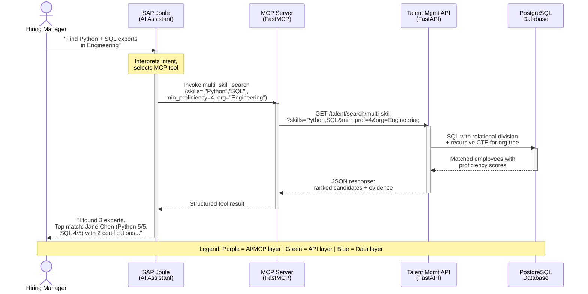
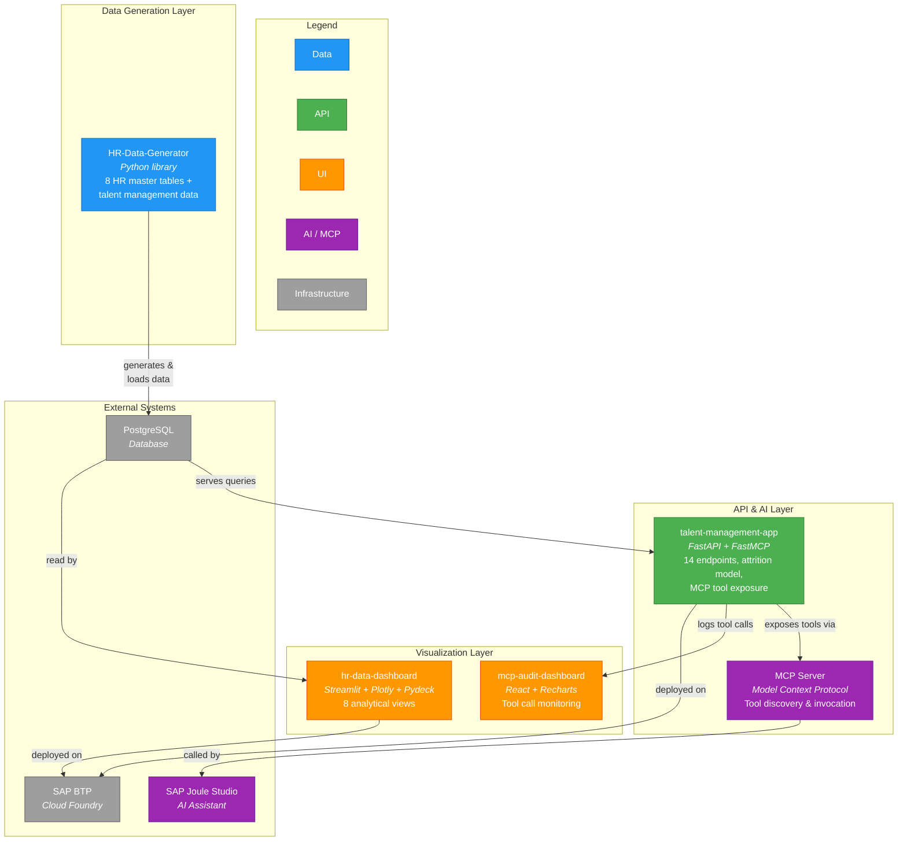

# Talent Management Demo

Welcome to the documentation site for the **Talent Management Demo** project. This site provides architectural overviews, implementation details, and design insights for the multi-repository talent management ecosystem -- organized as navigable articles for fast comprehension.

## Executive Summary

This documentation covers the **Talent Management Demo Ecosystem** -- a multi-repository project that demonstrates how synthetic HR data, a skills-focused REST API, AI agent integration, and analytics dashboards combine into an end-to-end talent management platform. The ecosystem was purpose-built for customer-facing demonstrations of SAP's AI capabilities, specifically showing how custom enterprise APIs connect to **SAP Joule Studio** through the **Model Context Protocol (MCP)**.

The demo spans four repositories, each handling a distinct layer of the stack: data generation, API and AI serving, HR analytics visualization, and MCP audit monitoring. Together, they answer a deceptively simple question that every enterprise struggles with:

> *"Given our workforce data, can an AI assistant answer complex talent questions in natural language -- and can we trust and audit what it does?"*

The answer this demo provides is *yes* -- and the pages that follow explain exactly how each piece works, why it was designed that way, and what lessons emerged from building it.

This documentation is intended for a technical audience comfortable with concepts like SQL joins, REST APIs, and data pipelines, but who may not be deeply familiar with every framework involved. Each section is self-contained enough to read independently, while cross-references guide readers who want the full picture.

---

## Problem Statement

Enterprise talent management sits at the intersection of several hard problems. Organizations invest heavily in HR systems like SAP SuccessFactors to manage employee master data -- job assignments, compensation, performance reviews, org structures -- yet the *talent intelligence* layer remains fragmented and underserved.

### Data Fragmentation

HR master data (employees, organizations, jobs, compensation) typically resides in a core HCM system. Skill and competency data, when it exists at all, lives in a separate learning management system, a spreadsheet, or nowhere. Bridging these two worlds requires deliberate schema design and data integration -- a problem explored in [Database Design](data-model/index.md).

### Skill Visibility

Consider a straightforward business question: *"Who in our Engineering organization has both Python and SQL at expert level?"* Answering this requires:

- A normalized skill catalog with consistent proficiency scales
- Employee-skill associations with quantified proficiency
- Organizational hierarchy traversal (Engineering includes sub-departments)
- Relational division in SQL (matching employees who have *all* requested skills, not just *any*)

Most enterprise systems cannot answer this question without manual data gathering. The Talent Management API solves it with a single endpoint, backed by advanced SQL patterns detailed in [Business Questions & SQL](business-queries/index.md).

### Evidence-Based Decisions

Self-reported skills lack credibility. An employee claiming "expert in Python" carries different weight than one whose Python proficiency is backed by three certifications, two project deliverables, and peer endorsements. The demo's evidence framework -- certifications, projects, assessments, and endorsements -- provides the trust layer that enterprise skill management needs.

### Attrition Prediction

Predicting employee attrition traditionally requires real, sensitive HR data -- data that is difficult to obtain for demos and risky to use in non-production environments. This project sidesteps the problem by generating synthetic data with configurable attrition drivers (performance, tenure, seniority, employment type), enabling a full ML prediction pipeline without privacy concerns. The data generation approach is covered in [Data Generation](data-generation/index.md).

### AI Integration Standardization

The final challenge is connectivity. Even if an API can answer talent questions, connecting it to an AI assistant like SAP Joule requires a standardized protocol. The **Model Context Protocol (MCP)** provides this standardization, turning API endpoints into "tools" that an AI agent can discover, select, and invoke autonomously. The MCP integration layer is the subject of [MCP Integration](mcp-integration/index.md).

---

## What This Demo Solves

The Talent Management Demo Ecosystem provides a complete, working reference implementation that addresses each of the problems above:

1. **Synthetic data generation** that mirrors real SAP SuccessFactors data models -- 8 interconnected HR master tables plus a full talent management layer with skills, evidence, and organizational mappings. No real employee data is needed.

2. **A REST API** answering 14 business questions about talent, built on FastAPI with raw SQL using advanced patterns including recursive CTEs, window functions, and relational division.

3. **An attrition prediction model** with explainable multi-factor risk scoring, using features extracted from the intersection of HR master data and talent management data.

4. **AI agent integration** via MCP, allowing natural language queries through SAP Joule -- turning SQL-powered endpoints into conversational tools.

5. **Visual analytics dashboards** for HR data exploration, including 8 analytical views covering compensation, performance, attrition, geographic distribution, and organizational hierarchy.

6. **Audit monitoring** for AI tool usage transparency, tracking every MCP tool call so organizations can verify what their AI assistant is doing and why.

---

## Customer Demo Scenarios

The ecosystem was designed around three representative demo scenarios that showcase progressively complex talent intelligence capabilities.

### Scenario 1: "Find Me a Python Expert in Engineering"

A hiring manager asks SAP Joule: *"Find me someone in the Engineering organization who is expert-level in both Python and SQL."*

Behind the scenes, Joule identifies the appropriate MCP tool (multi-skill search), constructs the API call with skill names and minimum proficiency thresholds, and the API executes a relational division query against PostgreSQL. The response includes ranked candidates with proficiency scores, confidence ratings, and links to supporting evidence (certifications, project work, peer endorsements).

### Scenario 2: "Show Me Attrition Risk for Sales"

A VP of Sales asks: *"Which of my people are most likely to leave?"*

Joule calls the organizational attrition summary endpoint, which extracts 9 features per employee from the combined HR and talent management dataset -- including tenure, recent performance trajectory, compensation percentile, skill staleness, and manager change frequency. The response provides a risk distribution across the org and highlights the top-N highest-risk employees with explainable factor breakdowns.

### Scenario 3: "What Skills Are We Lacking in Engineering?"

A Chief Learning Officer asks: *"Where are our skill gaps in Engineering?"*

Joule orchestrates multiple tool calls -- org skill summary and skill coverage endpoints -- to compare the skills currently held by Engineering employees against the skills required by their job roles. The response surfaces gaps (required skills with no coverage), weak areas (skills present but below target proficiency), and stale skills (not updated or evidenced recently), enabling targeted learning investment.

The following sequence diagram illustrates the flow for Scenario 1:

---

## Ecosystem Overview

The demo is distributed across four repositories, each responsible for a distinct architectural concern. The following diagram shows how they connect:

The following table maps each repository to its role and the sections that cover it in detail:

| Repository | Role | Relevant Sections |
|---|---|---|
| [HR-Data-Generator](https://github.com/pradeepj-prj/HR-Data-Generator) | Synthetic HR data generation library producing 8 interconnected tables with configurable attrition simulation | [Database Design](data-model/index.md), [Data Generation](data-generation/index.md) |
| [talent-management-app](https://github.com/pradeepj-prj/talent-management-app) | REST API with 14 endpoints, attrition prediction model, and MCP server for AI agent integration | [Architecture](architecture/index.md), [Business Questions & SQL](business-queries/index.md), [MCP Integration](mcp-integration/index.md) |
| [hr-data-dashboard](https://github.com/pradeepj-prj/hr-data-dashboard) | Streamlit analytics dashboard with 8 views covering compensation, performance, attrition, and geography | [HR Dashboard](dashboards/hr-analytics.md) |
| [mcp-audit-dashboard](https://github.com/pradeepj-prj/mcp-audit-dashboard) | React-based monitoring dashboard tracking MCP tool calls for transparency and governance | [MCP Integration](mcp-integration/index.md) |

---

## Technology Summary

The following table provides a quick reference for the technologies used across the ecosystem:

| Layer | Technologies | Purpose |
|---|---|---|
| **Data Generation** | Python, pandas, NumPy | Synthetic HR dataset creation with realistic distributions and constraints |
| **Database** | PostgreSQL 12+ | Relational storage for HR master data and talent management data |
| **API** | FastAPI, asyncpg, Pydantic, slowapi | Async REST API with connection pooling, schema validation, and rate limiting |
| **AI / MCP** | FastMCP, SAP Joule Studio, OpenAPI 3.0.3 | Tool exposure via Model Context Protocol for AI agent consumption |
| **HR Dashboard** | Streamlit, Plotly, Pydeck, NetworkX, Pyvis | Interactive data exploration with charts, maps, and network graphs |
| **Audit Dashboard** | React, Recharts | MCP tool call monitoring and usage analytics |
| **Infrastructure** | SAP BTP Cloud Foundry, AWS EC2, BTP Destination Service | Cloud deployment with cross-environment connectivity |

---

*Next: [Architecture](architecture/index.md) -- System topology, component interactions, and deployment architecture.*
