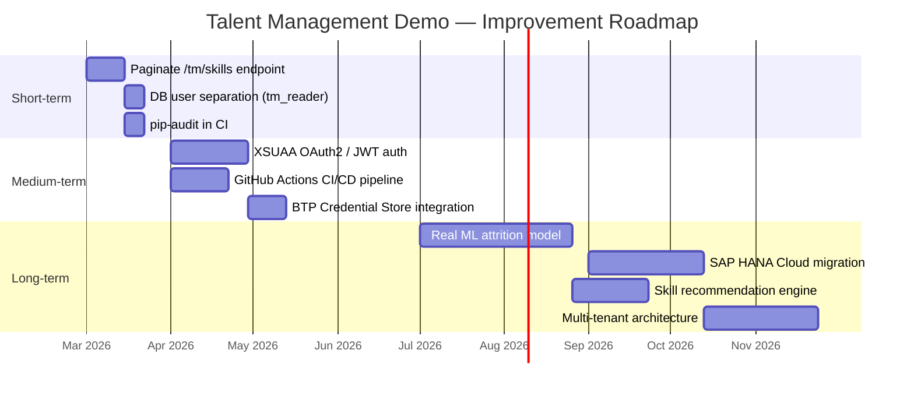
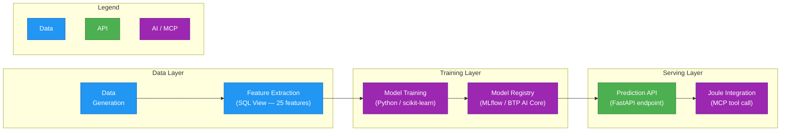
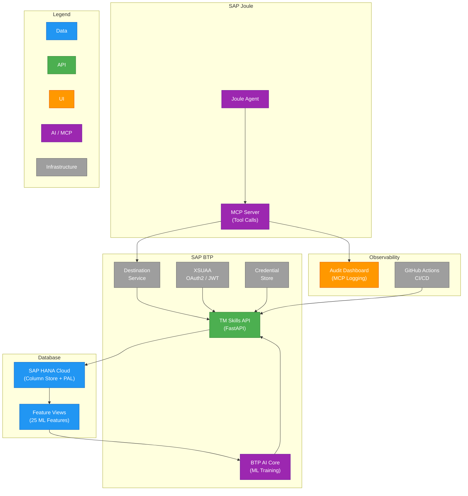

# Learnings & Future Improvements

**Previous:** [Deployment](../deployment/index.md) | **See also:** [Architecture](../architecture/index.md), [Business Questions & SQL Query Design](../business-queries/index.md)

This chapter consolidates the technical learnings from building and deploying the Talent Management demo, then charts a roadmap of future improvements. Each section distills decisions that either paid off or caused problems, with enough context that a reader facing similar choices can make an informed call. The final section presents a phased roadmap from the current state to a production-grade talent intelligence platform.

---

## Architecture Learnings

### Schema Separation Works

The decision to place all Talent Management tables in a dedicated `tm` schema within the shared `hr_data` database (see [Database Design](../data-model/index.md)) proved to be one of the most consequential positive choices in the project. Two reference tables -- `tm.employee_ref` and `tm.org_unit_ref` -- act as local syncs of HR master data. At query time the API never needs to cross into the `public` schema for employee names, job titles, or org hierarchy. The `search_path` is configured at the asyncpg pool level:

```python
server_settings={"search_path": "tm,public"}
```

This means every SQL query in `app/queries/` can reference `employee_ref`, `skill`, `employee_skill`, `skill_evidence`, and `org_unit_ref` without schema prefixes. The one exception is the attrition feature-extraction queries, which explicitly prefix `public.employee_performance` and `public.employee_job_assignment` because those tables exist only in the HR schema. The comment at the top of `attrition_queries.py` calls this out directly:

> *"public.\* tables must be explicitly prefixed because the connection search_path is (tm, public) -- unqualified names resolve to tm first."*

!!! key-pattern "Key Pattern"

    Schema separation gives you logical multi-tenancy inside a single database without the operational cost of managing multiple databases. The reference-table pattern (syncing a subset of another schema's data into yours) is a practical way to keep a service self-contained while still sharing infrastructure.

### Raw SQL Over ORM Was the Right Call

The API's 14+ endpoints use query patterns that would be awkward or impossible to express idiomatically in ORMs like SQLAlchemy or Tortoise:

| Pattern | Endpoint | SQL Feature |
|---------|----------|-------------|
| Relational division | Multi-skill AND search (5) | `HAVING COUNT(DISTINCT ...) = $3` |
| Recursive CTE | Org hierarchy traversal (12) | `WITH RECURSIVE org_tree AS (...)` |
| Self-join for co-occurrence | Skill adjacency (9) | `JOIN employee_skill es2 ON es1.employee_id = es2.employee_id` |
| LATERAL join | Attrition batch features | `LATERAL (SELECT ... LIMIT 1)` |
| Window functions | Various ranking queries | `ROW_NUMBER() OVER (...)` |
| Positional parameters | All queries | asyncpg's `$1, $2` prepared statements |

asyncpg's prepared statements (`$1`, `$2`) are both safe from SQL injection and cached by PostgreSQL's query planner, so the raw-SQL approach carries no security penalty and a measurable performance benefit for repeated queries. For more on the security aspects of this approach, see [Security](../security/index.md).

!!! key-pattern "Key Pattern"

    Use an ORM for CRUD-heavy applications where the queries are predictable. Use raw SQL when your query patterns are the core intellectual property of the service.

### Three-Layer Architecture

The `routers -> services -> queries` layering described in [Architecture](../architecture/index.md) proved its value during development:

- **Routers** (`app/routers/`) handle HTTP concerns: path parameters, query parameters, response models, dependency injection.
- **Services** (`app/services/`) contain business logic: computing attrition factors, assembling nested response objects, orchestrating multiple queries.
- **Queries** (`app/queries/`) are pure SQL strings plus the asyncpg `conn.fetch()` / `conn.fetchrow()` calls.

When the attrition prediction feature was added late in development (five new endpoints, a 9-factor multiplicative model, org-level summaries), the existing architecture absorbed it cleanly: `attrition_queries.py`, `attrition_service.py`, and `attrition.py` router followed the established pattern without modifying any existing code.

### asyncpg Over psycopg2 for the API

The API uses asyncpg for true non-blocking I/O with FastAPI's async event loop. The data generation script (`scripts/generate_tm_data.py`) uses psycopg2 because batch inserts via `execute_values()` are synchronous by nature and psycopg2 handles them well. This dual-driver approach was deliberate: async for the request-serving path, sync for the batch-loading path.

The practical difference: a single uvicorn worker with asyncpg handles concurrent requests without blocking, whereas psycopg2 would require multiple workers (processes) to achieve the same concurrency -- at significantly higher memory cost in a 256M Cloud Foundry container.

---

## Data Generation Learnings

### Correlated Data Creates Realism

The TM data generator (`scripts/generate_tm_data.py`, documented in [Data Generation Module](../data-generation/index.md)) produces believable data by correlating skill assignments with employee attributes:

- **Job-group matching:** Software engineers receive Python, Docker, and Kubernetes. Sales representatives receive Salesforce, Pipeline Management, and Contract Negotiation. The 93-skill catalog includes a `groups` field that constrains which job families can receive each skill.
- **Seniority-correlated skill breadth:** Senior employees (level 3+) receive more skills (up to 20), higher proficiency ratings, and leadership-category skills. Junior employees receive fewer skills (4-8) with lower average proficiency.
- **Staleness injection:** Approximately 17% of skill records have `last_updated_at` dates older than one year. This is not a bug -- it enables the governance/freshness endpoint (Question 7: stale skills) to return meaningful results during demos.

Without these correlations, a random uniform distribution would produce data that looks plausible in aggregate statistics but fails basic sanity checks ("Why does a sales rep have Kubernetes expertise at proficiency 5?").

### Seeded Randomness Is Critical

The TM generator uses `random.seed(42)` at the start of execution. The HR Data Generator uses `numpy.random.default_rng(seed)` for the same purpose. Both produce identical datasets on every run, which has two consequences:

1. **Reproducible demos:** The same employees, skills, and evidence appear every time, making it possible to prepare demo scripts that reference specific employee IDs.
2. **Deterministic tests:** All 70 integration tests depend on specific data (e.g., "employee EMP000042 has 12 skills"). Changing the seed would break these assertions. This is a deliberate trade-off: the tests are not seed-agnostic, but they catch real SQL bugs that mocks would miss.

### The Noise Parameter for ML Difficulty

The HR Data Generator's attrition simulation accepts a `noise_std` parameter that controls how predictable attrition is:

| noise_std | Expected ML Accuracy | Use Case |
|-----------|---------------------|----------|
| 0.1 | ~90%+ | Demo -- impressive accuracy |
| 0.2 | ~80-85% | Realistic -- matches industry benchmarks |
| 0.3 | ~70-75% | Challenging -- tests model robustness |

The default of 0.2 was chosen because it produces accuracy numbers that match what real HR analytics teams report, making the demo credible without being suspiciously perfect.

---

## Deployment Learnings

### Zero Code Changes for Cloud Foundry

The application required no modifications for deployment to SAP BTP Cloud Foundry (see [Deployment](../deployment/index.md)). Three design choices made this possible:

1. **pydantic-settings reads env vars by default.** The `.env` file is optional -- if absent, `BaseSettings` silently falls back to OS environment variables. Cloud Foundry sets env vars via the manifest and `cf set-env`.
2. **StaticFiles relative path.** `StaticFiles(directory="app/static")` resolves correctly because the CF Python buildpack sets the working directory to the app root.
3. **Pre-existing /health endpoint.** The health check was built for development debugging but happened to be exactly what CF's HTTP health probe needs.

### The manifest.yml Secret Overwrite Gotcha

This was the most costly deployment bug: `cf push` applies `manifest.yml` environment variables on **every push**, overwriting any values previously set via `cf set-env`. Having `DB_PASSWORD: ""` as an empty placeholder in the manifest wiped the real password on each deployment, causing production crashes.

The fix is enforced by `deploy.sh`:

```bash
cf push --no-start          # Create app without starting
cf set-env ... DB_PASSWORD   # Set secrets AFTER push
cf set-env ... API_KEYS      # Set secrets AFTER push
cf start ...                 # Start with secrets in place
```

!!! warning "Important"

    Never put secrets in `manifest.yml` -- not even as empty placeholders. The `push -> set-env -> start` sequence must be automated (via `deploy.sh`) to prevent human error.

### pydantic-settings Complex Type Gotcha

Declaring `api_keys: set[str]` as a pydantic-settings field requires the environment variable to be a valid JSON array (`'["key1","key2"]'`). A plain comma-separated string like `my-secret-key` fails validation. The robust pattern uses a `str` field with a `@property` parser:

```python
api_keys: str = ""

@property
def api_keys_set(self) -> set[str]:
    if not self.api_keys:
        return set()
    return {k.strip() for k in self.api_keys.split(",") if k.strip()}
```

This accepts both single keys and comma-separated lists without requiring JSON formatting in environment variables.

### Resource Sizing

The async architecture pays off in resource efficiency: 256M memory and a single uvicorn worker handle the full API workload. The asyncpg pool is capped at 5 connections (reduced from 10 in local development) to respect CF container constraints. Because the event loop handles concurrency within a single process, there is no need for multiple workers -- which would each consume their own memory allocation.

---

## Testing Learnings

### Integration Tests Against Real Database

All 70 tests run against actual PostgreSQL with generated data -- no mocks, no SQLite substitutes. The `conftest.py` creates a session-scoped asyncpg pool:

```python
@pytest_asyncio.fixture(loop_scope="session", scope="session")
async def client():
    await create_pool()
    transport = ASGITransport(app=app, raise_app_exceptions=False)
    async with AsyncClient(transport=transport, base_url="http://test") as ac:
        yield ac
    await close_pool()
```

This approach catches real-world issues that mocks miss: SQL syntax errors, type mismatches between Python and PostgreSQL, missing columns, and query performance problems. The trade-off is that tests require a running database with pre-generated data.

### Test Organization Mirrors Router Structure

Each test file corresponds to a router module:

| Test File | Router | Coverage |
|-----------|--------|----------|
| `test_health.py` | `/health` | DB connectivity, pool state |
| `test_employees.py` | `employees.py` | Endpoints 1, 2, 8, 10, name search |
| `test_skills.py` | `skills.py` | Endpoints 3, 4, 6, 7, 9, 11 |
| `test_search.py` | `talent_search.py` | Endpoint 5 (multi-skill AND) |
| `test_orgs.py` | `orgs.py` | Endpoint 12 (recursive hierarchy) |
| `test_attrition.py` | `attrition.py` | All 4 attrition endpoints |

This naming convention makes it trivial to find the test for any endpoint: change the router file name prefix from `app/routers/` to `tests/test_`.

---

## SAP Integration Learnings

### BTP Destination URL.headers Convention

The API is registered as a BTP destination (`tm-skills-api`) with the API key injected via a custom header property. The key configuration field is `URL.headers.X-API-Key` -- a standard SAP BTP Destination Service convention for injecting custom HTTP headers. This property is **not in the dropdown** in the BTP cockpit; it must be typed manually as an "Additional Property." For more on the BTP destination setup, see [Deployment](../deployment/index.md).

### OpenAPI 3.0.x, Not 3.1

SAP's ecosystem (Joule Studio, API Business Hub, Integration Suite) supports OpenAPI 3.0.x specifications. OpenAPI 3.1 introduced incompatible JSON Schema changes -- most notably `"type": ["string", "null"]` instead of 3.0's `"nullable": true`. FastAPI defaults to generating 3.1-compatible specs in recent versions; the project explicitly generates an `openapi.json` in 3.0.3 format for SAP compatibility.

### Joule 10KB Context Limit

SAP Joule Studio enforces a `BYTE_SIZE_LIMIT` of 10,000 bytes on response context passed to the underlying LLM. The `/tm/skills` catalog endpoint returns all 93 skills (~13,455 bytes), exceeding this limit. The workaround is pagination with a default limit of 50 records, which keeps responses around 7-8KB. This limit applies to **every** endpoint's response, making pagination a requirement rather than a nice-to-have for any SAP Joule integration.

### Starlette Middleware Execution Order

Starlette middleware executes in **reverse** registration order -- the last `add_middleware()` call runs first (outermost). In the application:

```python
app.add_middleware(AccessLogMiddleware)       # Registered third → runs outermost
app.add_middleware(SecurityHeadersMiddleware) # Registered second → runs middle
app.add_middleware(SlowAPIMiddleware)         # Registered first → runs innermost
```

This means `AccessLogMiddleware` sees the final response status code (including rate-limit 429 responses), and `SlowAPIMiddleware` runs closest to the actual route handler. Getting this order wrong would cause access logs to miss rate-limited requests. For the full middleware analysis, see [Security](../security/index.md).

---

## Future Roadmap

The current implementation covers the core demo requirements. The roadmap below organizes planned improvements into three phases, each building on the previous one.

### Roadmap Overview



### Short-Term Improvements

**Paginate `/tm/skills`:** The Joule 10KB context limit makes this the highest-priority fix. Add `LIMIT $3 OFFSET $4` to the `BROWSE_SKILLS` query, add `limit` and `offset` parameters to the router (default 50, max 100), and include a `total` field in the response so the LLM knows whether more pages exist.

**Database user separation:** The current `hr_app` user has full read/write access. A dedicated `tm_reader` role with `SELECT`-only grants on the `tm` schema would enforce least-privilege for the API, while `hr_app` remains available for the data generation script. See also the [Security](../security/index.md) chapter for the full security rationale.

**Dependency scanning:** Add `pip-audit` to the CI pipeline to catch known vulnerabilities in dependencies. The current stack (FastAPI, asyncpg, pydantic-settings, slowapi) has a small surface area, but transitive dependencies can introduce risk.

### Medium-Term Improvements

**XSUAA OAuth2 / JWT Authentication (Phase 7):** Replace API key authentication with SAP XSUAA-issued JWT tokens. This involves binding a BTP XSUAA service instance, defining role collections (`tm-viewer` for read access, `tm-admin` for data management), and validating JWTs in a FastAPI dependency. API key auth can coexist during the transition via a dual-auth middleware that accepts either mechanism. For the detailed XSUAA integration design, see [Security](../security/index.md).

**CI/CD Pipeline:** GitHub Actions workflow that runs linting (ruff), integration tests (against a test database), and deploys to Cloud Foundry on merge to `main`. The `deploy.sh` script already handles the `push -> set-env -> start` sequence, so the CI job only needs to invoke it with the right credentials stored as GitHub secrets.

**Secret Management via BTP Credential Store:** Replace the file-based secret storage (`.api-key`, `.db-password`) with the BTP Credential Store service. This provides centralized, auditable secret management with automatic rotation capabilities.

### Long-Term Improvements

**Real ML Model for Attrition Prediction:** The current deterministic model (9 multiplicative factors, base rate 0.12, capped at 0.95) is explainable but not trainable. A real ML pipeline would:



The feature extraction SQL view already provides 25 ML-ready features in panel format (one row per employee per observation year). The view has a HANA-compatible variant documented in the feature extraction plan, making migration straightforward. Training on generated data with `noise_std=0.2` should yield ~80-85% accuracy, matching the deterministic model's calibration but with the ability to improve as more features are added.

!!! btp-insight "BTP Insight"

    **SAP HANA Cloud Migration:** Replace PostgreSQL with SAP HANA Cloud to leverage column-store compression, the Predictive Analysis Library (PAL) for in-database ML, and native integration with SAP Analytics Cloud. The recursive CTE pattern for org hierarchy traversal and the relational division pattern for multi-skill search are both supported by HANA's SQL engine. The main migration effort is replacing asyncpg with the hdbcli async driver and adjusting syntax for HANA-specific date functions.

**Skill Recommendation Engine:** The co-occurrence data from endpoint 9 (skill adjacency) already provides the foundation for "people who know X also know Y" recommendations. A collaborative filtering model trained on the `employee_skill` matrix could suggest skills for employee development plans, surfaced through Joule as a conversational recommendation.

### Future Architecture Vision



The future architecture preserves the current layered design while adding enterprise-grade authentication (XSUAA), a real ML pipeline (BTP AI Core), and a managed database (HANA Cloud). The MCP server pattern remains unchanged -- Joule agents still call the same API endpoints through the Destination Service, but the backing infrastructure becomes fully managed and auditable.

---

## Key Takeaways

These are the most transferable lessons from the project, applicable to any similar demo or proof-of-concept involving synthetic data, REST APIs, and SAP integration:

1. **Schema separation for multi-domain data in a shared database.** The `tm` schema inside `hr_data` provides clean logical isolation without the operational burden of a second database. Reference tables (`employee_ref`, `org_unit_ref`) as local syncs make the API self-contained at runtime.

2. **Raw SQL for complex query patterns, ORM for CRUD.** Recursive CTEs, relational division, self-joins for co-occurrence, and LATERAL joins for batch feature extraction are all patterns where raw SQL is the natural expression. Reserve ORMs for applications where the query patterns are predictable and schema migrations matter more than query sophistication.

3. **Seeded data generation for reproducible testing.** `random.seed(42)` (or `numpy.random.default_rng(seed)`) ensures identical datasets across runs. Integration tests can assert on specific data values, and demo scripts can reference specific employee IDs. The cost is that changing the seed requires updating test assertions.

4. **pydantic-settings for zero-config deployment portability.** The same `Settings` class reads from `.env` locally and OS environment variables in production. This enabled zero-code-change deployment to Cloud Foundry -- the only configuration differences are in environment variable sources.

5. **deploy.sh for CF secret management.** The `push --no-start -> set-env -> start` sequence prevents the manifest.yml overwrite gotcha. Storing secrets in gitignored local files (`.api-key`, `.db-password`) with automated generation on first run eliminates the "where do I find the password?" problem. See [Deployment](../deployment/index.md) for the full deploy workflow.

6. **OpenAPI 3.0.x (not 3.1) for SAP integrations.** SAP Joule Studio, API Business Hub, and Integration Suite support 3.0.x. OpenAPI 3.1 introduces JSON Schema incompatibilities that cause silent failures in SAP tooling.

7. **Multiplicative factor models for explainable predictions.** The attrition model's `base_rate x factor1 x factor2 x ... x factor9` formula makes every prediction decomposable into named factors with human-readable descriptions. This is more valuable for a demo than a black-box ML model because stakeholders can inspect and challenge individual factors.

8. **Audit logging from day one for demo credibility.** The `AccessLogMiddleware` and MCP audit dashboard (see [Architecture](../architecture/index.md)) were built early, not retrofitted. During demos, being able to show a live audit trail of every Joule tool call -- with timestamps, parameters, and response times -- transforms the demo from "look what it can do" to "look, it's observable and governable."

---

!!! note "Next Steps"

    The short-term improvements (pagination, DB user separation, dependency scanning) can be implemented independently. The medium-term XSUAA integration depends on BTP service provisioning and should be planned alongside the CI/CD pipeline to avoid manual deployment of security-sensitive changes.
