# Audit Dashboard

> **Parent:** [MCP Server & Joule Integration](index.md)

---

The **MCP Audit Dashboard** (`mcp-audit-dashboard`) provides real-time monitoring of every tool invocation made through the MCP server. It is a read-only React SPA that consumes the three REST audit endpoints described in [MCP Server Architecture](index.md#tm-mcp-server-architecture).

## Technology Stack

| Layer | Technology | Version |
|-------|-----------|---------|
| Framework | React + TypeScript | 19.2 / 5.9 |
| Build | Vite | 7.3 |
| Styling | Tailwind CSS (v4, CSS-first config) | 4.1 |
| Charts | Recharts | 3.7 |
| Data Table | TanStack Table (headless) | 8.21 |
| Data Fetching | TanStack Query (caching + polling) | 5.90 |
| UI Primitives | Headless UI (tabs), Lucide (icons) | -- |
| Dates | date-fns | 4.1 |

## Dashboard Tabs

The dashboard is organized into four monitoring views, each serving a distinct observability purpose:

**Tab 1: Overview** -- At-a-glance operational health. Displays six KPI metric cards (total calls, error rate percentage, average latency, unique clients, unique tools, data time span), a tool usage donut chart showing call distribution across tools, a recent activity feed with the last 10 calls and status icons, and a call volume area chart bucketed by hour. All data auto-refreshes every 30 seconds via TanStack Query's `refetchInterval`.

**Tab 2: Session Explorer** -- Reconstruct what an AI agent did step-by-step during a conversation. Filter by client name and time range (1h, 6h, 24h, 7d, All), then view a vertical chronological timeline with color-coded tool calls, duration bars, and **gap detection**. Gaps longer than 30 seconds between consecutive calls are highlighted and labeled as "LLM thinking time" -- this is the interval where the AI model is reading the previous tool's response and reasoning about its next action. During demos, this gap detection is one of the most compelling features: it makes the AI's autonomous reasoning process visible.

**Tab 3: Observability** -- Deep-dive performance analytics. Includes horizontal bar charts for calls per tool and error rate per tool (with a 5% threshold reference line), grouped bar charts for latency by tool (average and maximum), a latency scatter plot (time vs. duration, color-coded by tool), a duration histogram (bucketed at 0-100ms, 100-200ms, ..., 1000+ms), percentile cards (P50, P95, P99 computed client-side), and a top-10 slowest calls table.

**Tab 4: Raw Data** -- Full audit log in a sortable, filterable TanStack Table. Features include expandable rows showing complete parameter JSON and error messages, client-side filtering by tool name, client name, errors-only toggle, and free-text search, pagination at 50 rows per page, and CSV export for offline analysis.

## Key Design Decisions

The dashboard embodies several deliberate architectural choices that are worth understanding:

**Separate repository from the MCP server.** The MCP server is Python (FastMCP + Starlette); the dashboard is TypeScript/React. They use different toolchains (pip vs. npm), target different deployment platforms, and follow different release cadences. Keeping them in separate repositories avoids coupling a backend service to a frontend tool. The tradeoff is that CORS configuration creates an explicit coupling point -- the MCP server must know which origins the dashboard runs on.

**REST endpoints over MCP protocol for data access.** The dashboard fetches from `/audit/*` REST endpoints, not through the MCP protocol. MCP requires a stateful session with an initialization handshake, which is heavyweight for a browser SPA. Standard `fetch()` with CORS is the natural browser data-fetching pattern, and TanStack Query handles caching, polling, and deduplication out of the box.

**Client-side aggregation.** Percentiles, hourly buckets, duration histograms, and gap detection are all computed in the browser from raw audit records. The API returns at most 500 records per request -- trivial to process in JavaScript. This avoids bloating the MCP server with dashboard-specific aggregation endpoints and means new chart types can be added with a `useMemo` hook and zero server changes.

**Polling at 30-second intervals.** TanStack Query's `refetchInterval: 30_000` provides automatic refresh. This is simpler than WebSockets and sufficient for a monitoring dashboard. The server status ping runs at 15-second intervals for the status badge. Polling is inherently resilient to disconnections -- it just retries on the next interval.

**Dark theme only.** Monitoring dashboards are conventionally dark-themed. A single theme halves the CSS surface area and eliminates theme-switching state management. Custom Tailwind v4 `@theme` tokens (`--color-surface`, `--color-bg`) are calibrated specifically for dark backgrounds.

**Container/Presentational component pattern.** Tab-level components (e.g., `OverviewTab`) are "containers" that call hooks and pass data down as typed props. Sub-components (e.g., `ToolUsageChart`, `KpiGrid`) are "presentational" -- they receive data and render UI without calling hooks directly. This makes sub-components testable and reusable.

**Deterministic tool color map.** A single `colors.ts` module maps each of the 13+ TM tools to a unique hex color, shared across all Recharts charts and UI badges. The same tool always appears in the same color everywhere in the dashboard, making color a reliable navigation aid.

## Component Architecture

```mermaid
graph TB
    subgraph "AppShell (Layout)"
        HEADER["Header Bar"]
        STATUS["StatusBadge<br/>(online/offline + RTT)"]
        SETTINGS["SettingsDialog<br/>(URL override)"]
        TABS["TabGroup<br/>(Headless UI)"]
    end

    subgraph "Tab 1: Overview"
        OT["OverviewTab<br/>(container)"]
        KPI["KpiGrid<br/>(6 metric cards)"]
        DONUT["ToolUsageChart<br/>(donut)"]
        FEED["RecentFeed<br/>(last 10 calls)"]
        VOL["CallVolumeChart<br/>(area by hour)"]
    end

    subgraph "Tab 2: Sessions"
        ST["SessionExplorerTab<br/>(container)"]
        SF["SessionFilters<br/>(client + time range)"]
        TL["SessionTimeline<br/>(gap detection)"]
        SS["SessionSummary<br/>(strip)"]
    end

    subgraph "Tab 3: Observability"
        OBS["ObservabilityTab<br/>(container)"]
        TBC["ToolBarChart"]
        ERC["ErrorRateChart"]
        LC["LatencyChart"]
        LS["LatencyScatter"]
        DH["DurationHistogram"]
    end

    subgraph "Tab 4: Raw Data"
        RD["RawDataTab<br/>(container)"]
        ATF["AuditTableFilters"]
        AT["AuditTable<br/>(TanStack Table)"]
    end

    subgraph "Data Layer"
        HOOKS["TanStack Query Hooks<br/>(useRecentCalls, useSummary,<br/>useAuditQuery, useServerPing)"]
        CLIENT["Typed Fetch Client<br/>(base URL from env/localStorage)"]
    end

    TABS --> OT
    TABS --> ST
    TABS --> OBS
    TABS --> RD

    OT --> KPI
    OT --> DONUT
    OT --> FEED
    OT --> VOL

    ST --> SF
    ST --> TL
    ST --> SS

    OBS --> TBC
    OBS --> ERC
    OBS --> LC
    OBS --> LS
    OBS --> DH

    RD --> ATF
    RD --> AT

    OT -.->|"calls hooks"| HOOKS
    ST -.->|"calls hooks"| HOOKS
    OBS -.->|"calls hooks"| HOOKS
    RD -.->|"calls hooks"| HOOKS
    HOOKS --> CLIENT

    HEADER --> STATUS
    HEADER --> SETTINGS

    style HEADER fill:#FF9800,stroke:#F57C00,color:#fff
    style STATUS fill:#FF9800,stroke:#F57C00,color:#fff
    style SETTINGS fill:#FF9800,stroke:#F57C00,color:#fff
    style TABS fill:#FF9800,stroke:#F57C00,color:#fff
    style OT fill:#FF9800,stroke:#F57C00,color:#fff
    style KPI fill:#FF9800,stroke:#F57C00,color:#fff
    style DONUT fill:#FF9800,stroke:#F57C00,color:#fff
    style FEED fill:#FF9800,stroke:#F57C00,color:#fff
    style VOL fill:#FF9800,stroke:#F57C00,color:#fff
    style ST fill:#FF9800,stroke:#F57C00,color:#fff
    style SF fill:#FF9800,stroke:#F57C00,color:#fff
    style TL fill:#FF9800,stroke:#F57C00,color:#fff
    style SS fill:#FF9800,stroke:#F57C00,color:#fff
    style OBS fill:#FF9800,stroke:#F57C00,color:#fff
    style TBC fill:#FF9800,stroke:#F57C00,color:#fff
    style ERC fill:#FF9800,stroke:#F57C00,color:#fff
    style LC fill:#FF9800,stroke:#F57C00,color:#fff
    style LS fill:#FF9800,stroke:#F57C00,color:#fff
    style DH fill:#FF9800,stroke:#F57C00,color:#fff
    style RD fill:#FF9800,stroke:#F57C00,color:#fff
    style ATF fill:#FF9800,stroke:#F57C00,color:#fff
    style AT fill:#FF9800,stroke:#F57C00,color:#fff
    style HOOKS fill:#4CAF50,stroke:#388E3C,color:#fff
    style CLIENT fill:#4CAF50,stroke:#388E3C,color:#fff
```

