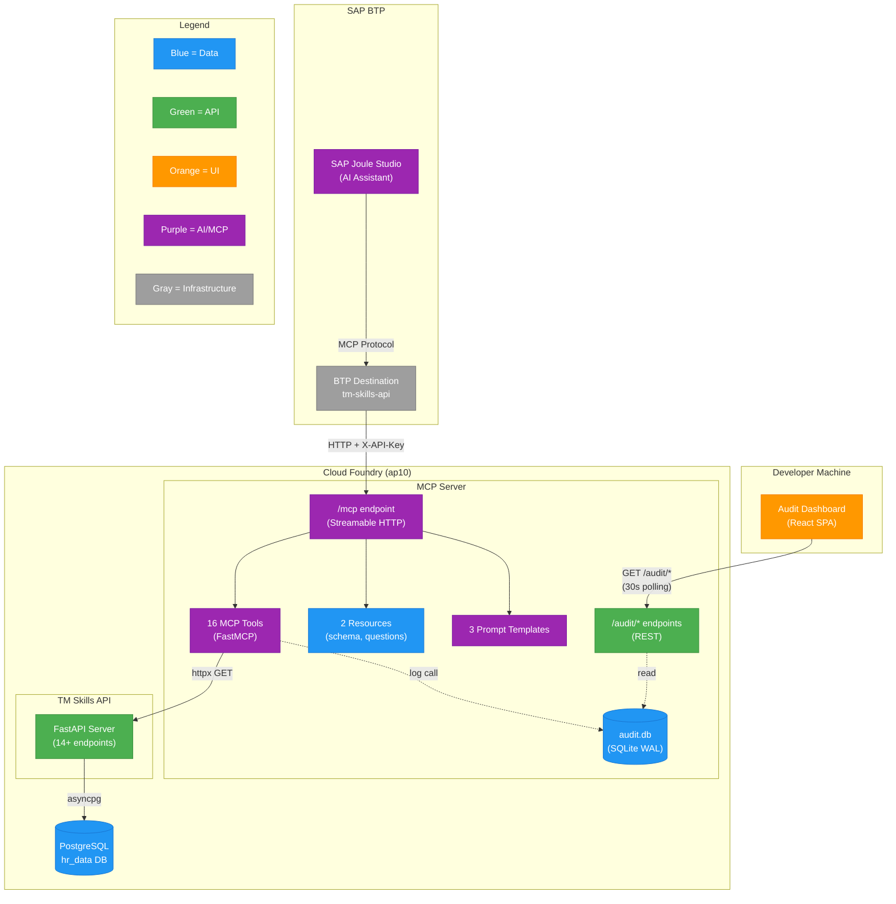
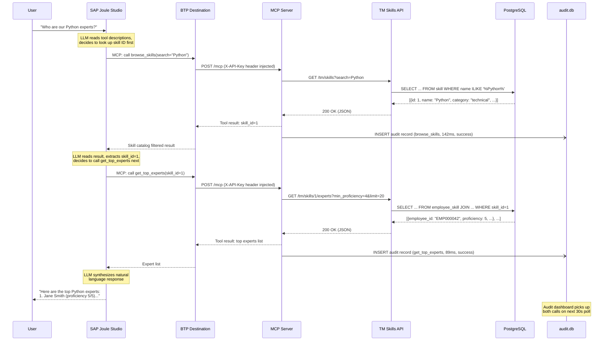

# MCP Server & Joule Integration

> **Previous:** [Business Questions & SQL Query Design](../business-queries/index.md) | **Next:** [Deployment](../deployment/index.md)

---

## What is MCP?

The **Model Context Protocol (MCP)** is an open standard for connecting AI assistants to external data sources and tools. Announced by Anthropic in late 2024 and rapidly adopted across the AI ecosystem, MCP solves a fundamental integration problem: before MCP, every AI platform required proprietary connection methods, meaning developers had to rebuild the same integrations for each AI client. MCP standardizes this into a single, universal protocol -- analogous to how USB standardized peripheral connections for hardware.

MCP defines three core primitives that a server can expose:

| Primitive | Purpose | Example in This Project |
|-----------|---------|------------------------|
| **Tools** | Functions the AI can invoke, with typed parameters and descriptions | `get_top_experts(skill_id, min_proficiency, limit)` |
| **Resources** | Read-only data providing domain context | TM database schema, business questions catalog |
| **Prompts** | Reusable templates guiding multi-step workflows | "Expert Discovery" prompt that chains skill lookup with expert search |

The protocol operates on a **client-server architecture**:

- **Client** -- The AI application (e.g., SAP Joule, Claude Desktop) that discovers available tools and invokes them on behalf of the user.
- **Server** -- Custom code that declares available capabilities and executes them when requested.

All communication uses **JSON-RPC 2.0** over one of several transport mechanisms. The current recommended transport is **Streamable HTTP** (defined in the MCP spec 2025-03-26), which uses a single HTTP POST endpoint without persistent connections -- well-suited for serverless and Cloud Foundry environments. This replaces the older SSE (Server-Sent Events) transport that required persistent HTTP connections.

The communication follows three phases:

1. **Initialization** -- Client and server negotiate protocol version and exchange capability declarations.
2. **Discovery** -- The client requests `tools/list`, `resources/list`, and `prompts/list`. The server returns descriptions and parameter schemas. These descriptions are critical: the AI reads them to decide *which* tool to call for a given user question.
3. **Usage** -- The AI model reads the cached tool descriptions, selects the appropriate tool(s), sends invocation requests, evaluates results, and may chain additional tool calls before composing a final answer.

The key distinction from a REST API is **who decides the workflow**. With a REST API, the calling code must know which endpoints to call and in what order. With MCP, the AI model reads tool descriptions and autonomously determines the execution plan. This is what makes the demo compelling: the same set of tools can answer questions the developer never explicitly programmed workflows for.

---

## TM MCP Server Architecture

The TM Skills MCP Server (`tm-mcp-server`) is a Python application that wraps the TM Skills API (described in [Business Questions & SQL Query Design](../business-queries/index.md)) as MCP tools, making the talent management data accessible to AI assistants.

### Technology Stack

| Component | Technology | Version |
|-----------|-----------|---------|
| MCP SDK | FastMCP (Python MCP SDK) | 1.26+ |
| HTTP Client | httpx (async) | -- |
| Configuration | pydantic-settings | -- |
| Audit Database | aiosqlite (SQLite) | -- |
| Transport | Streamable HTTP | MCP spec 2025-03-26 |

### Capabilities Exposed

The server exposes **16 tools**, **2 resources**, and **3 prompt templates**:

**Tools (13 TM + 3 audit):**

| Category | Tools | Description |
|----------|-------|-------------|
| Employee | `get_employee_skills`, `get_skill_evidence`, `get_top_skills`, `get_evidence_inventory` | Individual skill profiles, evidence, and skill passports |
| Skills | `browse_skills`, `get_top_experts`, `get_skill_coverage`, `get_evidence_backed_candidates`, `get_stale_skills`, `get_cooccurring_skills` | Catalog browsing, expertise discovery, coverage analysis |
| Talent Search | `search_talent` | Multi-skill AND search across the workforce |
| Organizations | `get_org_skill_summary`, `get_org_skill_experts` | Org-level skill summaries with hierarchy traversal |
| Audit | `query_recent_audit`, `query_filtered_audit`, `get_audit_summary` | Self-inspection of the server's own tool call history |

**Resources (2 static):**

- `tm://schema` -- The TM database schema (`resources/tm_schema.sql`), giving the AI context about available tables and columns.
- `tm://business-questions` -- The business questions catalog (`resources/business_questions.md`), helping the AI understand what kinds of queries the system is designed to answer.

**Prompt Templates (3 reusable):**

- **Expert Discovery** -- Guides the AI through a skill lookup followed by expert search.
- **Employee Analysis** -- Structures a deep dive into an individual employee's skill profile and evidence.
- **Org Talent Review** -- Templates a multi-step organizational readiness assessment.

### How Tools Work

Each MCP tool is a thin wrapper around an HTTP call to the TM Skills API. The MCP server holds the API key and base URL, so the AI client never needs direct API access. When the AI invokes a tool:

1. The MCP server validates parameters against defined schemas.
2. It constructs an HTTP GET request to the corresponding TM Skills API endpoint using `httpx`.
3. It forwards the API key in the `X-API-Key` header.
4. It returns the JSON response to the AI client.
5. It logs the invocation to the SQLite audit database (tool name, parameters, duration, success/failure).

The `@audited` decorator wraps every tool function, capturing timing and error information without propagating audit failures to callers.

### Audit Logging

Every tool invocation is recorded in a local SQLite database (`audit.db`) using **WAL (Write-Ahead Logging) mode** for concurrent read/write performance. The schema captures:

```sql
CREATE TABLE tool_calls (
    id              INTEGER PRIMARY KEY AUTOINCREMENT,
    timestamp       TEXT    NOT NULL,
    request_id      TEXT,
    session_id      TEXT,
    client_name     TEXT,
    client_version  TEXT,
    tool_name       TEXT    NOT NULL,
    parameters      TEXT,        -- JSON-serialized
    success         INTEGER NOT NULL,
    error_msg       TEXT,
    duration_ms     REAL    NOT NULL
);
```

Indexes on `timestamp`, `session_id`, `tool_name`, and `client_name` support the query patterns used by the [audit dashboard](audit-dashboard.md).

The `AuditLogger` class uses **lazy initialization** (`_ensure_db()`) -- the database connection is created on first use rather than at server startup. This is a deliberate design choice: the FastMCP `lifespan` parameter runs per MCP client session, not per ASGI application startup. REST endpoints that bypass MCP sessions (like `/audit/recent`) would hit an uninitialized database without this pattern.

### Entry Point and REST Endpoints

The server entry point uses `mcp.streamable_http_app()` to obtain a Starlette ASGI application, then adds `CORSMiddleware` for dashboard access:

```python
app = mcp.streamable_http_app()
app.add_middleware(CORSMiddleware, allow_origins=settings.cors_origins.split(","), ...)
uvicorn.run(app, host=settings.host, port=settings.port)
```

In addition to the MCP endpoint at `/mcp`, the server exposes three REST endpoints for audit data:

| Endpoint | Description |
|----------|-------------|
| `GET /audit/summary` | Aggregate stats: total calls, unique tools/clients/sessions, error rate, avg/max duration, per-tool breakdown |
| `GET /audit/recent?limit=N` | Last N tool invocations with full metadata |
| `GET /audit/query?...` | Filtered query by tool name, session ID, client, time range, errors-only flag |

These REST endpoints exist alongside the MCP protocol on the same server -- they are registered as custom Starlette routes, not MCP tools. This dual-protocol approach means the [audit dashboard](audit-dashboard.md) can use standard HTTP `fetch()` calls while AI clients use the MCP protocol, all served from a single process.

### Architecture Diagram



---

## SAP Joule Studio Integration

SAP Joule is the AI copilot embedded across SAP's product suite. **Joule Studio** allows developers to create custom Joule agents that connect to external services through MCP servers. The TM MCP Server is registered as a tool provider in Joule Studio, enabling the AI to answer talent management questions using natural language.

### BTP Destination Configuration

SAP BTP uses **Destinations** as a configuration layer for outbound HTTP connections. The MCP server is registered as a BTP Destination with the following settings:

| Field | Value |
|-------|-------|
| Name | `tm-skills-api` |
| Type | HTTP |
| Authentication | NoAuthentication |
| URL | `https://tm-skills-mcp.cfapps.ap10.hana.ondemand.com` |
| Additional Property | `URL.headers.X-API-Key` = *(API key value)* |

The `URL.headers.<header-name>` pattern is a standard BTP Destination convention for injecting custom HTTP headers into every request routed through the destination. This is how the API key reaches the MCP server without the Joule agent needing to manage credentials directly. The authentication is set to `NoAuthentication` at the destination level because the API key header handles authentication at the application level.

### OpenAPI Specification Upload

Joule Studio requires an **OpenAPI 3.0.x specification** (JSON format) to understand the MCP server's capabilities. The specification was generated from the MCP server's tool definitions and uploaded to Joule Studio during agent configuration.

A critical compatibility constraint: **SAP Joule Studio supports OpenAPI 3.0.x but not 3.1.x**. The specification must use version `3.0.3` or earlier. OpenAPI 3.1 introduced breaking changes (e.g., `type` can be an array, `nullable` was replaced by `type: ["string", "null"]`) that Joule Studio's parser does not handle.

### Known Limitation: 10KB Response Context Limit

Joule Studio imposes a **10KB byte-size limit** on individual tool responses (`BYTE_SIZE_LIMIT` error). Any response exceeding this threshold is rejected, and the AI receives an error instead of data.

This limitation affects the `/tm/skills` catalog endpoint, which returns the full list of 93 skills with descriptions, categories, and metadata -- totaling approximately **13,455 bytes**. When the AI calls `browse_skills` without filters, the response exceeds the 10KB limit and fails.

**Workarounds:**

- Apply filters (category or search term) to reduce the result set before returning.
- Implement server-side pagination with a configurable `limit` parameter (e.g., max 8KB per page).
- Return abbreviated records (name and ID only) with a follow-up tool for full details.

This is documented in the project's LEARNINGS.md as a key constraint for anyone building MCP servers intended for Joule Studio consumption. The recommended fix is adding pagination with a response size budget, keeping each page under 8KB with headroom.

---

## Tool Call Sequence

The following sequence diagram illustrates a typical interaction when a user asks Joule "Who are our Python experts?" This question requires a **two-step reasoning chain**: the AI must first discover Python's skill ID from the catalog, then use that ID to query for experts.



Key observations from this sequence:

- **The gap between the two tool calls is LLM reasoning time.** The AI must read the first response, extract the skill ID, and decide what to do next. In the [audit dashboard](audit-dashboard.md), this gap is visible as a pause in the session timeline (typically 2-5 seconds).
- **The MCP server never exposes the API key to the AI client.** The BTP Destination injects the `X-API-Key` header, and the MCP server forwards it to the TM Skills API. The AI model never sees credentials.
- **Audit logging is fire-and-forget.** The `log_tool_call` method catches all exceptions internally, so an audit database failure never breaks a tool invocation.

---

## Demo Flow Walkthrough

A typical customer demo follows a carefully designed narrative arc, progressing from simple single-tool queries to complex multi-step reasoning chains. The progression builds the audience's understanding of what the AI is doing and why it matters.

### Step 1: Establish Baseline

Open the [audit dashboard's](audit-dashboard.md) Overview tab to show the current state -- existing tool call counts, error rate, and latency baseline. This establishes context so that the audience can see the dashboard update in real-time as the demo proceeds.

### Step 2: Simple Lookup (Single Tool)

In Joule Studio, ask: **"What are the top skills for employee EMP000042?"**

The AI maps this to a single tool call (`get_top_skills`) and returns a formatted skill passport. Point out that the AI selected the correct tool from 16 options based on intent alone -- it chose `get_top_skills` rather than `get_employee_skills` because the user asked for "top" skills, not the full profile.

### Step 3: Two-Step Reasoning Chain

Ask: **"Who are the top Python experts in our company?"**

This triggers a two-call chain:

1. `browse_skills(search="Python")` -- the AI first looks up Python's skill ID from the catalog.
2. `get_top_experts(skill_id=1)` -- then uses that ID to find experts.

The key insight for the audience: the AI did not hardcode the skill ID. It discovered it at runtime by first browsing the catalog. The second call depended on the output of the first -- this is autonomous tool chaining.

### Step 4: Intent-Sensitive Tool Selection

Ask: **"I need a machine learning engineer for a new project. Find someone with strong, verified credentials."**

This produces a three-step chain: `browse_skills` (find ML skill ID), `get_evidence_backed_candidates` (find verified practitioners), and `get_skill_evidence` (drill into proof for the top candidate). The word "verified" changed the AI's tool selection -- it chose `get_evidence_backed_candidates` over `get_top_experts` because the user emphasized credentials. The AI also proactively fetched detailed evidence for the best match without being explicitly asked.

### Step 5: Complex Decomposition

Ask: **"How well is our Engineering org (ORG031) prepared for a cloud migration? Do we have enough AWS and Kubernetes expertise, or are there gaps?"**

This is the most complex query, potentially generating 5-6 tool calls: `get_org_skill_summary`, two `browse_skills` calls (for AWS and Kubernetes), two `get_skill_coverage` calls, and possibly `get_stale_skills` for outdated certifications. The AI decomposed a strategic business question into specific, measurable data queries -- no one programmed this workflow explicitly.

### Step 6: Reveal the Observability Story

Switch to the [audit dashboard](audit-dashboard.md) to show what happened behind the scenes:

1. **Overview tab** -- KPIs have updated in real-time. Total call count increased, new tools were used, latency values refreshed.
2. **Session Explorer** -- Select the demo session by client name and time range. The vertical timeline shows every tool call in sequence with color-coded badges and duration bars. Gaps between calls (typically 2-5 seconds) represent LLM reasoning time -- the AI reading the previous response and deciding what to do next. Gaps longer than 30 seconds are explicitly flagged.
3. **Observability tab** -- The tool usage chart shows which tools the AI preferred. The latency scatter plot shows the demo's calls as recent data points. Percentile cards (P50/P95/P99) give a sense of typical and worst-case performance.
4. **Raw Data tab** -- Expand any row to see the full parameters JSON, demonstrating that every detail is captured for auditability.

### Key Demo Messages

| Point | Evidence Shown |
|-------|---------------|
| AI chooses tools autonomously | Different prompts trigger different tool combinations |
| AI chains tools intelligently | Output from tool A feeds as input to tool B |
| AI reasons about intent | "verified credentials" triggers evidence-backed search vs. plain expert lookup |
| AI decomposes complex questions | Strategic question becomes 5-6 specific data queries |
| Full observability | Every call logged with timing, parameters, success/failure |
| Session context carries forward | Follow-up prompts build on previous results |

---

## MCP Server vs. REST API: Why Both?

A natural question arises: if the TM Skills API already exists as a well-designed REST API, why add an MCP server layer on top?

The answer lies in **who controls the workflow**:

| Aspect | REST API (Direct) | MCP Server (AI-Mediated) |
|--------|-------------------|--------------------------|
| Consumer | Developers, dashboards, scripts | AI assistants (Joule, Claude) |
| Workflow | Caller must know which endpoints to call and in what order | AI reads tool descriptions and decides autonomously |
| Discovery | OpenAPI spec read by humans | `tools/list` read by AI models |
| Authentication | Caller manages API keys | MCP server holds credentials; AI never sees them |
| Chaining | Manual orchestration in code | Autonomous multi-step reasoning |
| New questions | Requires new code or endpoint | Same tools, new questions -- zero code changes |

The MCP server does not replace the REST API. The REST API continues to serve the HR Dashboard ([Data Model](../data-model/index.md)) and any direct integration needs. The MCP server adds a **natural language interface** on top, enabling non-technical users to query the same data through conversation rather than API calls.

This layered architecture also provides a clean security boundary. The AI assistant never receives database credentials or direct API keys. The MCP server acts as a controlled gateway, and the audit log captures every interaction for compliance and debugging.

---

## Lessons Learned

Several non-obvious lessons emerged from building and deploying the MCP integration:

**FastMCP lifespan is per-session, not per-app.** The `lifespan` parameter passed to `FastMCP(lifespan=...)` executes per MCP client session, not when the Starlette ASGI application starts. Any initialization that REST endpoints depend on (like the audit database connection) must use lazy initialization patterns rather than relying on the MCP lifespan hook.

**`streamable_http_app()` returns a plain Starlette app.** This means standard Starlette middleware (CORS, authentication, logging) can be added directly. There is no need to monkey-patch `mcp.run()` -- the returned ASGI app gives explicit control over the middleware stack.

**Tool descriptions are the most important code you write.** The AI model's tool selection depends entirely on the quality of tool descriptions. Vague descriptions lead to wrong tool choices. Specific, action-oriented descriptions with examples of when to use each tool dramatically improve selection accuracy.

**Joule's 10KB limit shapes API design.** Any endpoint that might return a large payload needs pagination or filtering. This is not just a Joule limitation -- it is a general principle for MCP servers. AI models work better with focused, bounded responses than with large data dumps.

**CORS breaks silently in browsers.** When the MCP server lacks CORS headers, browser-based dashboards see the server as "offline" even though `curl` returns valid data. CORS preflight failures produce network errors that are indistinguishable from connectivity problems. Testing CORS requires browser-level validation, not just command-line HTTP checks.

**The audit log is a demo multiplier.** Recording every tool invocation transforms the demo from "look what the AI can do" into "look at how the AI thinks." The session timeline with gap detection makes the AI's reasoning process visible, which is far more compelling to technical audiences than the final answer alone.

---

> **Next:** [Deployment](../deployment/index.md)
