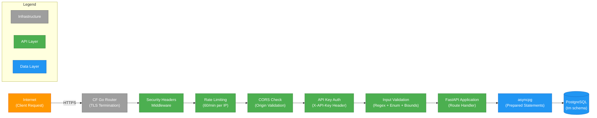
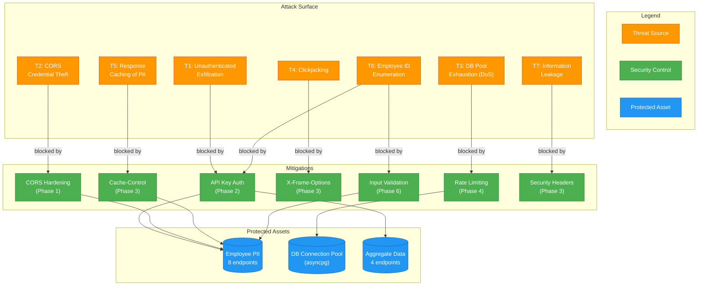
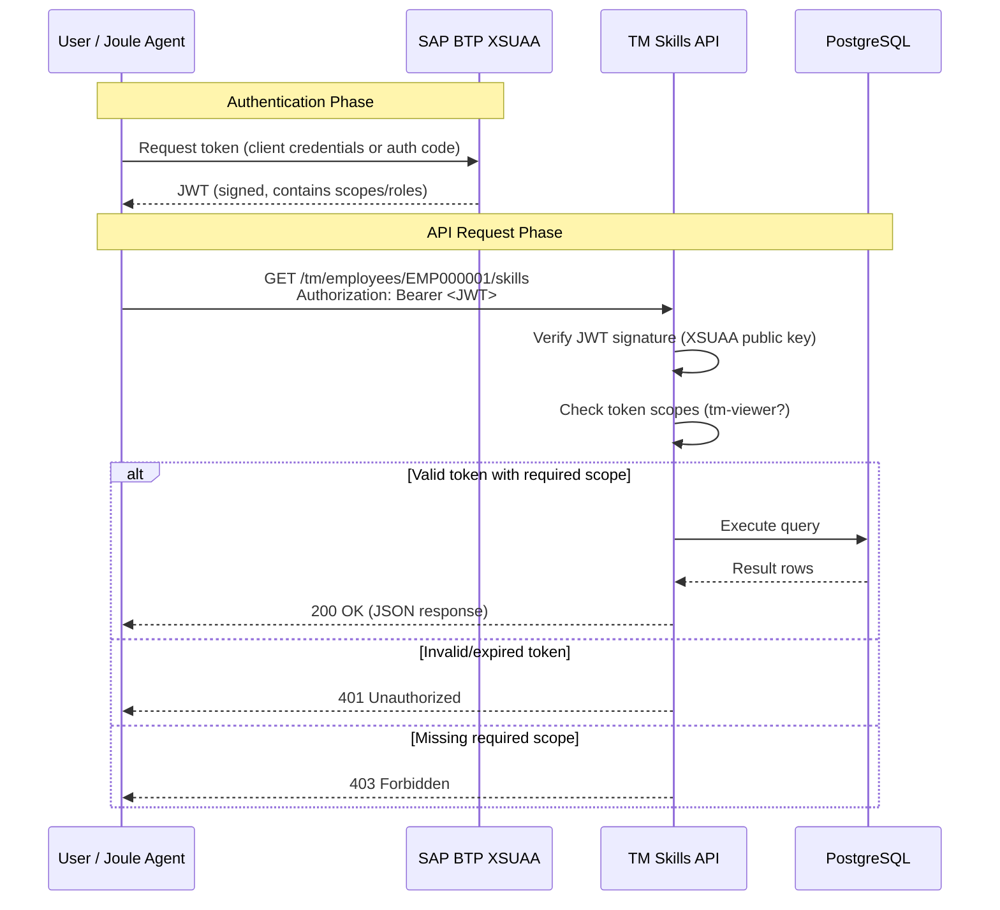
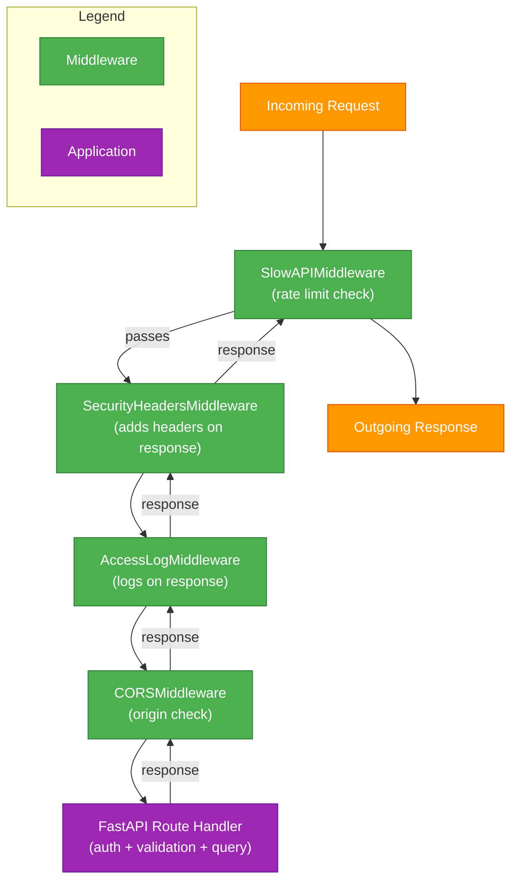

# Security

The TM Skills API is a read-only API serving employee talent and skill data -- information that includes names, job titles, proficiency scores, certifications, and peer endorsements. This is sensitive HR/PII data. Leaving it unprotected would expose the organisation to data exfiltration, enumeration attacks, and regulatory risk.

This chapter documents the threat model, the six-phase hardening implementation that was carried out, the technical design of each security control, and the future roadmap toward OAuth2/JWT integration with SAP BTP XSUAA.

All six remediation phases have been implemented and deployed to production on SAP BTP Cloud Foundry (`ap10` region).

!!! note "Cross-references"

    The API layer discussed here is the same FastAPI application described in [Architecture](../architecture/index.md). The SQL queries referenced in the injection-prevention section are detailed in [Business Questions & SQL Query Design](../business-queries/index.md). The database schema and user permissions are covered in [Database Design](../data-model/index.md).

---

## Defense-in-Depth Architecture

Security is not a single gate; it is a series of concentric layers, each catching what the previous one missed. The TM Skills API implements seven distinct layers between the internet and the database. A request must pass through every layer before it touches PostgreSQL.



Each layer addresses a different class of threat. TLS protects data in transit. Security headers instruct browsers to prevent clickjacking, MIME-sniffing, and response caching. Rate limiting prevents denial-of-service attacks that exhaust the database connection pool. CORS restricts which browser origins can call the API. API key authentication blocks unauthenticated access entirely. Input validation rejects malformed identifiers before they reach the query layer. And asyncpg prepared statements prevent SQL injection at the protocol level.

The following sections describe each hardening phase in the order they were implemented.

---

## Six-Phase Hardening Implementation

### Phase 1: CORS Hardening (Addresses T2 -- Credential Theft)

Cross-Origin Resource Sharing (CORS) controls which browser-based JavaScript applications can call the API. Without restrictions, any website could make AJAX requests and potentially exfiltrate data if the user's browser holds credentials.

The implementation in `app/main.py`:

```python
app.add_middleware(
    CORSMiddleware,
    allow_origins=settings.cors_origins,
    allow_credentials=False,
    allow_methods=["GET", "OPTIONS"],
    allow_headers=["Authorization", "X-API-Key", "Content-Type"],
)
```

Key design decisions:

- **Origins restricted to production domain only** -- the `cors_origins` setting is loaded from an environment variable, defaulting to localhost for development. In production, only the specific deployed frontend domain is permitted.
- **`allow_credentials=False`** -- API keys are sent via the `X-API-Key` header, not cookies. Disabling credentials eliminates an entire class of cross-site request forgery (CSRF) attacks.
- **Methods limited to `GET, OPTIONS`** -- this is a read-only API with no mutating endpoints. Restricting allowed methods communicates intent and blocks any accidental `POST`/`PUT`/`DELETE` attempts from browsers.

!!! warning "Important"

    CORS is enforced by browsers, not by the server. Tools like `curl`, Postman, or any non-browser HTTP client bypass CORS entirely. This is why CORS alone is insufficient -- it must be layered with API key authentication (Phase 2).

### Phase 2: API Key Authentication (Addresses T1, T6)

Every data endpoint requires a valid API key in the `X-API-Key` request header. The authentication logic lives in `app/auth.py` and is applied as a FastAPI dependency at the router level.

The dependency function follows a three-step decision tree:

1. **No keys configured** (`API_KEYS` env var is empty) -- authentication is disabled entirely. This preserves local development convenience and allows tests to pass without modification.
2. **Key missing** -- returns HTTP 401 Unauthorized with the message "Missing API key -- include an X-API-Key header."
3. **Key invalid** -- returns HTTP 403 Forbidden with the message "Invalid API key."

The key is validated against a set parsed from the `API_KEYS` environment variable (comma-separated):

```python
async def require_api_key(
    api_key: str | None = Security(_api_key_header),
) -> str | None:
    if not settings.api_keys_set:
        return None
    if not api_key:
        raise HTTPException(status_code=status.HTTP_401_UNAUTHORIZED, ...)
    if api_key not in settings.api_keys_set:
        raise HTTPException(status_code=status.HTTP_403_FORBIDDEN, ...)
    return api_key
```

**Router-level application, not global:** The dependency is injected via `include_router(dependencies=[Depends(require_api_key)])` rather than as a global FastAPI dependency. This is a deliberate design choice -- FastAPI global dependencies do not support per-route overrides. By applying auth at the router level, the `/health` endpoint (used by Cloud Foundry health probes) remains exempt without workarounds. The `dependencies=[]` parameter in `include_router` is additive, meaning each router inherits the auth check without needing to declare it in every route function.

### Phase 3: Security Response Headers (Addresses T4, T5, T7)

A custom `SecurityHeadersMiddleware` class injects six security headers into every HTTP response. These headers instruct browsers and proxies how to handle the response content.

| Header | Value | Purpose |
|:-------|:------|:--------|
| `X-Content-Type-Options` | `nosniff` | Prevents MIME-type sniffing -- browser must trust the declared `Content-Type` |
| `X-Frame-Options` | `DENY` | Blocks the response from being rendered in an `<iframe>` (clickjacking prevention) |
| `Referrer-Policy` | `strict-origin-when-cross-origin` | Limits referrer information sent to other origins |
| `Cache-Control` | `no-store` | Prevents browsers and intermediate proxies from caching PII responses |
| `Strict-Transport-Security` | `max-age=31536000; includeSubDomains` | Forces HTTPS for one year after first visit (HSTS) |
| `Content-Security-Policy` | `default-src 'self'; frame-ancestors 'none'` | Restricts resource loading; `frame-ancestors 'none'` is the CSP equivalent of `X-Frame-Options: DENY` |

The `Cache-Control: no-store` header is particularly important for this API. Since 8 of 12 endpoints return individual employee PII, cached responses in shared proxy servers or browser caches could leak sensitive data to subsequent users of the same device or network.

### Phase 4: Rate Limiting (Addresses T3 -- DoS)

The API uses the `slowapi` library to enforce a rate limit of 60 requests per minute per client IP address. This protects the asyncpg connection pool (which has a finite size) from being exhausted by a single aggressive client.

```python
limiter = Limiter(
    key_func=get_remote_address,
    default_limits=[settings.rate_limit_default],
    enabled=settings.rate_limit_enabled,
)
```

**`X-Forwarded-For` awareness:** Because Cloud Foundry's Go Router acts as a reverse proxy, the actual client IP is in the `X-Forwarded-For` header, not the TCP source address. The `get_remote_address` function from `slowapi` extracts this correctly, ensuring rate limits apply to the real client rather than the Go Router's internal IP.

When the limit is exceeded, the client receives an HTTP 429 (Too Many Requests) response with a `Retry-After` header indicating when they can resume.

### Phase 5: Audit Logging (All Threats)

The `AccessLogMiddleware` in `app/middleware/logging.py` logs every request in a structured `key=value` format designed for easy parsing by log aggregation tools.

Each log entry includes:

- **method** -- HTTP method (`GET`, `OPTIONS`)
- **path** -- the URL path
- **status** -- HTTP status code
- **duration_ms** -- request processing time in milliseconds
- **client_ip** -- extracted from `X-Forwarded-For` (with fallback to `request.client.host`)
- **api_key** -- masked to show only the first 4 characters (e.g., `ab12****`), preventing key leakage into logs while preserving enough information for correlation
- **query** -- query string parameters (or `-` if none)

**Middleware execution order:** Starlette processes middleware in reverse registration order -- the last `add_middleware()` call runs outermost. The registration order in `main.py` is: (1) CORS, (2) AccessLog, (3) SecurityHeaders, (4) SlowAPI. This means SlowAPI runs first (outermost), then SecurityHeaders, then AccessLog, and finally CORS (innermost). The access log therefore captures the status code set by rate limiting (429) and sees the security headers already applied.

### Phase 6: Input Validation (Addresses T6 -- Enumeration)

Without input validation, an attacker with a valid API key could enumerate employee IDs by iterating through `EMP000001` to `EMP999999`. While the API key blocks unauthenticated access, validation ensures that even authenticated clients cannot submit malformed or out-of-pattern identifiers.

The validation uses FastAPI's `Annotated` type pattern with `Path` and `Query` constraints:

```python
EmpId = Annotated[str, Path(pattern=r"^EMP\d{6}$", description="Employee ID (e.g. EMP000001)")]
OrgId = Annotated[str, Path(pattern=r"^ORG\d{1,4}[A-Z]?$", description="Org unit ID (e.g. ORG030)")]
```

The full set of input validations:

| Parameter | Validation | Rejects |
|:----------|:-----------|:--------|
| Employee ID | Regex `^EMP\d{6}$` | `EMP1`, `EMP0000001`, `EMPLOYEE1`, SQL fragments |
| Org Unit ID | Regex `^ORG\d{1,4}[A-Z]?$` | `ORG`, `ORG12345`, arbitrary strings |
| Skill category | Enum (`technical`, `functional`, `leadership`, `domain`, `tool`, `other`) | Any value outside the enum |
| Search name | `min_length=2`, max length cap | Single-character searches, excessively long strings |
| Numeric limits | `ge`/`le` bounds (e.g., `limit: 1-100`, `proficiency: 0-5`) | Out-of-range values, negative numbers |

**Python syntax note:** The `Annotated[str, Path(pattern=...)]` pattern is used instead of `Path(pattern=..., default=...)` because FastAPI path parameters cannot have default values in Python's function signature syntax. The `Annotated` type cleanly separates the type hint from the validation metadata.

---

## Data Sensitivity Assessment

Not all endpoints carry equal risk. Understanding which endpoints expose individual PII versus aggregate statistics is essential for prioritising security controls and for future role-based access design.

| Sensitivity | Endpoints | Count | Data Characteristics |
|:------------|:----------|:------|:---------------------|
| **High (PII)** | 1, 2, 3, 5, 6, 8, 10, 12b | 8 | Employee names, job titles, skill proficiency scores, certifications, peer endorsements, project histories |
| **Medium** | 7 (staleness indicators) | 1 | Employee names with time-since-last-assessment; exposes who has outdated records |
| **Low (aggregates)** | 4, 9, 11, 12a | 4 | Statistical counts, skill co-occurrence correlations, org-level summaries with no individual names |

Eight of twelve endpoints expose individual employee PII. This means the API key authentication gate (Phase 2) is the single most important control -- without it, all PII is publicly accessible. The future OAuth2 integration (see Future Security Roadmap below) will add a second authentication factor and enable fine-grained role-based access, allowing aggregate endpoints to be accessible to a broader audience while PII endpoints remain restricted.

---

## Threat Model

The threat model identifies seven scenarios, assesses their likelihood and impact, and maps each to the specific mitigation phase that addresses it.



### Threat Assessment Table

| # | Threat | Likelihood | Impact | Mitigation Phase | Status |
|:--|:-------|:-----------|:-------|:-----------------|:-------|
| T1 | Unauthenticated data exfiltration -- anyone on the internet pulls employee PII | High | High | Phase 2: API Key Auth | Resolved |
| T2 | CORS credential theft -- malicious website makes cross-origin requests using stored credentials | Medium | High | Phase 1: CORS Hardening | Resolved |
| T3 | DB pool exhaustion (DoS) -- rapid requests consume all asyncpg connections | Medium | Medium | Phase 4: Rate Limiting (60/min) | Resolved |
| T4 | Clickjacking -- API responses embedded in a malicious iframe | Low | Low | Phase 3: X-Frame-Options DENY | Resolved |
| T5 | Response caching of PII -- proxy/browser cache stores and serves sensitive data | Low | Medium | Phase 3: Cache-Control no-store | Resolved |
| T6 | Employee ID enumeration -- iterating EMP000001 through EMP999999 to scrape all profiles | Medium | Medium | Phases 2 + 6: API Key + Input Validation | Resolved |
| T7 | Information leakage via headers/stack traces -- server version, framework details, Python tracebacks | Low | Low | Phase 3: Security Headers + Exception Handler | Resolved |

---

## SQL Injection Prevention

SQL injection is the most critical vulnerability class for any database-backed API. The TM Skills API is protected at the protocol level, not merely by string escaping.

**asyncpg uses positional parameters (`$1`, `$2`) that are prepared statements.** These are parameterised at the PostgreSQL binary protocol level. The query text and the parameter values are sent as separate protocol messages -- there is no point at which a parameter value could be interpreted as SQL syntax. This is fundamentally safer than string-based parameterisation libraries that escape special characters before concatenating values into a query string.

All SQL queries are defined as constant strings in dedicated modules under `app/queries/`:

```
app/queries/
    employee_queries.py    -- Endpoints 1, 2, 8, 10, search
    skill_queries.py       -- Endpoints 3, 4, 6, 7, 9, 11
    talent_search_queries.py -- Endpoint 5
    org_queries.py         -- Endpoint 12a, 12b
```

Each query uses `$N` positional placeholders. The service layer passes parameter values as separate arguments to `conn.fetch()` or `conn.fetchrow()`. No string interpolation, concatenation, or f-string formatting ever touches SQL.

For example, a typical query constant and its invocation:

```python
# In queries/employee_queries.py
GET_EMPLOYEE_SKILLS = """
    SELECT s.skill_name, es.proficiency_level, es.confidence_score
    FROM tm.employee_skill es
    JOIN tm.skill s ON s.skill_id = es.skill_id
    WHERE es.employee_id = $1
    ORDER BY es.proficiency_level DESC
"""

# In services/employee_service.py
rows = await conn.fetch(GET_EMPLOYEE_SKILLS, employee_id)
```

The `employee_id` value is never embedded in the SQL string. Even if a caller somehow passed `"EMP000001'; DROP TABLE tm.skill;--"` as the employee ID, the input validation regex (`^EMP\d{6}$`) would reject it before it reached the query layer. And even if it somehow bypassed validation, asyncpg would send it as a parameter value, not as part of the query text -- PostgreSQL would simply find no matching row.

**Stack trace suppression** adds a final safeguard. The global exception handler in `main.py` catches all unhandled exceptions and returns a generic `{"detail": "Internal server error"}` response. This prevents database error messages (which might reveal schema names, column names, or query structure) from leaking to the client.

---

## Future Security Roadmap

The current six-phase implementation provides a solid baseline for a demo API. For production use with real employee data, three additional capabilities are planned. For the broader project roadmap beyond security, see [Learnings & Future Improvements](../learnings/index.md).

### OAuth2 / JWT Authentication (Phase 7)

The current API key approach is a shared-secret model -- anyone with the key has full access to all endpoints. OAuth2 with JWT tokens enables per-user identity, role-based access control, and token expiration.

The planned integration uses SAP BTP's XSUAA (Extended Services for User Account and Authentication) service:



Implementation details:

- **XSUAA service instance** bound to the Cloud Foundry application via `manifest.yml` services
- **`sap-xssec`** Python package verifies JWT Bearer tokens from the `Authorization` header
- **Role collections** map to endpoint access: `tm-viewer` for read access to aggregate endpoints, `tm-admin` for PII-bearing endpoints
- **Coexistence with API keys** -- the `app/auth.py` module is designed so that OAuth2 can be added as an alternative authentication path alongside the existing API key check. The dependency function can accept either `X-API-Key` or `Authorization: Bearer` and validate accordingly

### Database User Separation

The current deployment uses a single PostgreSQL user (`hr_app`) for all database operations. This user has permissions beyond what a read-only API requires.

The planned improvement:

- Create a dedicated `tm_reader` PostgreSQL user with `SELECT`-only grants on the `tm` schema
- Revoke `INSERT`, `UPDATE`, `DELETE`, and `DDL` permissions
- The API's asyncpg connection pool would use `tm_reader` credentials
- Even if an attacker gained full control of the API process, they could not modify or delete data

### Additional Future Items

| Item | Description | Benefit |
|:-----|:------------|:--------|
| **Dependency scanning** | Add `pip-audit` or `safety` to the CI/CD pipeline | Detect known vulnerabilities in `asyncpg`, `fastapi`, `uvicorn`, `pydantic-settings` before deployment |
| **Secret management** | Migrate DB credentials from environment variables to SAP BTP Credential Store service | Eliminates secrets from `cf env` output and deployment scripts; supports automatic rotation |
| **Network segmentation** | Restrict PostgreSQL access to Cloud Foundry egress IP ranges only | Even with valid credentials, connections from non-CF networks would be rejected at the `pg_hba.conf` level |

For details on how secrets are managed in the current deployment, see [Deployment](../deployment/index.md).

---

## Middleware Execution Order

Understanding the middleware execution order is critical for debugging and for reasoning about which layer handles a given request. Starlette (the ASGI framework underlying FastAPI) processes middleware in **reverse registration order** -- the last middleware registered via `add_middleware()` runs outermost (i.e., it sees the request first and the response last).

The registration order in `main.py` is:

```
1. CORSMiddleware
2. AccessLogMiddleware
3. SecurityHeadersMiddleware
4. SlowAPIMiddleware
```

Therefore the actual execution order for an incoming request is:



This means:

1. **SlowAPIMiddleware** runs first -- a rate-limited request (429) never reaches authentication or the database.
2. **SecurityHeadersMiddleware** adds headers to every response, including 429 and 401/403 error responses.
3. **AccessLogMiddleware** logs the final status code, so rate-limited and auth-rejected requests appear in the audit trail.
4. **CORSMiddleware** runs innermost, adding CORS headers to the response on its way out.

---

## Summary

The TM Skills API implements a comprehensive defense-in-depth security posture across six deployed phases:

| Phase | Control | Key Mechanism |
|:------|:--------|:--------------|
| 1 | CORS Hardening | Production-only origins, credentials disabled, GET-only |
| 2 | API Key Authentication | `X-API-Key` header, 401/403 responses, `/health` exempt |
| 3 | Security Response Headers | 6 headers: HSTS, CSP, X-Frame-Options, Cache-Control, nosniff, Referrer-Policy |
| 4 | Rate Limiting | 60 req/min per IP via `slowapi`, `X-Forwarded-For` aware |
| 5 | Audit Logging | Structured `key=value` logs with masked API keys |
| 6 | Input Validation | Regex on IDs, enum on categories, bounds on numerics |

SQL injection is prevented at the protocol level by asyncpg's binary-protocol prepared statements, with all queries stored as constant strings with `$N` placeholders. Stack traces are suppressed by a global exception handler.

The architecture is designed for forward compatibility: the `app/auth.py` dependency can accept OAuth2 JWT tokens alongside API keys, and the read-only nature of the API makes database user separation straightforward. The planned Phase 7 (XSUAA integration) will add per-user identity, token expiration, and role-based access control when the application moves toward production use with real employee data.

---

**Next:** [Learnings & Future Improvements](../learnings/index.md) | **Previous:** [Deployment](../deployment/index.md)
